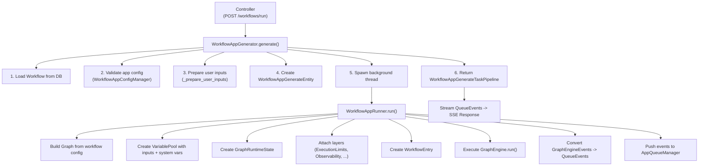
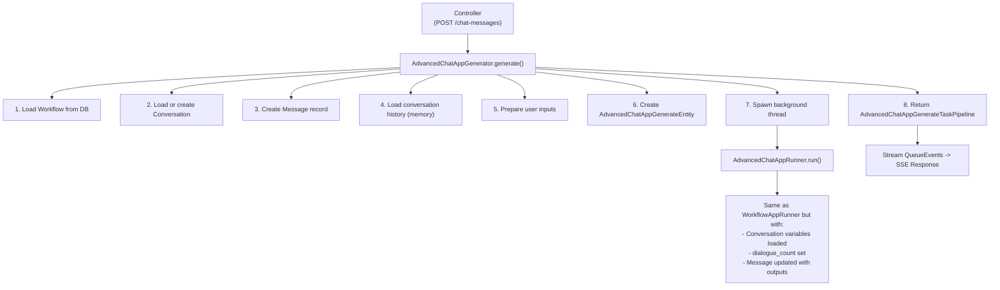
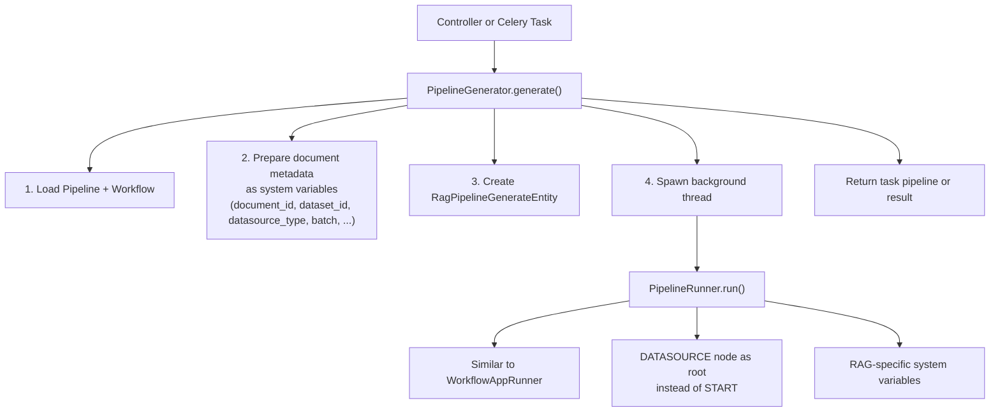
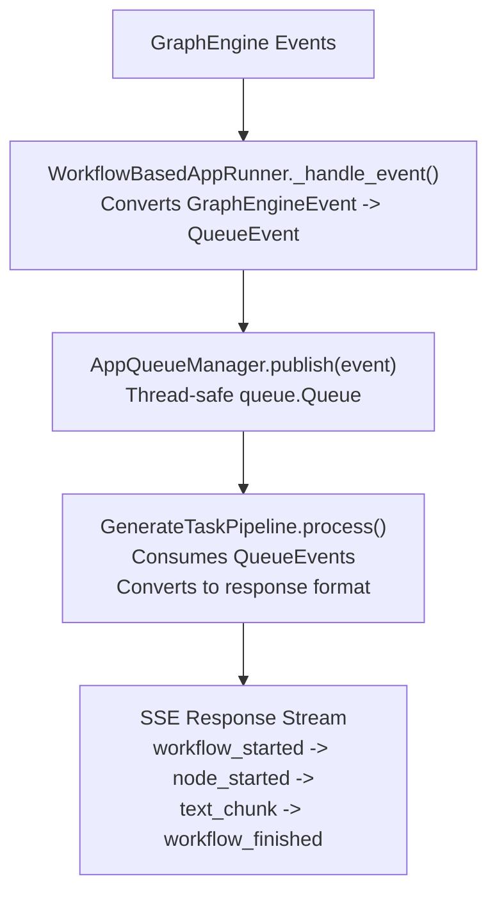
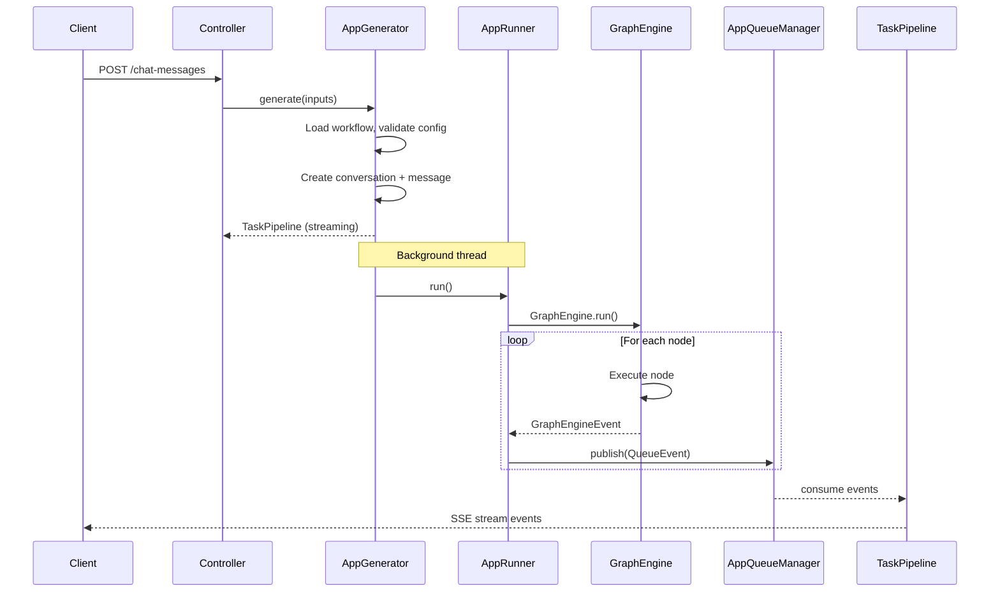

Pulse supports 7 application modes, each with a dedicated generator, runner,
config manager, and response converter. This document covers the app mode
taxonomy, the execution pipeline from API request to workflow execution, and
the task pipeline for streaming responses.

## App Modes

Defined in `api/models/model.py`:

```python
class AppMode(StrEnum):
    COMPLETION = "completion"        # Single-turn text completion
    WORKFLOW = "workflow"            # Standalone workflow execution
    CHAT = "chat"                    # Simple chatbot
    ADVANCED_CHAT = "advanced-chat"  # Chatbot backed by workflow
    AGENT_CHAT = "agent-chat"       # Agent-based chatbot
    CHANNEL = "channel"             # Channel integrations
    RAG_PIPELINE = "rag-pipeline"   # Document processing pipeline
```

### Mode Characteristics

| Mode | Workflow Engine | Memory | Streaming | Multi-turn |
| ---- | -------------- | ------ | --------- | ---------- |
| COMPLETION | No | No | Yes | No |
| CHAT | No | Yes | Yes | Yes |
| WORKFLOW | Yes | No | Yes | No |
| ADVANCED_CHAT | Yes | Yes | Yes | Yes |
| AGENT_CHAT | No | Yes | Yes | Yes |
| CHANNEL | Yes | Yes | Yes | Yes |
| RAG_PIPELINE | Yes | No | Yes | No |

## Per-Mode Components

Each app mode has a dedicated set of classes in `api/core/app/apps/`:

```
api/core/app/apps/
  completion/
    app_config_manager.py     # CompletionAppConfigManager
    app_generator.py          # CompletionAppGenerator
    app_runner.py             # CompletionAppRunner
    generate_response_converter.py
  chat/
    app_config_manager.py     # ChatAppConfigManager
    app_generator.py          # ChatAppGenerator
    app_runner.py             # ChatAppRunner
    generate_response_converter.py
  workflow/
    app_config_manager.py     # WorkflowAppConfigManager
    app_generator.py          # WorkflowAppGenerator
    app_runner.py             # WorkflowAppRunner
    app_queue_manager.py      # WorkflowAppQueueManager
    generate_response_converter.py
    generate_task_pipeline.py # WorkflowAppGenerateTaskPipeline
  advanced_chat/
    app_config_manager.py     # AdvancedChatAppConfigManager
    app_generator.py          # AdvancedChatAppGenerator
    app_runner.py             # AdvancedChatAppRunner
    generate_response_converter.py
    generate_task_pipeline.py # AdvancedChatAppGenerateTaskPipeline
  agent_chat/
    app_config_manager.py     # AgentChatAppConfigManager
    app_generator.py          # AgentChatAppGenerator
    app_runner.py             # AgentChatAppRunner
    generate_response_converter.py
  pipeline/
    pipeline_config_manager.py # PipelineConfigManager
    pipeline_generator.py      # PipelineGenerator
    pipeline_runner.py         # PipelineRunner
    pipeline_queue_manager.py  # PipelineQueueManager
    generate_response_converter.py
```

## Base Classes

### BaseAppGenerator

`api/core/app/apps/base_app_generator.py` -- Handles input preparation:

```python
class BaseAppGenerator:
    def _prepare_user_inputs(
        self,
        *,
        user_inputs: Mapping[str, Any] | None,
        variables: Sequence[VariableEntity],
        tenant_id: str,
        strict_type_validation: bool = False,
    ) -> Mapping[str, Any]:
        # 1. Filter inputs by form configuration
        # 2. Validate required fields, defaults, option values
        # 3. Convert file inputs to File objects
        # 4. Convert file list inputs
        # 5. Return sanitized inputs
```

### AppRunner (Easy UI modes)

`api/core/app/apps/base_app_runner.py` -- For completion/chat/agent_chat
(non-workflow modes):

```python
class AppRunner:
    def recalc_llm_max_tokens(self, model_config, prompt_messages):
        """Recalculate max_tokens if prompt + max exceeds context window."""

    def organize_prompt_messages(self, app_record, model_config,
        prompt_template_entity, inputs, ...):
        """Build prompt messages from template + inputs + memory."""
```

### WorkflowBasedAppRunner

`api/core/app/apps/workflow_app_runner.py` -- For workflow/advanced_chat/pipeline
modes:

```python
class WorkflowBasedAppRunner:
    def __init__(
        self,
        *,
        queue_manager: AppQueueManager,
        variable_loader: VariableLoader = DUMMY_VARIABLE_LOADER,
        app_id: str,
        graph_engine_layers: Sequence[GraphEngineLayer] = (),
    ):
```

## Execution Pipeline

### Workflow Mode



### Advanced Chat Mode



### RAG Pipeline Mode



## App Config System

Each app mode has a config manager that validates and constructs the
application configuration:

```
api/core/app/app_config/
  __init__.py
  entities.py               # VariableEntity, PromptTemplateEntity, ...
  features/
    file_upload/manager.py  # File upload config validation
    ...
```

### Config Manager Pattern

```python
class WorkflowAppConfigManager:
    @classmethod
    def get_app_config(cls, app_model: App, workflow: Workflow) -> AppConfig:
        """
        Validate and construct app configuration from
        the app model and workflow definition.
        """
```

## Task Pipeline for Streaming

The task pipeline converts internal queue events into SSE response events
for the frontend.

### Queue Event Flow



### Chat Request and Workflow Execution Flow



### Queue Events

Key queue event types (`api/core/app/entities/queue_entities.py`):

```
QueueWorkflowStartedEvent
QueueWorkflowSucceededEvent
QueueWorkflowFailedEvent
QueueWorkflowPartialSuccessEvent
QueueNodeStartedEvent
QueueNodeSucceededEvent
QueueNodeFailedEvent
QueueNodeExceptionEvent
QueueNodeRetryEvent
QueueTextChunkEvent
QueueLLMChunkEvent
QueueMessageEndEvent
QueueAgentLogEvent
QueueIterationStartEvent
QueueIterationNextEvent
QueueIterationCompletedEvent
QueueLoopStartEvent
QueueLoopNextEvent
QueueLoopCompletedEvent
QueueRetrieverResourcesEvent
```

## Response Converters

Each app mode has a response converter that formats the final response:

```python
class WorkflowAppGenerateResponseConverter:
    @classmethod
    def convert_blocking(cls, result) -> WorkflowAppBlockingResponse: ...

    @classmethod
    def convert_stream(cls, generator) -> Generator[WorkflowAppStreamResponse]: ...
```

### Blocking vs Streaming

| Mode | Blocking Response | Streaming Response |
|------|-------------------|-------------------|
| Workflow | `WorkflowAppBlockingResponse` | `WorkflowAppStreamResponse` |
| Advanced Chat | `ChatbotAppBlockingResponse` | `ChatbotAppStreamResponse` |
| Completion | `CompletionAppBlockingResponse` | `CompletionAppStreamResponse` |

## MessageBasedAppGenerator

For chat-like modes (chat, advanced_chat, agent_chat), the
`MessageBasedAppGenerator` extends `BaseAppGenerator` with:

```python
class MessageBasedAppGenerator(BaseAppGenerator):
    # Creates Message records in the database
    # Manages conversation context
    # Handles dialogue counting
```

## Cross-References

- [02-Workflow Engine](/docs/architecture/workflow-engine) -- GraphEngine execution details
- [03-RAG Pipeline](/docs/architecture/rag-pipeline) -- RAG pipeline mode specifics
- [09-Async and Celery](/docs/architecture/async-and-celery) -- Async workflow execution
