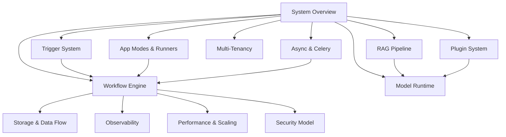

This directory contains deep-dive architecture documentation for the Pulse platform.
Pulse is an open-source LLM application platform designed for
production deployment with enhanced workflow, RAG, and trigger capabilities.

## Architecture Overview

## Document Index

| # | Document | Summary |
|---|----------|---------|
| 01 | [System Overview](/docs/architecture/system-overview) | Full system topology, request lifecycle, network architecture, service map |
| 02 | [Workflow Engine](/docs/architecture/workflow-engine) | Queue-based DAG executor, node types, VariablePool, error strategies, layers |
| 03 | [RAG Pipeline](/docs/architecture/rag-pipeline) | Extract-Chunk-Embed-Index-Retrieve-Rerank pipeline, vector store abstraction |
| 04 | [Model Runtime](/docs/architecture/model-runtime) | Three-layer model architecture, 6 model types, plugin-based loading |
| 05 | [Plugin System](/docs/architecture/plugin-system) | Plugin daemon, manifest, communication protocol, extension types |
| 06 | [Trigger System](/docs/architecture/trigger-system) | Webhook/schedule/plugin triggers, subscriptions, debug event bus |
| 07 | [Multi-Tenancy](/docs/architecture/multi-tenancy) | Tenant model, role hierarchy, data isolation, per-tenant encryption |
| 08 | [App Modes and Runners](/docs/architecture/app-modes-and-runners) | 7 app modes, generators, runners, task pipelines |
| 09 | [Async and Celery](/docs/architecture/async-and-celery) | Queue topology, routing, idempotency, worker scaling, Beat scheduler |

## Reading Order

For engineers new to the codebase, we recommend:

1. **Start with 01-System Overview** to understand how all components fit together.
2. **Read 02-Workflow Engine** next -- this is the most complex subsystem and the
   core differentiator of the platform.
3. **Then read 07-Multi-Tenancy** to understand the data isolation model that
   pervades every layer.
4. Read the remaining documents in any order based on your area of interest.

## Conventions Used

- **Code snippets** reference actual file paths relative to the repository root
  (e.g., `api/core/workflow/graph_engine/graph_engine.py`).
- **Mermaid diagrams** illustrate system topology, data flow, and state machines.
- **Class signatures** show the real constructor parameters from the source code.
- Cross-references link to related architecture documents and ADRs in
  `docs/pulse/architecture/14-design-decisions/`.

## Prerequisites

Before diving in, ensure you are comfortable with:

- Python 3.12+ type hints, Pydantic v2 models, SQLAlchemy 2.0 mapped columns
- Flask application factories, Blueprint registration, extension patterns
- Next.js App Router, React Server Components, TypeScript strict mode
- Redis data structures (strings, sets, sorted sets, Lua scripting)
- PostgreSQL schemas, Alembic migrations, connection pooling
- Celery task routing, worker concurrency models, Beat scheduling
- Docker Compose networking, multi-container orchestration

## Related Documentation

- `api/AGENTS.md` -- Backend development workflow
- `web/` -- Frontend codebase (Next.js 15)
- `docker/` -- Deployment configurations
- `api/docs/` -- API-specific documentation (tenant model, Weaviate, etc.)
