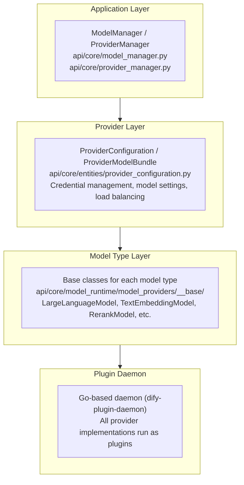
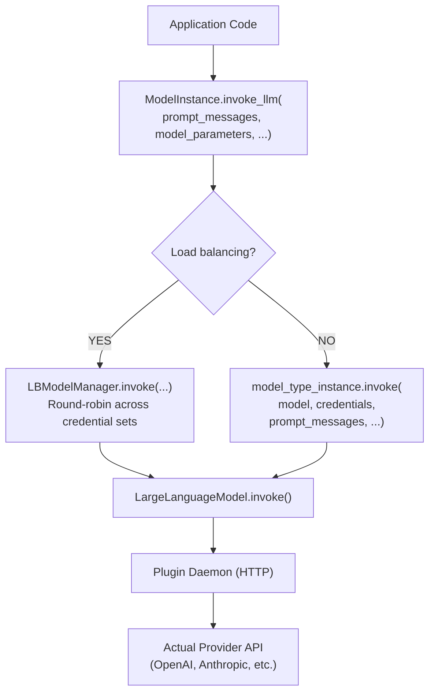
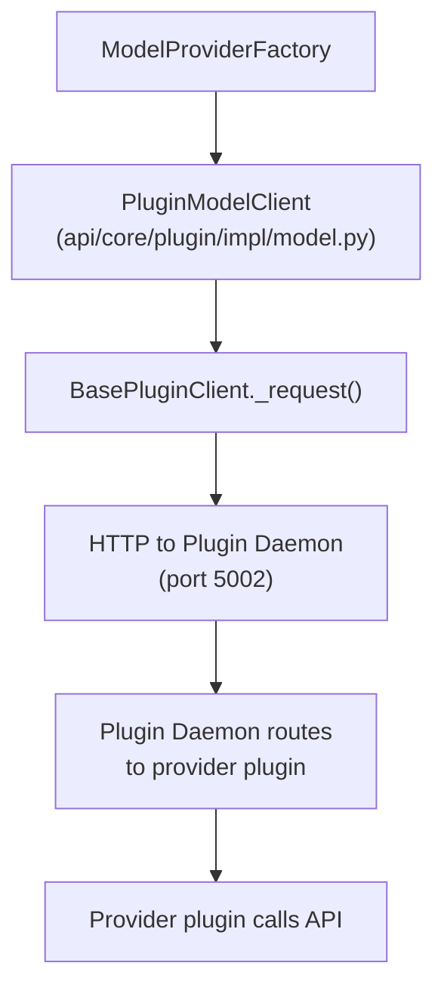
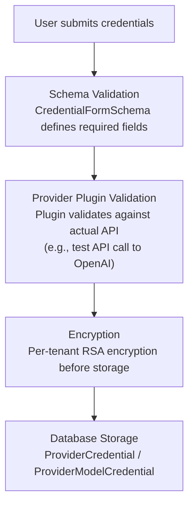

The model runtime provides a unified abstraction over all AI model providers,
handling 6 model types through a plugin-based architecture with credential
validation, streaming support, and load balancing.

## Three-Layer Architecture



## Six Model Types

Defined in `api/core/model_runtime/entities/model_entities.py`:

```python
class ModelType(StrEnum):
    LLM = auto()                    # Large language models
    TEXT_EMBEDDING = "text-embedding"  # Text embedding models
    RERANK = auto()                 # Reranking models
    SPEECH2TEXT = auto()            # Speech-to-text models
    MODERATION = auto()            # Content moderation models
    TTS = auto()                    # Text-to-speech models
```

### Model Type Base Classes

Each model type has a base class in
`api/core/model_runtime/model_providers/__base/`:

| Model Type     | Base Class           | Key Methods                      |
| -------------- | -------------------- | -------------------------------- |
| LLM            | `LargeLanguageModel` | `invoke()`, `get_num_tokens()`   |
| TEXT_EMBEDDING | `TextEmbeddingModel` | `invoke()`, `get_model_schema()` |
| RERANK         | `RerankModel`        | `invoke()`                       |
| SPEECH2TEXT    | `Speech2TextModel`   | `invoke()`                       |
| TTS            | `TTSModel`           | `invoke()`                       |
| MODERATION     | `ModerationModel`    | `invoke()`                       |

## ModelInstance

The `ModelInstance` class (`api/core/model_manager.py`) is the primary
interface for invoking models:

```python
class ModelInstance:
    def __init__(self, provider_model_bundle: ProviderModelBundle, model: str):
        self.provider_model_bundle = provider_model_bundle
        self.model = model
        self.provider = provider_model_bundle.configuration.provider.provider
        self.credentials = self._fetch_credentials_from_bundle(
            provider_model_bundle, model
        )
        self.model_type_instance = self.provider_model_bundle.model_type_instance
        self.load_balancing_manager = self._get_load_balancing_manager(...)
```

### Invocation Flow



## ProviderManager

The `ProviderManager` (`api/core/provider_manager.py`) manages model provider
configurations per tenant:

```python
class ProviderManager:
    def get_configurations(self, tenant_id: str) -> ProviderConfigurations:
        """
        Get model provider configurations for a tenant.

        Constructs ProviderConfiguration objects including:
        1. Basic provider information
        2. Hosting configuration (quotas, enabled status)
        3. Custom configuration (user-added API keys)
        4. Model settings (load balancing, enabled/disabled models)
        """
```

### Provider Configuration Hierarchy

```
ProviderConfigurations (per tenant)
    |
    +-- ProviderConfiguration[]
            |
            +-- provider: ProviderEntity           # Provider metadata
            +-- using_provider_type: ProviderType   # SYSTEM or CUSTOM
            +-- system_configuration: SystemConfiguration
            |       +-- enabled: bool
            |       +-- quota_configurations: list[QuotaConfiguration]
            |       +-- current_quota_type: ProviderQuotaType
            |       +-- credentials: dict
            +-- custom_configuration: CustomConfiguration
            |       +-- provider: CustomProviderConfiguration
            |       +-- models: list[CustomModelConfiguration]
            +-- model_settings: list[ModelSettings]
                    +-- model: str
                    +-- model_type: ModelType
                    +-- enabled: bool
                    +-- load_balancing_configs: list[...]
```

## Plugin-Based Loading

All model providers are loaded through the plugin system. The
`ModelProviderFactory` communicates with the Plugin Daemon:



### Model Provider Factory

```python
# api/core/model_runtime/model_providers/model_provider_factory.py
class ModelProviderFactory:
    """Factory for creating model provider instances from plugins."""
```

## Credential Validation

Credentials are validated at multiple levels:



### Credential Form Schema

```python
class CredentialFormSchema(BaseModel):
    variable: str           # Field name
    label: I18nObject       # Localized label
    type: FormType          # text_input, secret_input, select, etc.
    required: bool
    default: str | None
    options: list[...]      # For select fields
    placeholder: I18nObject | None
```

## Streaming Support

LLM invocations support streaming via generators:

```python
# Streaming invocation returns a Generator
def invoke_llm(
    self,
    prompt_messages: list[PromptMessage],
    stream: bool = True,
    ...
) -> Generator[LLMResultChunk, None, None] | LLMResult:
```

### LLM Result Types

```python
class LLMResult:
    model: str
    message: AssistantPromptMessage
    usage: LLMUsage
    system_fingerprint: str | None

class LLMResultChunk:
    model: str
    delta: LLMResultChunkDelta
    system_fingerprint: str | None
```

### Tool Call Buffering

When streaming with tool calls, chunks arrive incrementally. The runtime
buffers and merges tool call fragments:

```
Chunk 1: delta.tool_calls = [{index: 0, id: "call_1", function: {name: "search"}}]
Chunk 2: delta.tool_calls = [{index: 0, function: {arguments: '{"q'}}]
Chunk 3: delta.tool_calls = [{index: 0, function: {arguments: 'uery": "hello"}'}}]

Merged: tool_calls = [{id: "call_1", function: {name: "search",
                       arguments: '{"query": "hello"}'}}]
```

## Load Balancing

When multiple credential sets are configured for a provider, the
`LBModelManager` distributes requests:

```python
class LBModelManager:
    def __init__(
        self,
        tenant_id: str,
        provider: str,
        model_type: ModelType,
        model: str,
        load_balancing_configs: list[ModelLoadBalancingConfiguration],
        managed_credentials: dict | None,
    ):
```

Load balancing uses round-robin selection across credential sets, with
automatic failover on rate limit or connection errors.

## Error Mapping

Plugin daemon errors are mapped to domain-specific exceptions:

```python
# api/core/model_runtime/errors/invoke.py
InvokeConnectionError      # Network connectivity issues
InvokeServerUnavailableError  # Provider API down
InvokeRateLimitError       # Rate limit exceeded
InvokeAuthorizationError   # Invalid credentials
InvokeBadRequestError      # Malformed request
```

## Model Features

Models declare their capabilities via feature flags:

```python
class ModelFeature(StrEnum):
    TOOL_CALL = "tool-call"
    MULTI_TOOL_CALL = "multi-tool-call"
    AGENT_THOUGHT = "agent-thought"
    VISION = auto()
    STREAM_TOOL_CALL = "stream-tool-call"
    DOCUMENT = auto()
    VIDEO = auto()
    AUDIO = auto()
    STRUCTURED_OUTPUT = "structured-output"
```

These features determine which capabilities the workflow engine and agent
system can leverage for each model.

## Cross-References

- [03-RAG Pipeline](/docs/architecture/rag-pipeline) -- Embedding and rerank model usage
- [05-Plugin System](/docs/architecture/plugin-system) -- Plugin daemon architecture
- [07-Multi-Tenancy](/docs/architecture/multi-tenancy) -- Per-tenant credential encryption
