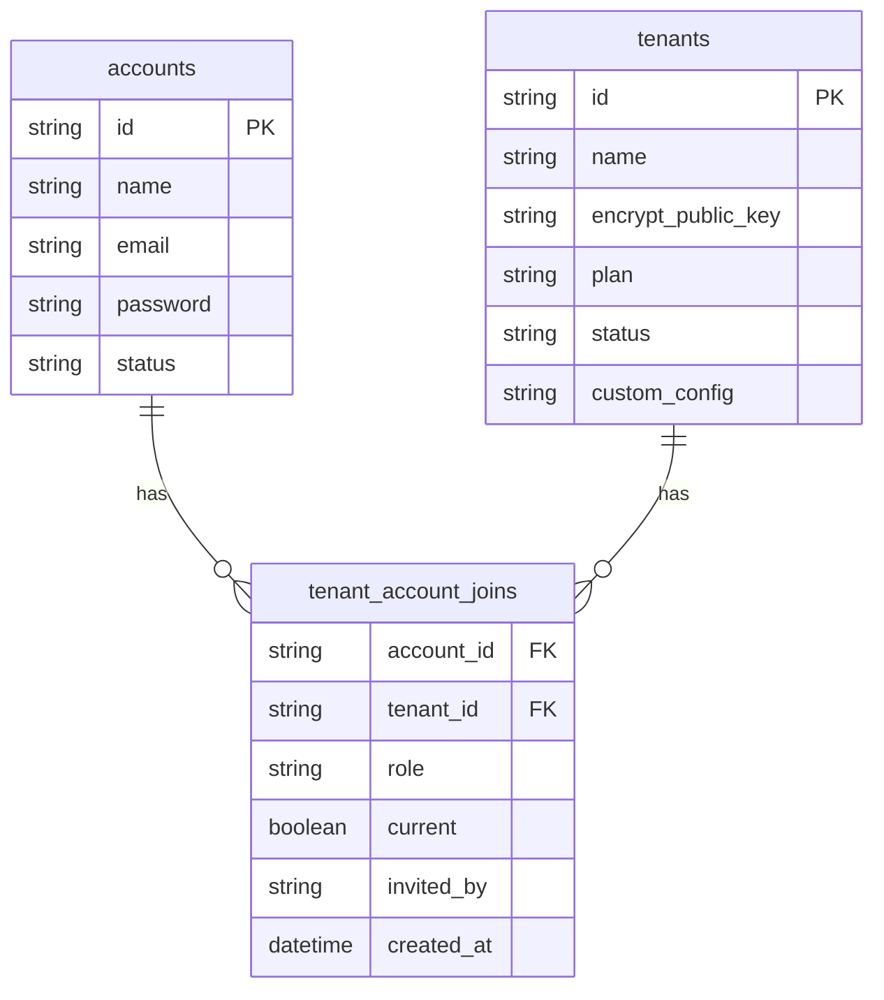
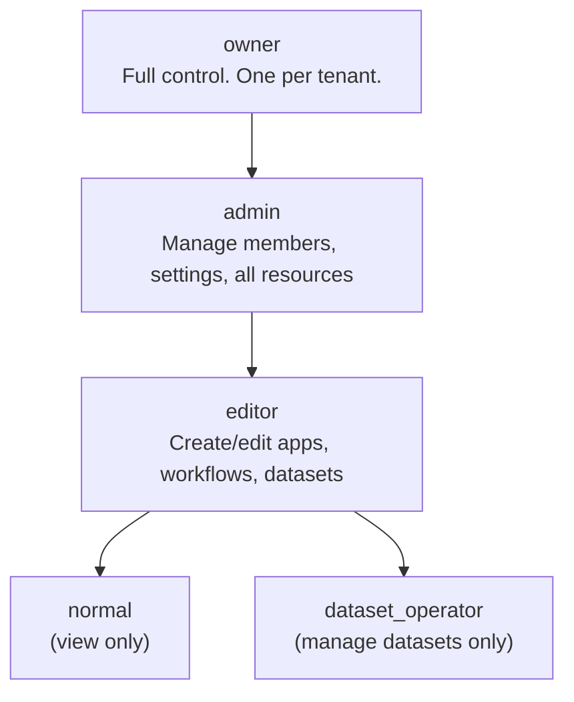
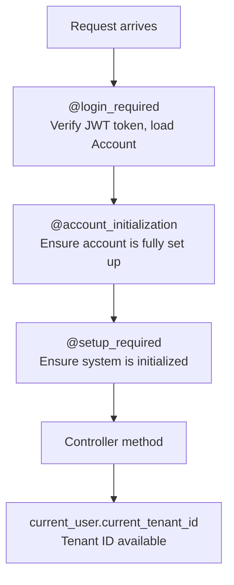
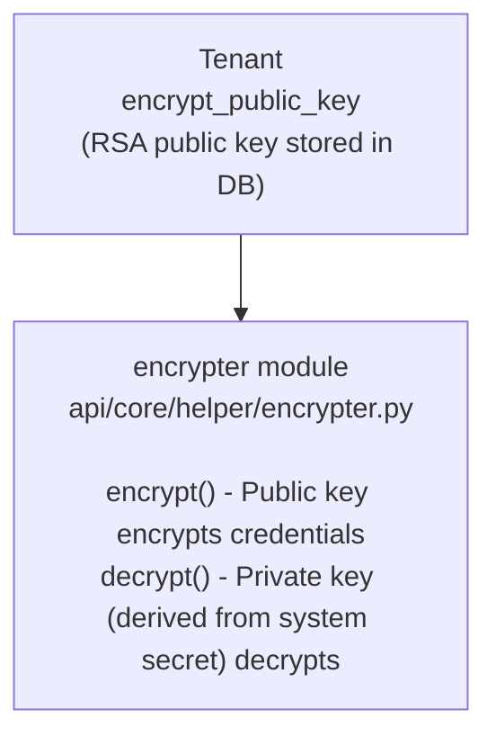
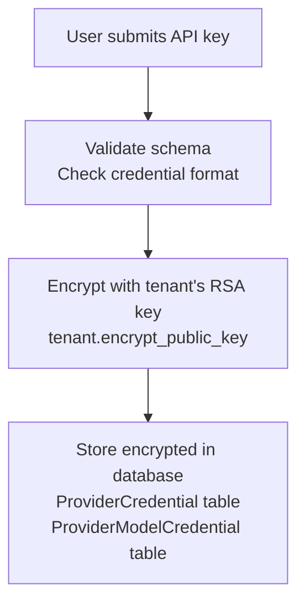
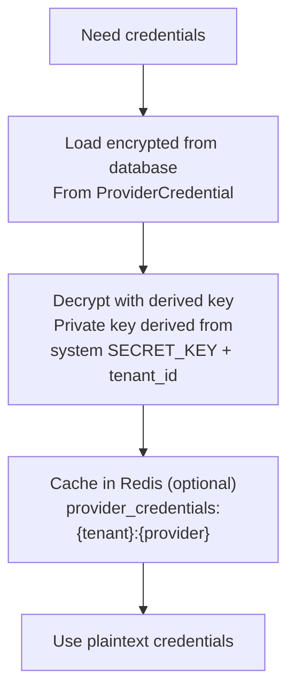

Pulse implements a shared-database, shared-schema multi-tenancy model where
every data table includes a `tenant_id` column. Tenants (called "workspaces"
in the UI) provide complete data isolation while sharing infrastructure.

## Tenant Model

### Core Tables



### Tenant SQLAlchemy Model

```python
# api/models/account.py
class Tenant(TypeBase):
    __tablename__ = "tenants"

    id: Mapped[str] = mapped_column(StringUUID, ...)
    name: Mapped[str] = mapped_column(String(255))
    encrypt_public_key: Mapped[str | None] = mapped_column(LongText)
    plan: Mapped[str] = mapped_column(String(255), default="basic")
    status: Mapped[str] = mapped_column(String(255), default="normal")
    custom_config: Mapped[str | None] = mapped_column(LongText)
    created_at: Mapped[datetime]
    updated_at: Mapped[datetime]
```

### TenantAccountJoin

The join table manages the many-to-many relationship with role information:

```python
class TenantAccountJoin(TypeBase):
    __tablename__ = "tenant_account_joins"

    id: Mapped[str]
    tenant_id: Mapped[str]    # FK to tenants.id
    account_id: Mapped[str]   # FK to accounts.id
    role: Mapped[str]         # owner, admin, editor, normal, dataset_operator
    current: Mapped[bool]     # Is this the user's active workspace?
    invited_by: Mapped[str | None]
    created_at: Mapped[datetime]
    updated_at: Mapped[datetime]
```

## Role Hierarchy



### Role Permission Matrix

```python
# api/models/account.py
class TenantAccountRole(enum.StrEnum):
    OWNER = "owner"
    ADMIN = "admin"
    EDITOR = "editor"
    NORMAL = "normal"
    DATASET_OPERATOR = "dataset_operator"

    @staticmethod
    def is_privileged_role(role) -> bool:
        return role in {TenantAccountRole.OWNER, TenantAccountRole.ADMIN}

    @staticmethod
    def is_editing_role(role) -> bool:
        return role in {OWNER, ADMIN, EDITOR}

    @staticmethod
    def is_dataset_edit_role(role) -> bool:
        return role in {OWNER, ADMIN, EDITOR, DATASET_OPERATOR}
```

## Data Isolation

### tenant_id on Every Table

Every data table that stores tenant-specific data includes a `tenant_id`
column. Examples:

```
apps.tenant_id
workflows.tenant_id
datasets.tenant_id
conversations.tenant_id
providers.tenant_id
trigger_nodes.tenant_id
workflow_runs.tenant_id
...
```

### Query Filtering

All database queries include tenant_id filtering:

```python
# Typical query pattern
apps = db.session.query(App).filter(
    App.tenant_id == current_user.current_tenant_id,
    App.id == app_id,
).first()
```

### Current Tenant Resolution

The current tenant is resolved from the authenticated user's session:

```python
# api/models/account.py
class Account(UserMixin, TypeBase):
    _current_tenant: "Tenant | None" = field(default=None, init=False)

    @current_tenant.setter
    def current_tenant(self, tenant: "Tenant"):
        # Load TenantAccountJoin to verify membership
        # Set self.role from join record
        # Set self._current_tenant

    @property
    def current_tenant_id(self) -> str | None:
        return self._current_tenant.id if self._current_tenant else None

    def set_tenant_id(self, tenant_id: str):
        # Query Tenant + TenantAccountJoin
        # Validate membership
        # Set role and current_tenant
```

## Controller Decorators

API endpoints enforce tenant context through decorators:

```python
# Typical controller pattern
class AppResource(Resource):
    @login_required
    @account_initialization_required
    def get(self, app_id):
        tenant_id = current_user.current_tenant_id
        # All queries scoped to tenant_id
```

### Decorator Chain



## Per-Tenant Encryption

Each tenant has an RSA key pair for encrypting sensitive data (API keys,
model credentials):



### Encryption Flow



### Decryption Flow



## Redis Namespacing

Redis keys are namespaced by tenant_id to prevent cross-tenant data leakage:

```
provider_credentials:{tenant_id}:{provider}
trigger_debug_inbox:{tenant_id}:{address_id}
trigger_debug_waiting_pool:{tenant_id}:{...}
rate_limit:{tenant_id}:{endpoint}
```

## Storage Isolation

File storage (S3/local/Azure) uses tenant-scoped paths:

```
{storage_root}/
  {tenant_id}/
    upload_files/
      {file_id}
    knowledge/
      {dataset_id}/
        {document_id}/
          ...
```

## Plugin Tenant Scoping

Plugins operate at two scopes:

| Scope | Constant | Behavior |
|-------|----------|----------|
| **Global** | `GLOBAL_TENANT_ID` | Available to all tenants |
| **Tenant** | specific `tenant_id` | Only for installing tenant |

When a plugin is fetched, the system checks both the tenant's plugins and
global plugins, with tenant-specific plugins taking precedence.

## Creating Tenants

Tenants can be created via:

1. **CLI Command** (recommended for production):
   ```bash
   uv run --project api flask create-tenant --name "My Workspace" --email admin@example.com
   ```

2. **User Registration**: First user creates a default tenant automatically.

3. **API**: Admin endpoints for workspace management.

## Cross-References

- [01-System Overview](/docs/architecture/system-overview) -- System context
- [04-Model Runtime](/docs/architecture/model-runtime) -- Per-tenant credential encryption
- [05-Plugin System](/docs/architecture/plugin-system) -- Per-tenant plugin scoping
