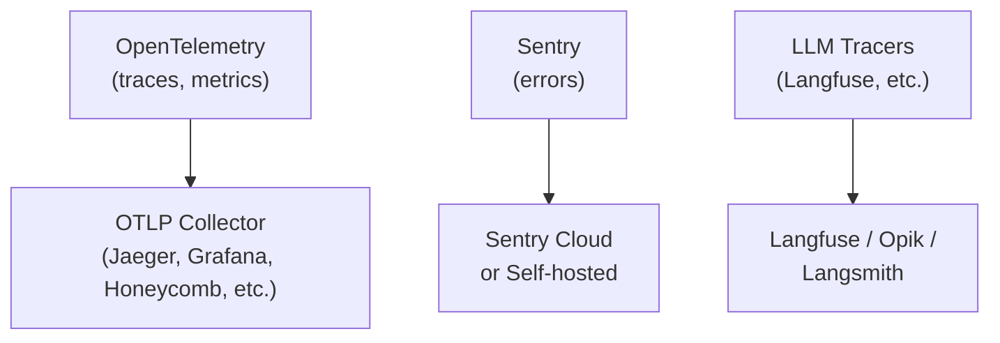
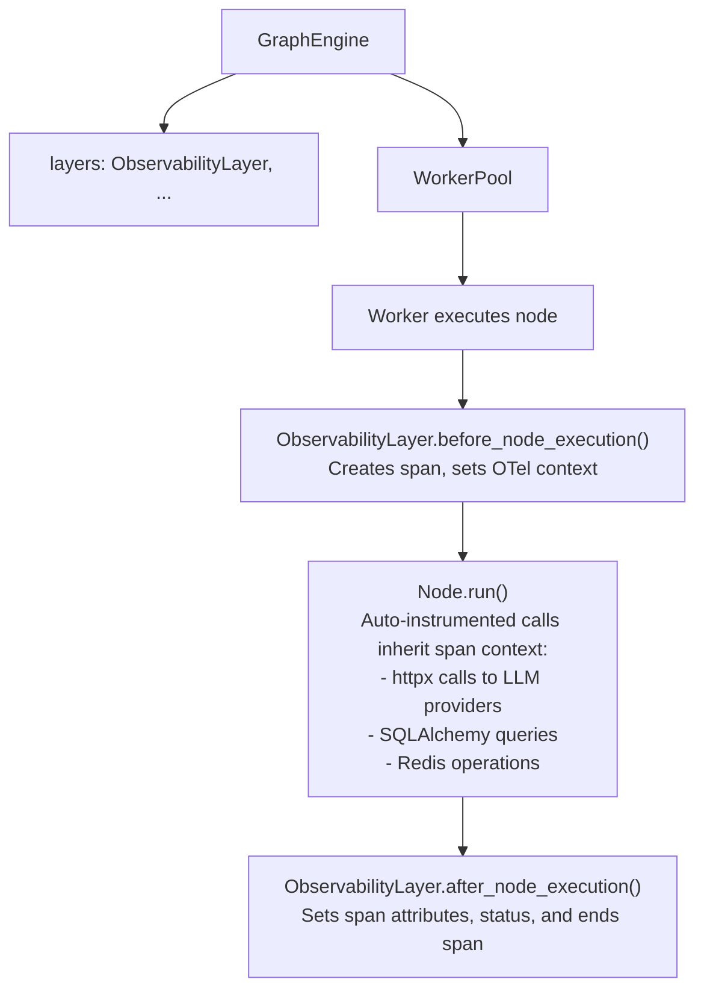
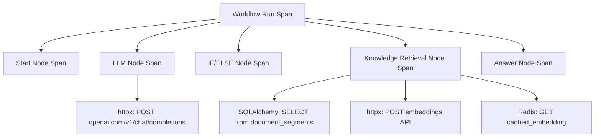
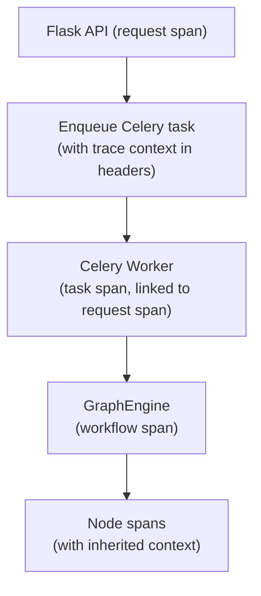

This document covers the observability stack in Pulse: OpenTelemetry
instrumentation, structured logging, the ObservabilityLayer in the graph
engine, metrics collection, distributed tracing, and LLM-specific
observability integrations.

---

## Table of Contents

1. [Overview](#overview)
2. [OpenTelemetry Setup](#opentelemetry-setup)
3. [Instrumentation](#instrumentation)
4. [ObservabilityLayer in Graph Engine](#observabilitylayer-in-graph-engine)
5. [Metrics](#metrics)
6. [Tracing Propagation](#tracing-propagation)
7. [Structured Logging](#structured-logging)
8. [LLM Observability Integrations](#llm-observability-integrations)
9. [Error Tracking with Sentry](#error-tracking-with-sentry)
10. [Logging Conventions](#logging-conventions)

---

## Overview

Pulse uses a layered observability approach:



| Signal   | Technology        | Purpose                              |
|----------|-------------------|--------------------------------------|
| Traces   | OpenTelemetry     | Request-level distributed tracing    |
| Metrics  | OpenTelemetry     | HTTP counters, system health         |
| Errors   | Sentry            | Exception tracking and alerting      |
| Logs     | Python `logging`  | Structured event logging             |
| LLM Ops  | Langfuse/Langsmith/Opik | LLM call tracing, cost tracking |

---

## OpenTelemetry Setup

### Configuration

All OTEL settings are defined in `api/configs/observability/otel/otel_config.py`:

```python
class OTelConfig(BaseSettings):
    ENABLE_OTEL: bool = Field(default=False)
    OTLP_TRACE_ENDPOINT: str = Field(default="")
    OTLP_METRIC_ENDPOINT: str = Field(default="")
    OTLP_BASE_ENDPOINT: str = Field(default="http://localhost:4318")
    OTLP_API_KEY: str = Field(default="")
    OTEL_EXPORTER_TYPE: str = Field(default="otlp")
    OTEL_EXPORTER_OTLP_PROTOCOL: str = Field(default="http")
    OTEL_SAMPLING_RATE: float = Field(default=0.1)
    OTEL_BATCH_EXPORT_SCHEDULE_DELAY: int = Field(default=5000)
    OTEL_MAX_QUEUE_SIZE: int = Field(default=2048)
    OTEL_MAX_EXPORT_BATCH_SIZE: int = Field(default=512)
    OTEL_METRIC_EXPORT_INTERVAL: int = Field(default=60000)
    OTEL_BATCH_EXPORT_TIMEOUT: int = Field(default=10000)
    OTEL_METRIC_EXPORT_TIMEOUT: int = Field(default=30000)
```

### Enabling OTEL

Set `ENABLE_OTEL=true` and configure the endpoint:

```bash
ENABLE_OTEL=true
OTLP_BASE_ENDPOINT=http://otel-collector:4318
OTEL_SAMPLING_RATE=0.1  # Sample 10% of traces in production
```

### Exporter Support

| Protocol | Value | Endpoint Format |
|----------|-------|-----------------|
| HTTP/protobuf | `http` | `http://host:4318/v1/traces` |
| gRPC | `grpc` | `host:4317` |

---

## Instrumentation

Pulse instruments five core libraries automatically via the OTEL SDK.
Instrumentation is configured in `api/extensions/otel/instrumentation.py`.

### Auto-Instrumented Libraries

| Library | Instrumentor | What It Captures |
|---------|-------------|------------------|
| Flask | `FlaskInstrumentor` | HTTP request spans, status codes, routes |
| Celery | `CeleryInstrumentor` | Task execution spans, queue/task names |
| SQLAlchemy | `SQLAlchemyInstrumentor` | Database query spans, SQL statements |
| httpx | `HTTPXClientInstrumentor` | Outbound HTTP calls (to LLM providers) |
| Redis | `RedisInstrumentor` | Redis command spans |

### Flask Response Hook

A custom response hook creates HTTP metrics counters:

```python
# api/extensions/otel/instrumentation.py
meter = get_meter("http_metrics", version=dify_config.project.version)
_http_response_counter = meter.create_counter(
    "http.server.response.count",
    description="Total HTTP responses by status code, method and target",
    unit="{response}",
)
```

### Exception Logging Handler

The `ExceptionLoggingHandler` bridges Python's logging to OpenTelemetry
spans. When an exception is logged, it:

1. Gets the current active span
2. Sets the span status to ERROR
3. Adds a `log.exception` event with file path and line number
4. Records the exception on the span

```python
# api/extensions/otel/instrumentation.py
class ExceptionLoggingHandler(logging.Handler):
    def emit(self, record: logging.LogRecord):
        span = get_current_span()
        if span and span.is_recording():
            span.set_status(StatusCode.ERROR, record.getMessage())
            span.record_exception(record.exc_info[1])
```

---

## ObservabilityLayer in Graph Engine

The `ObservabilityLayer` (`api/core/workflow/graph_engine/layers/observability.py`)
is a `GraphEngineLayer` plugin that creates OpenTelemetry spans for each
node execution within a workflow run.

### Architecture



### How It Works

1. **Initialization**: Checks if OTEL is enabled; if not, disables itself
   (zero overhead when OTEL is off)
2. **before_node_execution**: Creates a new span named after the node type,
   attaches it to the current context using `set_span_in_context`
3. **Node execution**: All auto-instrumented library calls (httpx, SQLAlchemy,
   Redis) automatically become child spans of the node span
4. **after_node_execution**: Sets complete attributes (inputs, outputs,
   duration, errors) and ends the span

### Node-Specific Parsers

Different node types export different attributes. A parser registry maps
node types to specialized OTEL attribute parsers:

```python
# Parser registry
self._parsers = {
    NodeType.TOOL: ToolNodeOTelParser(),
    # ... other node types use DefaultNodeOTelParser
}
```

### Resulting Trace Structure



---

## Metrics

### HTTP Metrics

The Flask instrumentor creates the following counter:

| Metric | Type | Labels |
|--------|------|--------|
| `http.server.response.count` | Counter | `status_code`, `method`, `target` |

### Custom Metrics Guidelines

When adding new metrics, follow the OpenTelemetry semantic conventions:

```python
from opentelemetry.metrics import get_meter

meter = get_meter("pulse.custom_metrics")

# Counters for events
request_counter = meter.create_counter(
    "pulse.requests.total",
    description="Total requests processed",
)

# Histograms for latencies
latency_histogram = meter.create_histogram(
    "pulse.node.duration",
    description="Node execution duration in seconds",
    unit="s",
)
```

### Metric Export

Metrics are exported at configurable intervals:

- `OTEL_METRIC_EXPORT_INTERVAL`: 60000ms (1 minute) default
- `OTEL_METRIC_EXPORT_TIMEOUT`: 30000ms default

---

## Tracing Propagation

### Request-to-Worker Context

When a workflow is triggered by an HTTP request and executed by a Celery
worker, trace context must propagate across the process boundary:



### Thread Context in Graph Engine

The graph engine captures the execution context before spawning worker
threads:

```python
# api/core/workflow/graph_engine/graph_engine.py
execution_context = capture_current_context()

self._worker_pool = WorkerPool(
    execution_context=execution_context,
    ...
)
```

Each worker thread restores this context, ensuring that node spans are
correctly parented to the workflow span even though they execute on
different threads.

---

## Structured Logging

### Logger Configuration

Pulse uses Python's standard `logging` module with named loggers:

```python
logger = logging.getLogger(__name__)
```

### Log Levels

| Level | When to Use |
|-------|-------------|
| `ERROR` | Unrecoverable failures, exceptions caught at boundaries |
| `WARNING` | Degraded but functional, retries, fallbacks triggered |
| `INFO` | Significant state transitions (workflow started, completed) |
| `DEBUG` | Detailed internal state (variable pool contents, node inputs) |

### Correlation with Traces

When OTEL is enabled, log records are automatically correlated with trace
and span IDs through the `ExceptionLoggingHandler`. This allows log
aggregation tools to link logs to specific traces.

---

## LLM Observability Integrations

Pulse supports multiple LLM observability platforms for tracking model
calls, costs, and quality:

| Platform | Purpose | Configuration |
|----------|---------|---------------|
| Langfuse | LLM tracing, prompt management, cost tracking | `LANGFUSE_*` env vars |
| Langsmith | LLM tracing, evaluation, datasets | `LANGSMITH_*` env vars |
| Opik | LLM tracing, experiment tracking | `OPIK_*` env vars |

These integrations provide:

- **Call-level tracing**: Input/output for each LLM call
- **Cost tracking**: Token counts and estimated costs per call
- **Latency breakdowns**: Time-to-first-token, total generation time
- **Prompt versioning**: Track which prompts produce which outputs
- **Quality evaluation**: Score outputs against criteria

---

## Error Tracking with Sentry

Sentry captures unhandled exceptions and provides:

- **Stack traces** with local variable context
- **Release tracking** to correlate errors with deployments
- **Performance monitoring** for transaction-level timing
- **Alerting** on new or regressed error patterns

Sentry is configured through standard `SENTRY_DSN` environment variables.

---

## Logging Conventions

### Do

- Use named loggers: `logger = logging.getLogger(__name__)`
- Include structured context: `logger.error("Node failed", extra={"node_id": node.id})`
- Log at appropriate levels (see table above)
- Use lazy formatting: `logger.debug("Processing %s", item_id)` (not f-strings)

### Do Not

- Log sensitive data (API keys, user content, credentials)
- Use `print()` statements (they bypass the logging framework)
- Log at `INFO` level in tight loops (use `DEBUG`)
- Catch and re-raise exceptions without logging: `except Exception: raise`
  should be `except Exception: logger.exception("..."); raise`

---

## Cross-References

- [10 Storage and Data Flow](/docs/architecture/storage-and-data-flow) -- what gets traced
  at each storage layer
- [11 Performance and Scaling](/docs/architecture/performance-and-scaling) -- metrics for
  scaling decisions
- [13 Security Model](/docs/architecture/security-model) -- what NOT to log (secrets,
  credentials)
