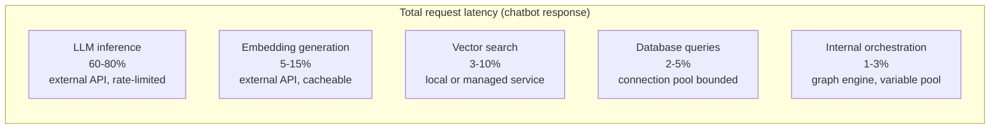
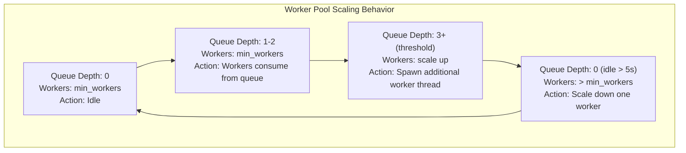
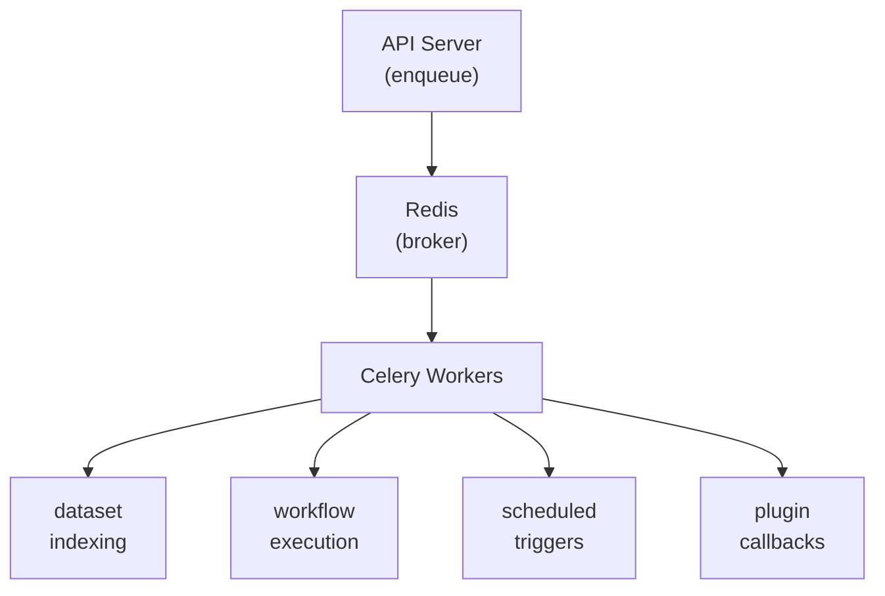
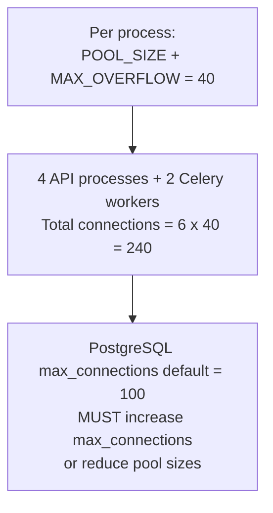
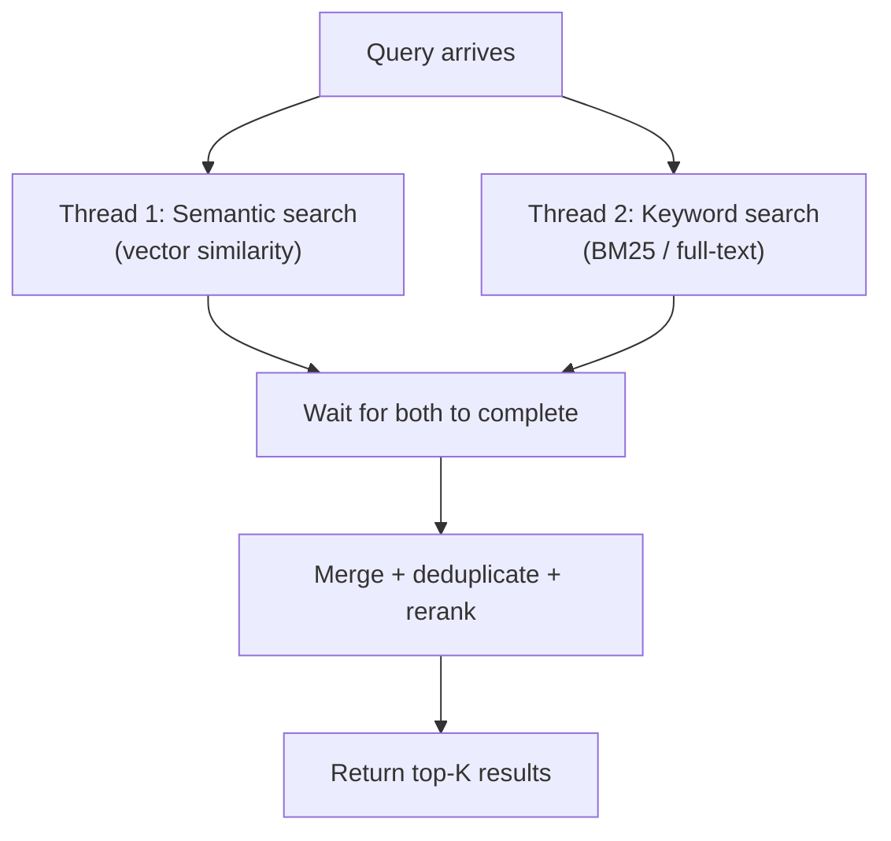
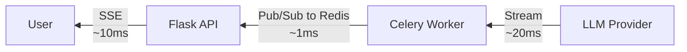
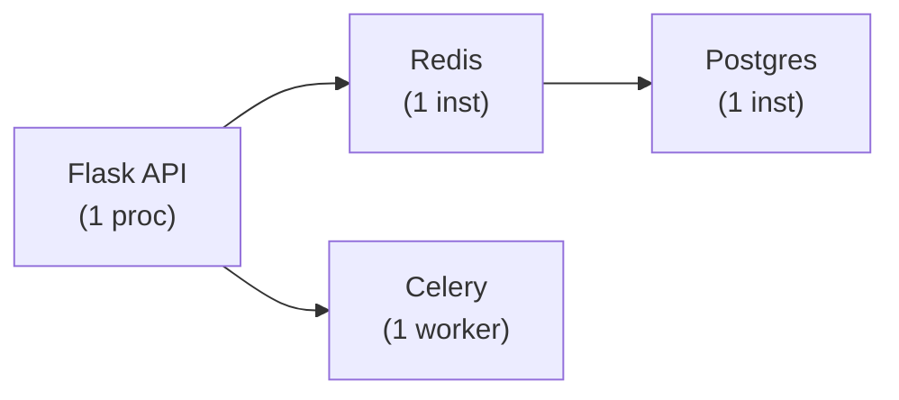
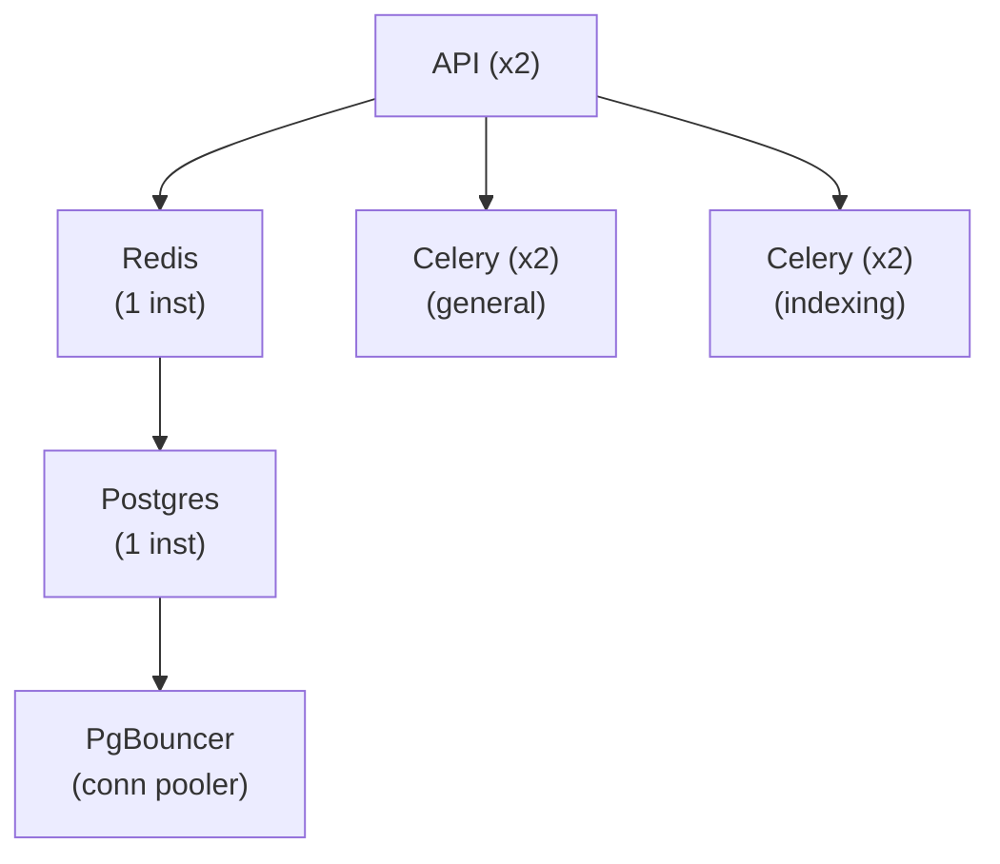
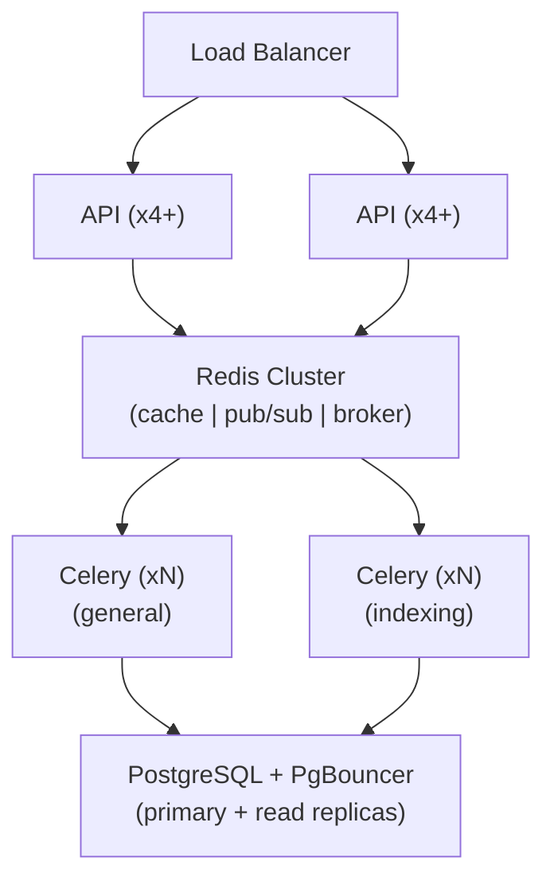

This document analyzes the performance characteristics of Pulse, identifies
primary bottlenecks, and describes the scaling mechanisms available at each
layer.

---

## Table of Contents

1. [Bottleneck Analysis](#bottleneck-analysis)
2. [Graph Engine Worker Pool](#graph-engine-worker-pool)
3. [Celery Worker Scaling](#celery-worker-scaling)
4. [Database Connection Pooling](#database-connection-pooling)
5. [Redis Memory and Throughput](#redis-memory-and-throughput)
6. [Caching Strategies](#caching-strategies)
7. [Vector Search Performance](#vector-search-performance)
8. [Streaming and Response Latency](#streaming-and-response-latency)
9. [Scaling Topology](#scaling-topology)

---

## Bottleneck Analysis

In a typical Pulse deployment, latency breaks down as follows:



**Key insight**: The dominant bottleneck is external LLM API latency. Internal
optimizations matter most when they reduce redundant external calls (caching
embeddings, batching requests) or enable concurrent execution of independent
operations (parallel node execution, hybrid retrieval).

### LLM Latency

- **Time to first token**: 200ms to 2s depending on provider and model
- **Token generation**: 20-100 tokens/sec depending on model
- **Mitigation**: Streaming SSE pushes tokens to the user as they arrive,
  reducing perceived latency even when total generation takes seconds

### Embedding Latency

- **Per-call**: 50-500ms depending on provider and batch size
- **Mitigation**: `CacheEmbedding` hashes input text and checks the PostgreSQL
  `embeddings` table before calling the model provider. Repeated documents
  incur zero embedding cost after the first indexing.

### Vector Search Latency

- **Per-query**: 10-100ms depending on index size and backend
- **Mitigation**: Parallel hybrid retrieval, result caching, appropriate index
  configuration (HNSW parameters, segment merging)

---

## Graph Engine Worker Pool

The graph engine uses a dynamic thread pool to execute workflow nodes in
parallel. This is critical for workflows with branching paths where
independent nodes can run concurrently.

### Configuration

Settings are defined in `api/configs/feature/__init__.py`:

```python
GRAPH_ENGINE_MIN_WORKERS: PositiveInt = Field(
    description="Minimum number of workers per GraphEngine instance",
    default=1,
)
GRAPH_ENGINE_MAX_WORKERS: PositiveInt = Field(
    description="Maximum number of workers per GraphEngine instance",
    default=10,
)
GRAPH_ENGINE_SCALE_UP_THRESHOLD: PositiveInt = Field(
    description="Queue depth threshold that triggers worker scale up",
    default=3,
)
GRAPH_ENGINE_SCALE_DOWN_IDLE_TIME: float = Field(
    description="Seconds of idle time before scaling down workers",
    default=5.0,
    ge=0.1,
)
```

### Scaling Behavior



The pool implementation (`api/core/workflow/graph_engine/worker_management/worker_pool.py`)
consolidates worker creation, activity tracking, and dynamic scaling into a
single class to minimize lock contention.

### Worker Lifecycle

Each worker thread:

1. Pulls a node from the `ReadyQueue`
2. Restores the execution context (Flask app context, tracing context)
3. Runs the node through registered `GraphEngineLayer` hooks (before/after)
4. Pushes completion events to the `event_queue`
5. Returns to the ready queue or idles

### Tuning Guidelines

| Scenario | Recommended Settings |
|----------|---------------------|
| Simple linear workflows | `min=1, max=2` -- no parallelism needed |
| Branching workflows (3-5 parallel paths) | `min=1, max=5` |
| Complex DAGs (10+ parallel branches) | `min=2, max=10` |
| High-throughput batch processing | `min=3, max=10, threshold=2` |

**Warning**: Each worker holds a thread, and each thread may hold a database
connection. Setting `max_workers` too high relative to `SQLALCHEMY_POOL_SIZE`
can exhaust the connection pool.

---

## Celery Worker Scaling

Celery handles asynchronous tasks: document indexing, workflow execution in
background mode, scheduled triggers, and long-running operations.

### Worker Configuration

```
# Common environment variables
CELERY_WORKER_AMOUNT=1          # Number of worker processes per container
CELERY_WORKER_CLASS=gevent      # Worker pool type (gevent for I/O-bound)
CELERY_MAX_TASKS_PER_CHILD=100  # Restart worker after N tasks (memory leak protection)
```

### Queue Architecture



### Scaling Strategies

| Strategy | When to Use | How |
|----------|------------|-----|
| Horizontal | High task volume | Add more Celery worker containers |
| Vertical | Large document processing | Increase memory per worker |
| Queue-based | Mixed workloads | Separate queues for indexing vs execution |
| Concurrency | I/O-bound tasks | Use gevent pool with higher concurrency |

### Monitoring Queue Depth

Redis queue lengths indicate whether workers are keeping up:

```
# Check queue depth
redis-cli LLEN celery
redis-cli LLEN celery:dataset
```

If queues grow unbounded, add more workers or increase concurrency.

---

## Database Connection Pooling

### Pool Configuration

```python
# api/configs/middleware/__init__.py
SQLALCHEMY_POOL_SIZE = 30       # Persistent connections
SQLALCHEMY_MAX_OVERFLOW = 10    # Temporary overflow connections
SQLALCHEMY_POOL_RECYCLE = 3600  # Recycle connections after 1 hour
SQLALCHEMY_POOL_PRE_PING = True # Validate before checkout
```

### Connection Budget



### Tuning for Deployment Size

| Deployment | POOL_SIZE | MAX_OVERFLOW | Notes |
|-----------|-----------|-------------|-------|
| Development | 5 | 5 | Single process |
| Small (1-10 users) | 10 | 5 | 2 API + 1 worker |
| Medium (10-100 users) | 20 | 10 | 4 API + 2 workers |
| Large (100+ users) | 30 | 10 | Use PgBouncer for pooling |

### Connection Leak Prevention

- Sessions are scoped to Flask request lifecycle and automatically returned
- Celery tasks use `with flask_app.app_context()` to ensure cleanup
- `pool_pre_ping` detects and discards dead connections

---

## Redis Memory and Throughput

### Memory Usage Patterns

| Data Type | Approximate Memory | TTL |
|-----------|-------------------|-----|
| Cached model schemas | 1-10 KB each | Minutes to hours |
| Rate limit counters | Bytes per key | Seconds to minutes |
| Pub/sub channels | Minimal (transient) | Connection lifetime |
| Command channel queues | 100 bytes - 1 KB per command | 3600s |
| Streaming buffers | 1-100 KB per active stream | Session lifetime |

### Memory Optimization

- **Set TTLs aggressively** -- every cached value should have a TTL
- **Use Redis pipelines** -- batch operations reduce round-trips (the
  `RedisChannel` implementation uses pipelines for atomic command operations)
- **Monitor with `INFO memory`** -- track `used_memory` vs `maxmemory`

### Throughput Considerations

- Redis is single-threaded for command processing
- High pub/sub fanout (many concurrent streaming sessions) can saturate
  the event loop
- For very high throughput, consider Redis Cluster or separate Redis
  instances for different roles (cache vs pub/sub vs queue)

---

## Caching Strategies

### Embedding Cache (CacheEmbedding)

The most impactful cache in terms of cost savings:

```python
# api/core/rag/embedding/cached_embedding.py
class CacheEmbedding(Embeddings):
    def embed_documents(self, texts: list[str]) -> list[list[float]]:
        # 1. Hash each text
        # 2. Check PostgreSQL embeddings table
        # 3. Only send uncached texts to model provider
        # 4. Store new embeddings for future lookups
```

**Impact**: When re-indexing documents or processing duplicate content, cache
hit rates can reach 90%+, dramatically reducing embedding API costs.

### Model Schema Cache

Model capabilities (context window, max tokens, supported features) are
cached in Redis to avoid repeated provider API calls.

### Rate Limit Cache

Rate limit counters in Redis use sliding window algorithms. They are
inherently short-lived and self-cleaning via TTL.

### Conversation History Cache

Recent conversation messages may be cached in Redis for fast access during
multi-turn chat sessions, avoiding database round-trips for every turn.

---

## Vector Search Performance

### Index Tuning (Weaviate Example)

| Parameter | Default | Effect |
|-----------|---------|--------|
| `efConstruction` | 128 | Build-time quality (higher = better recall, slower indexing) |
| `maxConnections` | 64 | Graph connectivity (higher = better recall, more memory) |
| `ef` | 100 | Query-time quality (higher = better recall, slower queries) |

### Parallel Hybrid Retrieval

When both semantic and keyword search are enabled, they run in parallel
using `ThreadPoolExecutor` with configurable worker count
(`RETRIEVAL_SERVICE_EXECUTORS`):



This parallelization cuts hybrid retrieval latency roughly in half compared
to sequential execution.

---

## Streaming and Response Latency

### Server-Sent Events (SSE) Architecture

Pulse streams LLM responses to reduce perceived latency:



**Time to first visible token**: Typically 200-500ms after the LLM starts
generating, dominated by the provider's time-to-first-token.

### Reducing Stream Latency

- Use gevent or async workers for the Flask API to handle many concurrent
  SSE connections efficiently
- Keep Redis close to the API server (same datacenter, low network hop)
- Use Redis pub/sub rather than polling for new tokens

---

## Scaling Topology

### Small Deployment (1-10 concurrent users)



### Medium Deployment (10-100 concurrent users)



### Large Deployment (100+ concurrent users)



---

## Cross-References

- [10 Storage and Data Flow](/docs/architecture/storage-and-data-flow) -- storage layer details
- [12 Observability](/docs/architecture/observability) -- monitoring performance metrics
- [ADR-001: Queue-Based Graph Engine](/docs/architecture/design-decisions/queue-based-graph-engine) --
  why parallel execution matters
- [10 Celery & Async](/docs/contributing/celery-and-async) -- worker
  configuration guide
