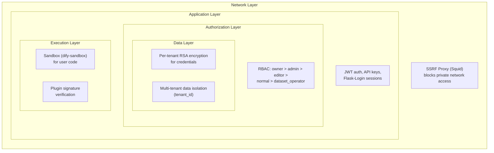
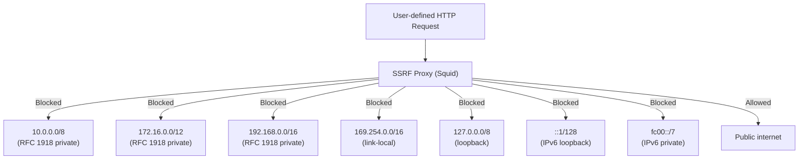
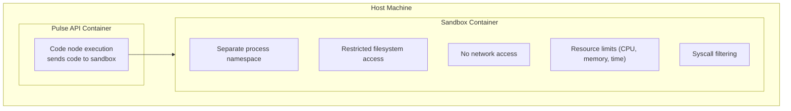
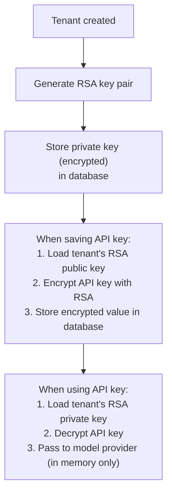
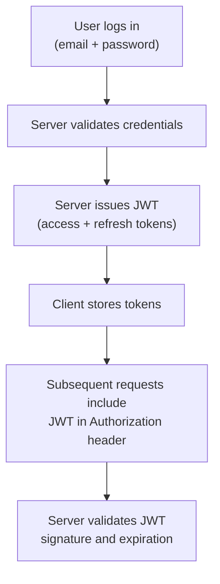
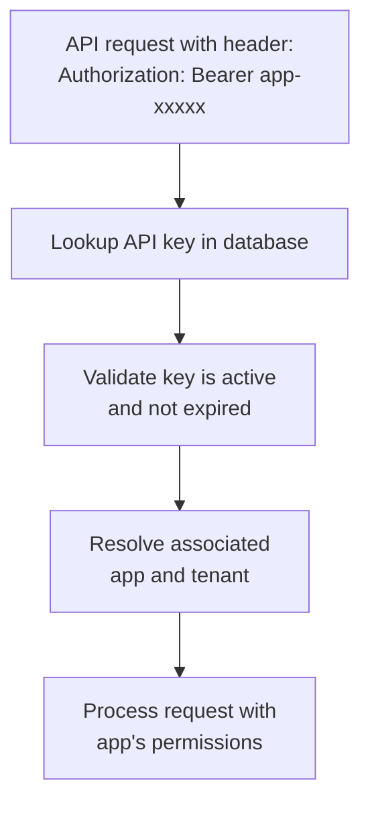
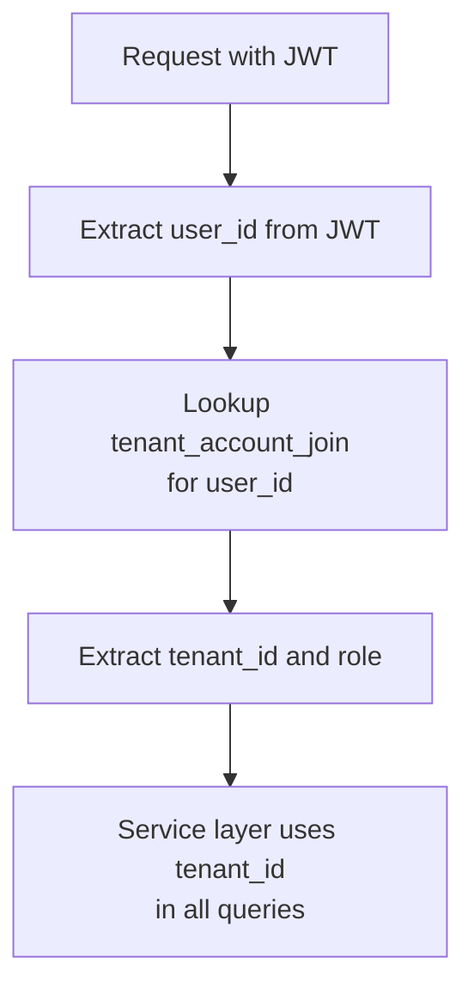
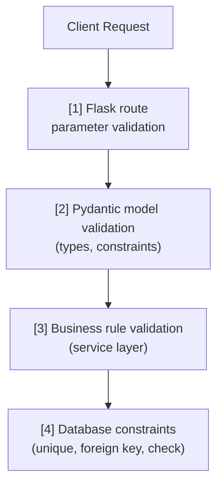
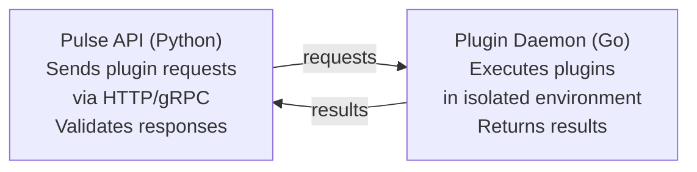
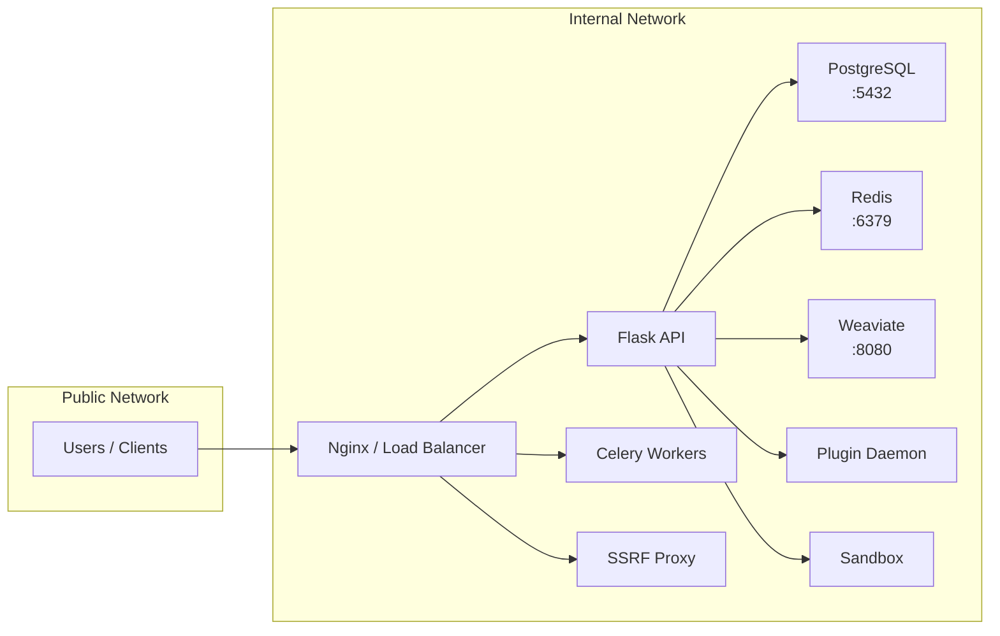

This document covers every security layer in Pulse: network-level protections,
code execution sandboxing, credential management, authentication and
authorization, input validation, and plugin security.

---

## Table of Contents

1. [Security Architecture Overview](#security-architecture-overview)
2. [SSRF Proxy](#ssrf-proxy)
3. [Code Execution Sandbox](#code-execution-sandbox)
4. [Credential Encryption](#credential-encryption)
5. [Authentication](#authentication)
6. [Authorization and RBAC](#authorization-and-rbac)
7. [Input Validation](#input-validation)
8. [Plugin Security](#plugin-security)
9. [Network Security](#network-security)
10. [Security Checklist](#security-checklist)

---

## Security Architecture Overview

Pulse implements defense-in-depth with security controls at every layer:



---

## SSRF Proxy

### What It Protects Against

Server-Side Request Forgery (SSRF) attacks trick the server into making
requests to internal resources. In Pulse, user-defined HTTP Request nodes
and tool configurations can specify arbitrary URLs. Without protection,
an attacker could target internal services, metadata endpoints, or private
network resources.

### Implementation

Pulse routes outbound HTTP requests from user-defined nodes through a Squid
proxy configured to block private networks:



### Configuration

The SSRF proxy runs as a separate container in the Docker Compose stack:

```yaml
# docker/docker-compose.middleware.yaml
ssrf_proxy:
  image: ubuntu/squid:latest
  volumes:
    - ./ssrf_proxy/squid.conf:/etc/squid/squid.conf
  networks:
    - ssrf_proxy_network
```

### Which Requests Are Proxied

| Component | Proxied | Notes |
|-----------|---------|-------|
| HTTP Request node | Yes | All user-defined URLs |
| Tool execution | Yes | External API calls |
| Knowledge base URL loading | Yes | When loading from URLs |
| LLM provider API calls | No | Trusted endpoints |
| Internal service calls | No | Direct connections |

---

## Code Execution Sandbox

### What It Protects Against

Code nodes allow users to run Python and JavaScript code within workflows.
Without sandboxing, malicious code could access the filesystem, network,
or system resources of the host.

### dify-sandbox Architecture

The sandbox (`dify-sandbox`) runs as a separate service with strict
isolation:



### Sandbox Restrictions

| Resource | Limit |
|----------|-------|
| Execution time | Configurable timeout (default: 10s) |
| Memory | Configurable limit |
| Network | Disabled -- no outbound connections |
| Filesystem | Read-only, no access to host filesystem |
| System calls | Filtered to safe subset |

---

## Credential Encryption

### Per-Tenant RSA Keys

Each tenant (workspace) has its own RSA key pair for encrypting sensitive
credentials like model provider API keys:



### What Gets Encrypted

| Data | Encrypted | Storage |
|------|-----------|---------|
| Model provider API keys | Yes (RSA) | PostgreSQL |
| Tool credentials | Yes (RSA) | PostgreSQL |
| Webhook secrets | Yes (RSA) | PostgreSQL |
| User passwords | Hashed (bcrypt) | PostgreSQL |
| Session tokens | Signed (JWT) | Client-side |

### Key Rotation

When rotating encryption keys:

1. Generate new RSA key pair for the tenant
2. Re-encrypt all credentials with the new public key
3. Store the new private key
4. Delete the old key pair

---

## Authentication

Pulse supports multiple authentication mechanisms for different contexts:

### JWT Authentication (Web UI)

The web frontend authenticates using JWT tokens:



### Flask-Login Sessions

Flask-Login manages server-side session state for the web UI:

- Session cookies are HTTP-only and secure
- Session data is stored server-side
- CSRF protection is enabled

### API Key Authentication

External integrations use API keys:



### Authentication Flow Comparison

| Mechanism | Use Case | Lifetime | Revocation |
|-----------|----------|----------|------------|
| JWT | Web UI sessions | Hours (configurable) | Refresh token rotation |
| Flask-Login | Web UI sessions | Server-managed | Session invalidation |
| API Key | External integrations | Until revoked | Delete from database |

---

## Authorization and RBAC

### Role Hierarchy

Pulse implements role-based access control with five roles defined in
`api/models/account.py`:

```python
class TenantAccountRole(enum.StrEnum):
    OWNER = "owner"
    ADMIN = "admin"
    EDITOR = "editor"
    NORMAL = "normal"
    DATASET_OPERATOR = "dataset_operator"
```

### Permission Matrix

| Action | Owner | Admin | Editor | Normal | Dataset Operator |
|--------|-------|-------|--------|--------|-----------------|
| Manage workspace settings | Yes | Yes | No | No | No |
| Manage members | Yes | Yes | No | No | No |
| Create/edit apps | Yes | Yes | Yes | No | No |
| View apps | Yes | Yes | Yes | Yes | No |
| Run apps | Yes | Yes | Yes | Yes | No |
| Create/edit datasets | Yes | Yes | Yes | No | Yes |
| View datasets | Yes | Yes | Yes | Yes | Yes |
| Manage model providers | Yes | Yes | No | No | No |
| Manage API keys | Yes | Yes | Yes | No | No |
| Delete workspace | Yes | No | No | No | No |

### Multi-Tenant Isolation

Every database query that accesses tenant-scoped data must include a
`tenant_id` filter. This is enforced at the service layer -- controllers
extract `tenant_id` from the authenticated session and pass it through.



---

## Input Validation

### Pydantic Models

Pulse uses Pydantic for request validation. All API endpoints define
request models with explicit types and constraints:

```python
# Example pattern
class CreateAppRequest(BaseModel):
    name: str = Field(min_length=1, max_length=255)
    mode: AppMode
    description: str = Field(max_length=2000, default="")
```

### Validation Layers



### Common Validation Patterns

| Input | Validation |
|-------|------------|
| User text input | Length limits, encoding validation |
| File uploads | Size limits, MIME type validation |
| JSON payloads | Pydantic schema validation |
| URL parameters | UUID format, existence checks |
| Workflow graph | DAG validation (no cycles, valid edges) |

---

## Plugin Security

### Plugin Daemon Isolation

The plugin daemon runs as a separate Go service, providing language-level
isolation from the Python API:



### Signature Verification

Plugins must be signed to be loaded:

1. Plugin packages include a cryptographic signature
2. The plugin daemon verifies the signature against trusted keys
3. Unsigned or tampered plugins are rejected

### Plugin Permissions

Plugins declare their required permissions in their manifest. The daemon
enforces these permissions at runtime:

- **Network access**: Must declare external domains
- **Storage access**: Scoped to plugin's own namespace
- **API access**: Limited to declared endpoints

---

## Network Security

### Internal Network Architecture



### Port Exposure

Only the load balancer / reverse proxy should be exposed to the public
network. All other services communicate over internal Docker networks.

### TLS

- All public-facing endpoints should use TLS (configured at the load
  balancer / reverse proxy level)
- Internal service-to-service communication may use plain HTTP within
  the Docker network
- LLM provider API calls use TLS (enforced by providers)

---

## Security Checklist

Before deploying to production, verify:

- [ ] SSRF Proxy is enabled and configured
- [ ] Sandbox is running with resource limits
- [ ] All model provider API keys are encrypted (not plaintext)
- [ ] JWT secret is strong and unique per deployment
- [ ] Database is not exposed to public network
- [ ] Redis is not exposed to public network (or requires AUTH)
- [ ] TLS is enabled on all public endpoints
- [ ] Default admin password is changed
- [ ] Rate limiting is configured for all API endpoints
- [ ] CORS is restricted to known origins
- [ ] File upload size limits are set
- [ ] Plugin signature verification is enabled
- [ ] Error messages do not leak internal details to clients

---

## Cross-References

- [10 Storage and Data Flow](/docs/architecture/storage-and-data-flow) -- credential storage
  and multi-tenant isolation
- [12 Observability](/docs/architecture/observability) -- what NOT to log
- [ADR-003: Plugin Daemon Separation](/docs/architecture/design-decisions/plugin-daemon-separation) --
  why plugins run in a separate process
- [08 Code Review Checklist](/docs/contributing/code-review-checklist) --
  security items in code review
