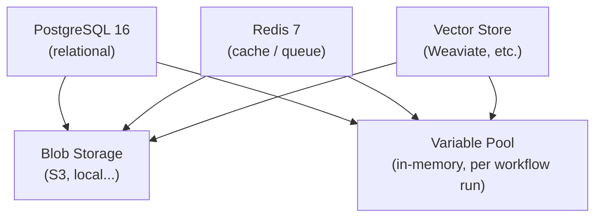
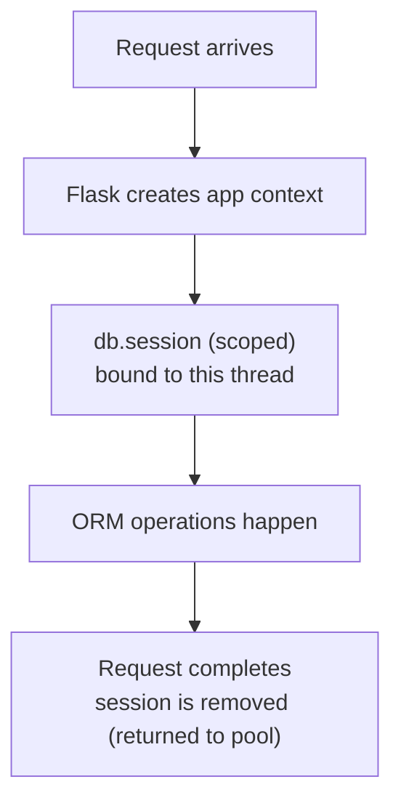
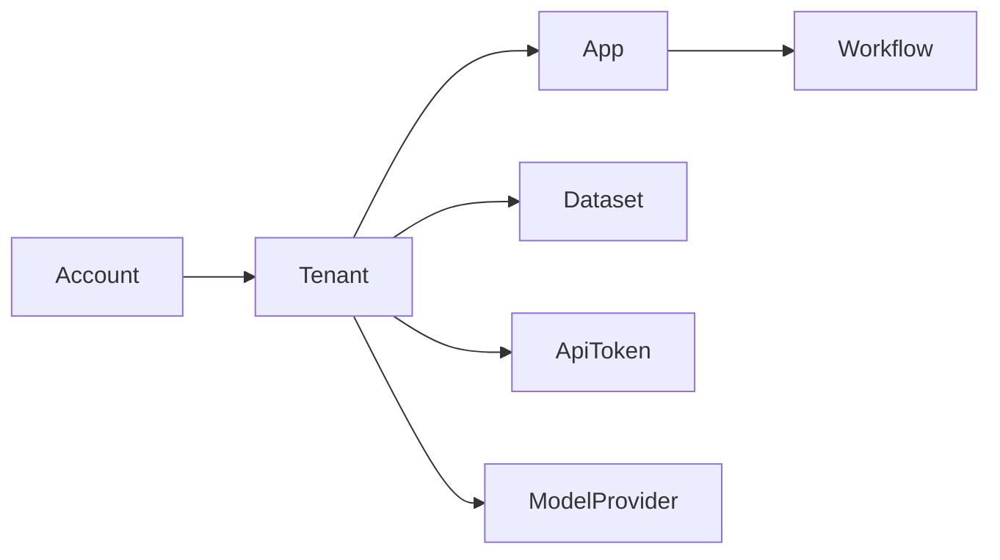
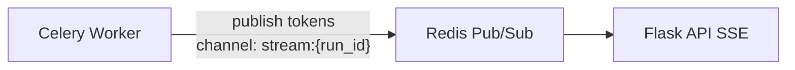
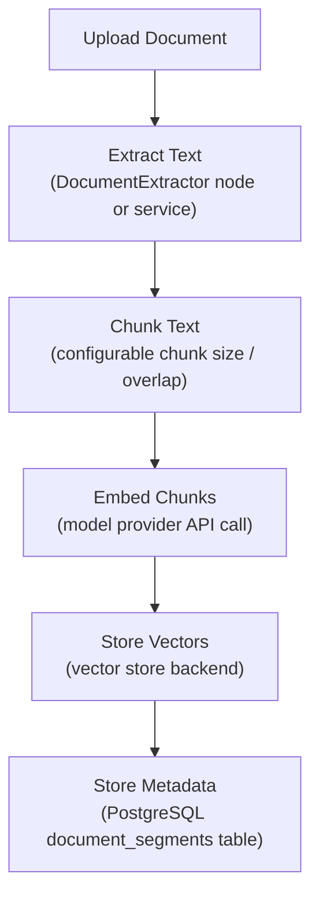
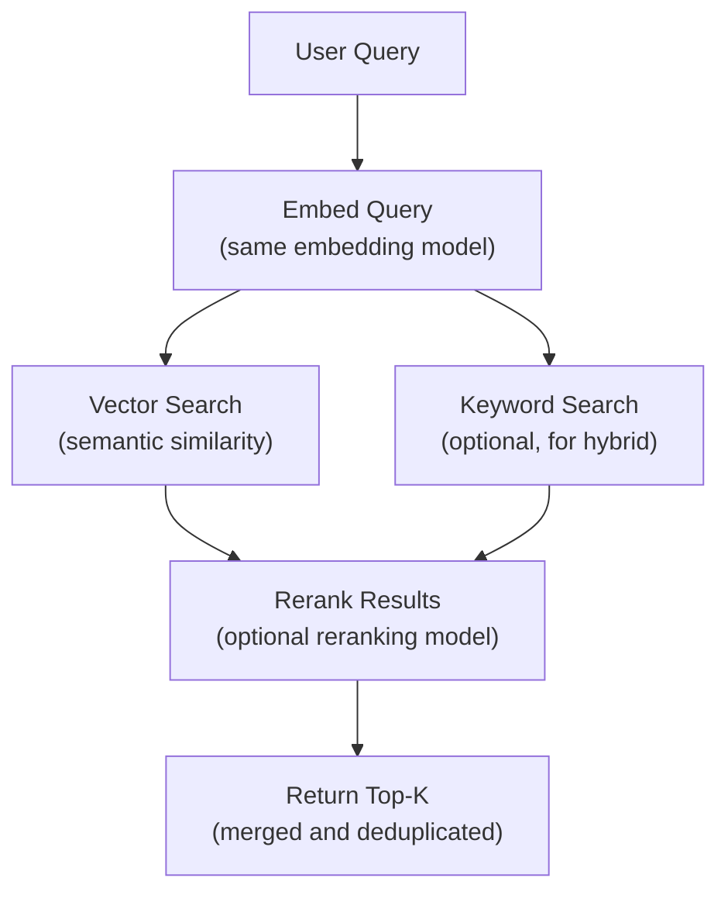
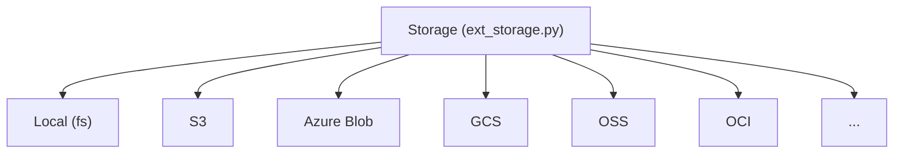
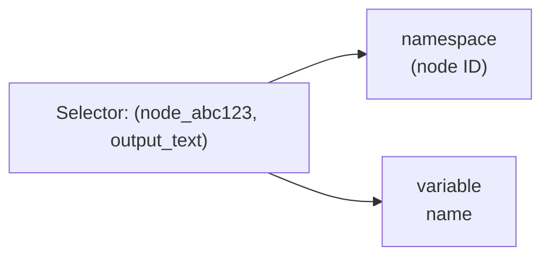
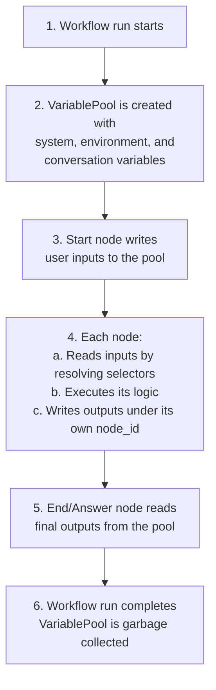
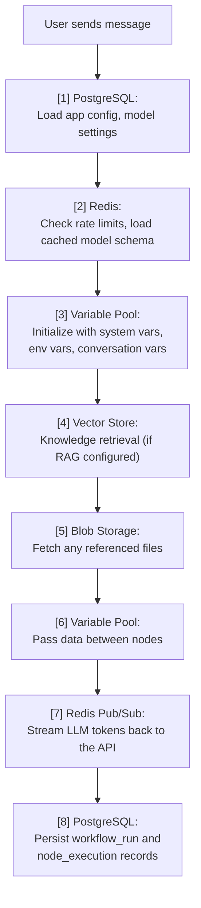

This document covers every persistence layer in Pulse -- relational database,
key-value store, vector databases, blob storage, and the in-memory Variable Pool
that threads data through workflow executions.

---

## Table of Contents

1. [Overview](#overview)
2. [PostgreSQL Patterns](#postgresql-patterns)
3. [Redis Patterns](#redis-patterns)
4. [Vector Store Layer](#vector-store-layer)
5. [Blob Storage](#blob-storage)
6. [Variable Pool Internals](#variable-pool-internals)
7. [Data Flow Across Layers](#data-flow-across-layers)

---

## Overview

Pulse uses five complementary storage systems, each optimized for a different
access pattern:



| Layer         | Technology                | Purpose                                    |
|---------------|---------------------------|--------------------------------------------|
| Relational    | PostgreSQL 16, SQLAlchemy 2.0 | Accounts, apps, workflows, dataset metadata |
| Key-value     | Redis 7                   | Caching, rate limiting, pub/sub, command channels |
| Vector        | Weaviate 1.27 + 40 others | Semantic search over document embeddings    |
| Blob          | S3, Azure Blob, GCS, local, etc. | Uploaded files, generated assets      |
| Variable Pool | In-memory Pydantic model  | Transient data flowing between workflow nodes |

---

## PostgreSQL Patterns

### Connection Management

Pulse uses SQLAlchemy 2.0 with scoped sessions. Connection pool settings are
defined in `api/configs/middleware/__init__.py`:

```python
# api/configs/middleware/__init__.py
SQLALCHEMY_POOL_SIZE: NonNegativeInt = Field(
    description="Maximum number of database connections in the pool.",
    default=30,
)
SQLALCHEMY_MAX_OVERFLOW: NonNegativeInt = Field(
    description="Maximum number of connections beyond pool_size.",
    default=10,
)
```

This gives a maximum of 40 simultaneous connections per process (30 pooled + 10
overflow). The pool is configured with:

- **`pool_pre_ping=True`** -- validates connections before checkout to handle
  stale connections from PostgreSQL restarts.
- **`pool_recycle`** -- recycles connections after a configurable number of
  seconds to prevent long-lived connection issues.

### Session Patterns

Sessions are managed through Flask's application context and scoped to the
current thread/greenlet:



**Context manager pattern for background tasks** (e.g., Celery workers):

```python
# Typical pattern in Celery tasks
with flask_app.app_context():
    # db.session is available here
    result = db.session.query(App).filter_by(id=app_id).first()
    # session is automatically cleaned up when context exits
```

### Multi-Tenant Scoping

Pulse is multi-tenant: every significant model includes a `tenant_id` column.
Queries must always scope by tenant to prevent data leakage between
workspaces:



### Key Tables

| Table                | Purpose                                   |
|----------------------|-------------------------------------------|
| `accounts`           | User accounts with hashed passwords       |
| `tenants`            | Workspaces / organizations                |
| `tenant_account_joins` | Many-to-many with role (owner, admin, editor, normal, dataset_operator) |
| `apps`               | Applications with mode (chat, workflow, etc.) |
| `workflows`          | Workflow definitions (JSON graph)          |
| `workflow_runs`      | Execution history and status               |
| `workflow_node_executions` | Per-node execution records            |
| `datasets`           | Knowledge base metadata                    |
| `documents`          | Documents within datasets                  |
| `document_segments`  | Chunked segments with embeddings           |
| `embeddings`         | Cached embedding vectors (for CacheEmbedding) |
| `app_model_configs`  | Model and prompt configuration per app     |

### Migration Discipline

All schema changes go through Alembic migrations in `api/migrations/versions/`.
See [09 Database & Migrations](/docs/contributing/database-and-migrations)
for the full workflow.

---

## Redis Patterns

Redis serves multiple roles in Pulse. Each role uses a different key prefix
and access pattern.

### Caching

Short-lived data that is expensive to compute is cached in Redis with TTL:

```
Key pattern:     cache:<domain>:<identifier>
Example:         cache:model_schema:openai:gpt-4
TTL:             Varies (minutes to hours)
```

### Rate Limiting

API rate limiting uses Redis counters with sliding windows:

```
Key pattern:     rate_limit:<scope>:<identifier>
Example:         rate_limit:api_key:ak-xxxx
Type:            Sorted set (sliding window) or counter
```

### Pub/Sub -- Streaming Responses

Chat and workflow streaming use Redis pub/sub to push incremental results
from Celery workers to the API process serving the SSE connection:



### Command Channels

The graph engine accepts external commands (abort, pause, resume, update
variables) through a command channel abstraction. Two implementations exist:

| Implementation | File | Use Case |
|---------------|------|----------|
| `InMemoryChannel` | `api/core/workflow/graph_engine/command_channels/in_memory_channel.py` | Single-process, testing |
| `RedisChannel` | `api/core/workflow/graph_engine/command_channels/redis_channel.py` | Distributed, multi-worker |

The Redis channel uses Redis lists with a pending marker optimization:

```
Key pattern:     command:<workflow_run_id>
Pending flag:    command:<workflow_run_id>:pending
TTL:             3600 seconds (configurable)
```

### Trigger Debug Event Bus

Trigger nodes (webhook, schedule, plugin) use a Redis-backed event bus to
deliver test events during development. This allows the UI debug panel to
simulate external triggers without requiring real webhook calls.

---

## Vector Store Layer

### Factory Pattern

Pulse supports 40+ vector store backends through a factory pattern. The
configuration selects which backend to instantiate:

```
VECTOR_STORE=weaviate  -->  WeaviateVectorStore
VECTOR_STORE=qdrant    -->  QdrantVectorStore
VECTOR_STORE=pgvector  -->  PGVectorStore
... (40+ backends)
```

### Document Indexing Flow



### Retrieval Flow



### Hybrid Retrieval Parallelization

When hybrid retrieval is enabled, semantic and keyword searches run
concurrently using `ThreadPoolExecutor`:

```python
# api/core/rag/datasource/retrieval_service.py
with ThreadPoolExecutor(max_workers=dify_config.RETRIEVAL_SERVICE_EXECUTORS) as executor:
    futures.append(executor.submit(self.semantic_search, ...))
    futures.append(executor.submit(self.keyword_search, ...))
```

### CacheEmbedding

The `CacheEmbedding` class (`api/core/rag/embedding/cached_embedding.py`)
wraps any embedding model to eliminate redundant API calls. It hashes input
text and checks the PostgreSQL `embeddings` table before calling the model
provider. Cache hits skip the API call entirely, reducing both latency and
cost.

---

## Blob Storage

### Abstraction Layer

The `Storage` class in `api/extensions/ext_storage.py` provides a unified
interface over multiple blob storage backends:



### Supported Backends

| Backend           | Config Value       | Notes                          |
|-------------------|--------------------|--------------------------------|
| Local filesystem  | `local`            | Uses OpenDAL with `fs` scheme  |
| AWS S3            | `s3`               | Also compatible with MinIO     |
| Azure Blob        | `azure-blob`       | Azure Blob Storage             |
| Google Cloud      | `google-storage`   | GCS buckets                    |
| Alibaba OSS       | `aliyun-oss`       | Object Storage Service         |
| Tencent COS       | `tencent-cos`      | Cloud Object Storage           |
| Oracle OCI        | `oci-storage`      | Oracle Cloud Infrastructure    |
| Huawei OBS        | `huawei-obs`       | Object Blob Storage            |
| Baidu BOS         | `baidu-obs`        | Baidu Object Storage           |
| Volcengine TOS    | `volcengine-tos`   | TOS buckets                    |
| Supabase          | `supabase`         | Supabase Storage               |
| ClickZetta Volume | `clickzetta-volume`| ClickZetta managed storage     |
| OpenDAL           | `opendal`          | Generic OpenDAL scheme         |

### What Gets Stored

- Uploaded documents (original files before chunking)
- Generated files (images, audio from model outputs)
- App icons and assets
- Plugin packages
- Export archives

---

## Variable Pool Internals

The Variable Pool is the in-memory data bus for workflow execution. Every node
reads inputs from and writes outputs to the pool. It lives for the duration of
a single workflow run and is not persisted.

### Core Data Structure

The `VariablePool` class (`api/core/workflow/runtime/variable_pool.py`) is a
Pydantic `BaseModel` with a two-level dictionary:

```
variable_dictionary: defaultdict[str, dict[str, Variable]]
                          |                    |
                     node_id              hash(keys)
```

### Selector Pattern

Variables are addressed using selectors -- tuples of `(node_id, key)`:



When a node declares an input variable reference like
`{{#node_abc123.output_text#}}`, the workflow engine resolves it by looking up
`variable_pool.get(("node_abc123", "output_text"))`.

### Special Namespaces

Four reserved node IDs serve as special namespaces:

```python
# api/core/workflow/constants.py
SYSTEM_VARIABLE_NODE_ID = "sys"
ENVIRONMENT_VARIABLE_NODE_ID = "env"
CONVERSATION_VARIABLE_NODE_ID = "conversation"
RAG_PIPELINE_VARIABLE_NODE_ID = "rag"
```

| Namespace      | Node ID          | Purpose                                      |
|----------------|------------------|----------------------------------------------|
| `sys`          | `"sys"`          | System variables: user_id, app_id, workflow_id, query, files, conversation_id, dialogue_count, timestamp |
| `env`          | `"env"`          | Environment variables defined at the workflow level (secrets, configuration) |
| `conversation` | `"conversation"` | Conversation-scoped variables that persist across turns in chatflow apps |
| `rag`          | `"rag"`          | RAG pipeline variables for document processing workflows |

### System Variables

The `SystemVariable` model (`api/core/workflow/system_variable.py`) provides
typed access to runtime context:

| Variable               | Type       | Description                          |
|------------------------|------------|--------------------------------------|
| `user_id`              | `str`      | Current user's account ID            |
| `app_id`               | `str`      | Application ID                       |
| `workflow_id`          | `str`      | Workflow definition ID               |
| `workflow_execution_id`| `str`      | Current run ID (aliased as `workflow_run_id`) |
| `query`                | `str`      | User's input query (chatflow only)   |
| `conversation_id`      | `str`      | Conversation ID (chatflow only)      |
| `dialogue_count`       | `int`      | Turn count in conversation           |
| `files`                | `list[File]` | Uploaded files                     |
| `timestamp`            | `int`      | Execution start timestamp            |
| `document_id`          | `str`      | Document ID (RAG pipeline only)      |
| `dataset_id`           | `str`      | Dataset ID (RAG pipeline only)       |
| `batch`                | `str`      | Batch ID (RAG pipeline only)         |
| `invoke_from`          | `str`      | Invocation source (api, web, etc.)   |

### Environment Variables

Environment variables are defined at the workflow level and injected into the
pool under the `env` namespace. They are typically used for secrets like API
keys or endpoint URLs that nodes need at runtime. They are scoped to the
workflow and not visible to other workflows.

### Conversation Variables

Conversation variables persist across turns within a single conversation in
chatflow apps. They enable the workflow to remember state between user
messages -- for example, tracking whether a user has already provided their
email address.

### Namespace Isolation

Each node's outputs are stored under its own node ID as the first-level key.
This prevents naming collisions: two nodes can both output a variable called
`result` without conflict because they live in different namespaces
(`node_A.result` vs `node_B.result`).

```
variable_dictionary = {
    "sys":            { "query": Variable(...), "user_id": Variable(...) },
    "env":            { "api_key": Variable(...) },
    "conversation":   { "user_email": Variable(...) },
    "start_node_001": { "input_text": Variable(...) },
    "llm_node_002":   { "text": Variable(...) },
    "if_else_003":    { "result": Variable(...) },
}
```

### Read-Only View

The `SystemVariableReadOnlyView` wraps a `SystemVariable` instance to
provide safe, read-only access to system variables within node execution.
It returns defensive copies (tuples for sequences, `MappingProxyType` for
dicts) to prevent accidental mutation.

### Variable Lifecycle



---

## Data Flow Across Layers

A typical chatbot request touches multiple storage layers:



---

## Cross-References

- [11 Performance and Scaling](/docs/architecture/performance-and-scaling) -- connection
  pooling tuning, Redis memory, caching strategies
- [12 Observability](/docs/architecture/observability) -- tracing across storage layers
- [13 Security Model](/docs/architecture/security-model) -- credential encryption,
  multi-tenant data isolation
- [09 Database & Migrations](/docs/contributing/database-and-migrations) --
  schema change process
- [ADR-004: Variable Pool Design](/docs/architecture/design-decisions/variable-pool-design) --
  design rationale for namespace isolation
