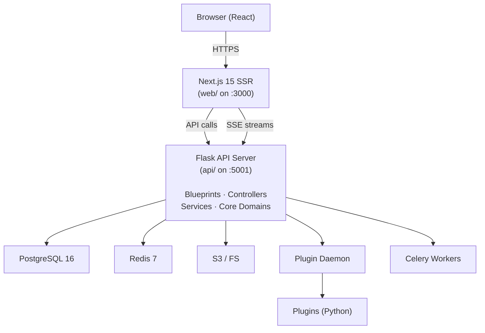
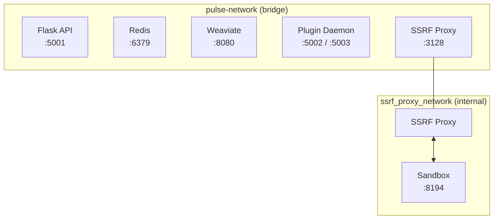
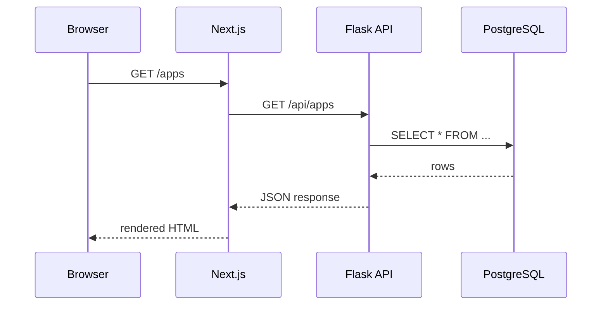
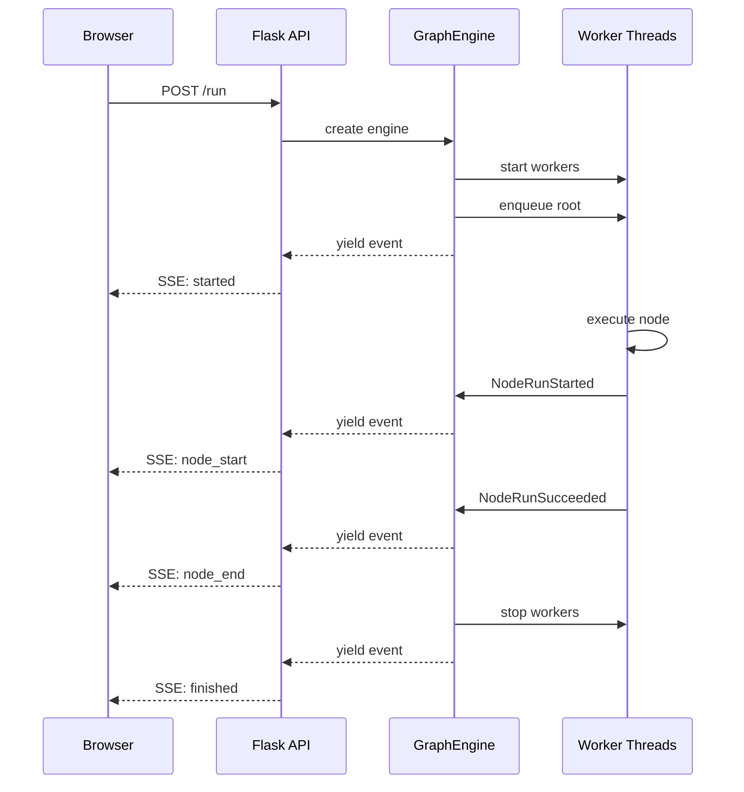
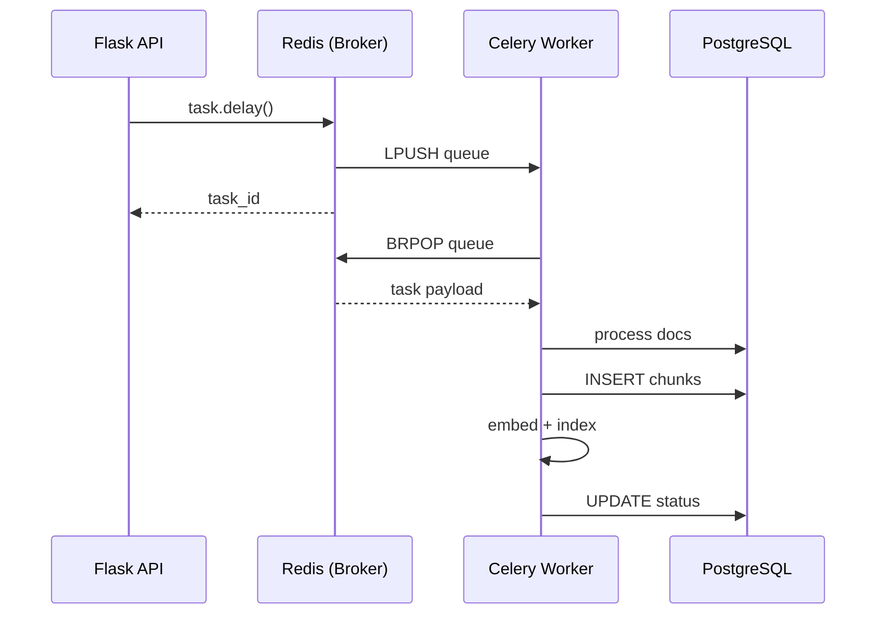
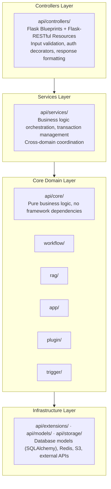
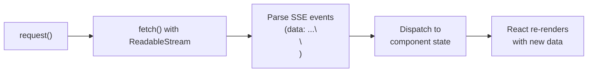
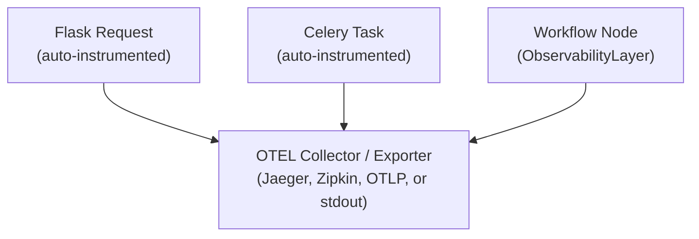
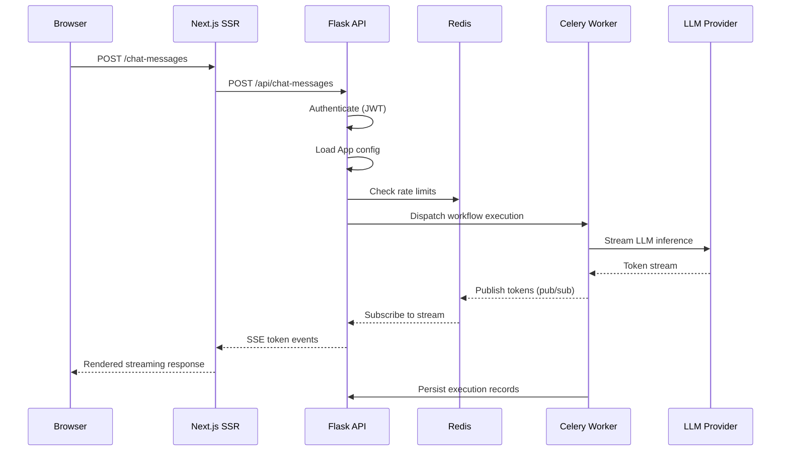

## High-Level Architecture

Pulse is a multi-tier LLM application platform with a clear separation between
client-facing frontend, API backend, async workers, and infrastructure services.



## Service Topology

### Core Services

| Service        | Port | Role                                                      |
| -------------- | ---- | --------------------------------------------------------- |
| Flask API      | 5001 | REST API, SSE streaming, webhook endpoints                |
| Next.js Web    | 3000 | Server-side rendered React frontend                       |
| Celery Workers | --   | Async task processing (dataset indexing, mail, workflows) |
| Celery Beat    | --   | Periodic task scheduler                                   |

### Infrastructure Services

| Service            | Port      | Role                                         |
| ------------------ | --------- | -------------------------------------------- |
| PostgreSQL 16      | 5432      | Primary data store, Alembic-managed schema   |
| Redis 7            | 6379      | Cache, Celery broker, pub/sub, rate limiting |
| Weaviate 1.27      | 8080      | Default vector store for RAG                 |
| SSRF Proxy (Squid) | 3128      | HTTP proxy blocking private network access   |
| Sandbox            | 8194      | Isolated code execution environment          |
| Plugin Daemon      | 5002/5003 | Go-based plugin runtime and management       |

## Network Architecture



The network topology uses two Docker networks:

- **pulse-network**: Main bridge network connecting all services. The Flask API,
  Redis, Weaviate, Plugin Daemon, and SSRF Proxy all communicate here.
- **ssrf_proxy_network**: An internal-only network (no external routing) that
  isolates the Sandbox. The SSRF Proxy bridges both networks, acting as a
  gateway that blocks private network access from user-submitted code.

## Request Lifecycle

### Synchronous API Request



### Streaming Workflow Execution



### Async Task Dispatch (Dataset Indexing)



## Backend Architecture

### Flask Application Factory

The application is created via `app_factory.py` using the factory pattern.
The `initialize_extensions()` function loads extensions in a carefully
ordered sequence:

```python
# api/app_factory.py

extensions = [
    ext_timezone,             # 1.  Set UTC timezone
    ext_logging,              # 2.  Configure structured logging
    ext_warnings,             # 3.  Filter Python warnings
    ext_import_modules,       # 4.  Eager-import heavy modules
    ext_orjson,               # 5.  Fast JSON serialization
    ext_forward_refs,         # 6.  Resolve forward references
    ext_set_secretkey,        # 7.  Flask secret key
    ext_compress,             # 8.  Response compression
    ext_code_based_extension, # 9.  Code-based extension loading
    ext_database,             # 10. SQLAlchemy + PostgreSQL
    ext_app_metrics,          # 11. Application metrics
    ext_migrate,              # 12. Alembic migration support
    ext_redis,                # 13. Redis connection pool
    ext_storage,              # 14. File storage (S3/local/Azure)
    ext_logstore,             # 15. Log storage backend
    ext_celery,               # 16. Celery app + Beat schedule
    ext_login,                # 17. Flask-Login session management
    ext_mail,                 # 18. SMTP email sending
    ext_hosting_provider,     # 19. Hosted model provider config
    ext_sentry,               # 20. Error tracking
    ext_proxy_fix,            # 21. Reverse proxy header handling
    ext_blueprints,           # 22. Register API route blueprints
    ext_commands,             # 23. CLI commands
    ext_otel,                 # 24. OpenTelemetry instrumentation
    ext_request_logging,      # 25. Request/response logging
    ext_session_factory,      # 26. SQLAlchemy session factory
]
```

Each extension follows the pattern:

```python
def init_app(app: DifyApp) -> None:
    """Initialize the extension with the Flask app."""
    ...

def is_enabled() -> bool:   # optional
    """Return False to skip initialization."""
    ...
```

### Domain-Driven Design Layers



### Configuration System

All configuration flows through Pydantic v2 `BaseSettings` models:

```
api/configs/
  __init__.py          -> dify_config singleton
  app_config.py        -> DifyConfig (aggregates all feature configs)
  feature/             -> Feature-specific config classes
    celery_config.py
    hosted_service.py
    mail_config.py
    ...
  middleware/           -> Infrastructure config classes
    cache_config.py
    database_config.py
    redis_config.py
    storage_config.py
    ...
```

The `DifyConfig` class uses multiple inheritance to compose all feature and
middleware configurations into a single settings object. Access anywhere via:

```python
from configs import dify_config

max_depth = dify_config.WORKFLOW_CALL_MAX_DEPTH
```

### Database Layer

- **ORM**: SQLAlchemy 2.0 with `mapped_column` declarative style
- **Database**: PostgreSQL 16
- **Migrations**: Alembic (via Flask-Migrate)
- **Session management**: Scoped sessions per request, dedicated session factory
  for background tasks

Key model files:

| File                     | Models                                       |
| ------------------------ | -------------------------------------------- |
| `api/models/account.py`  | Account, Tenant, TenantAccountJoin           |
| `api/models/model.py`    | App, AppMode, Conversation, Message          |
| `api/models/workflow.py` | Workflow, WorkflowRun, WorkflowNodeExecution |
| `api/models/dataset.py`  | Dataset, Document, DocumentSegment, Pipeline |
| `api/models/provider.py` | Provider, ProviderModel, TenantDefaultModel  |
| `api/models/trigger.py`  | TriggerNode, TriggerSubscription             |

### Redis Usage Patterns

Redis serves multiple roles across the system:

| Pattern         | Key Format                                 | Purpose                |
| --------------- | ------------------------------------------ | ---------------------- |
| Celery Broker   | `celery-task-meta-*`                       | Task queue and results |
| Rate Limiting   | `rate_limit:{endpoint}:{ip}`               | API rate limiting      |
| Embedding Cache | `embedding_cache:{hash}`                   | Cached embeddings      |
| Session         | `session:{token}`                          | User session data      |
| Trigger Debug   | `trigger_debug_inbox:{tenant}:{addr}`      | Debug event bus        |
| Provider Cache  | `provider_credentials:{tenant}:{provider}` | Credential cache       |
| Command Channel | `workflow_command:{workflow_run_id}`       | Workflow control       |

## Frontend Architecture

### Technology Stack

- **Framework**: Next.js 15 with App Router
- **Language**: TypeScript (strict mode)
- **UI**: React 19 with Server Components
- **State**: Zustand (global), Jotai (atomic), TanStack Query (server state)
- **API**: ORPC for type-safe API communication
- **Streaming**: Custom `request()` wrapper for SSE consumption

### Directory Structure

```
web/
  app/                    # Next.js App Router pages
    (commonLayout)/       # Shared layout for main app
    components/           # Page-level components
  components/             # Shared UI components
  context/                # React context providers
  hooks/                  # Custom React hooks
  i18n/                   # Internationalization (en-US, zh-CN, ...)
  models/                 # TypeScript type definitions
  service/                # API client functions
  utils/                  # Utility functions
```

### SSE Streaming Pattern

The frontend consumes streaming workflow events via a custom SSE wrapper:



## Observability

### OpenTelemetry Integration

OTEL instrumentation is wired across multiple layers:



Components instrumented:

- **Flask**: Request/response spans via `opentelemetry-instrumentation-flask`
- **SQLAlchemy**: Query spans via `opentelemetry-instrumentation-sqlalchemy`
- **httpx**: Outbound HTTP spans via `opentelemetry-instrumentation-httpx`
- **Celery**: Task spans via `opentelemetry-instrumentation-celery`
- **Workflow Nodes**: Custom `ObservabilityLayer` creates per-node spans

Trace headers (`X-Trace-Id`, `X-Span-Id`) are injected into HTTP responses
by the `after_request` hook in `app_factory.py`.

### Logging

Structured logging with contextual fields initialized both in Flask
`before_request` hooks and Celery task wrappers, ensuring consistent
correlation across sync and async code paths.

## Security Architecture

### SSRF Protection

All outbound HTTP requests from user code route through the SSRF Proxy (Squid),
which blocks access to private network ranges (10.0.0.0/8, 172.16.0.0/12,
192.168.0.0/16, etc.). The Sandbox runs on an internal-only network with
no direct internet access.

### Code Execution Sandbox

User-submitted code (Python/JavaScript) executes in `dify-sandbox`, an
isolated container with:

- No direct network access (routed through SSRF Proxy)
- Resource limits (CPU, memory, execution time)
- No filesystem access to host volumes
- Separate network namespace (`ssrf_proxy_network`)

### Credential Encryption

Per-tenant RSA key pairs encrypt sensitive credentials (API keys, tokens)
at rest. The `Tenant.encrypt_public_key` field stores the public key;
the private key is derived from the system secret key.

See [07-Multi-Tenancy](/docs/architecture/multi-tenancy) for details.

## Chat Request Flow



## Cross-References

- [02-Workflow Engine](/docs/architecture/workflow-engine) -- Core execution engine
- [03-RAG Pipeline](/docs/architecture/rag-pipeline) -- Document processing and retrieval
- [07-Multi-Tenancy](/docs/architecture/multi-tenancy) -- Data isolation model
- [09-Async and Celery](/docs/architecture/async-and-celery) -- Background task processing
