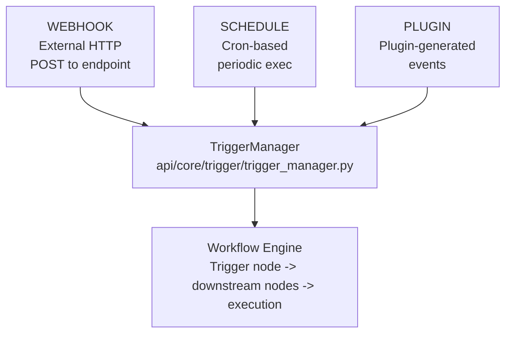
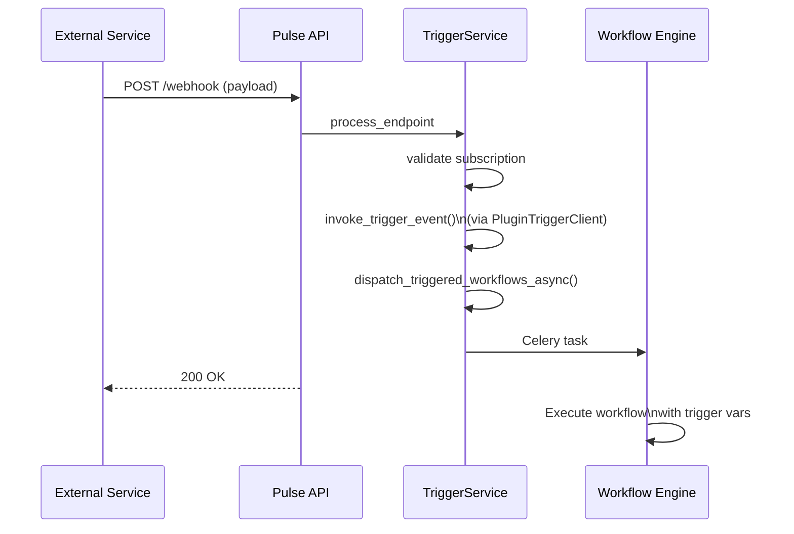
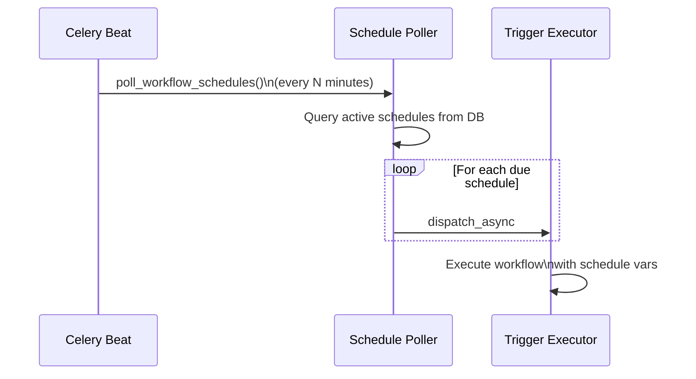
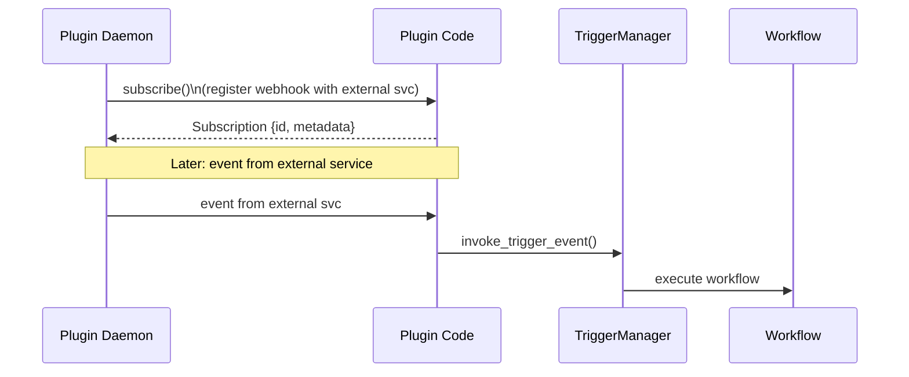
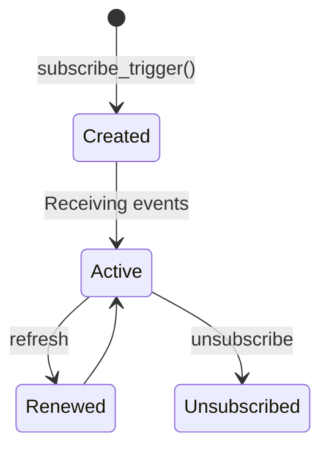
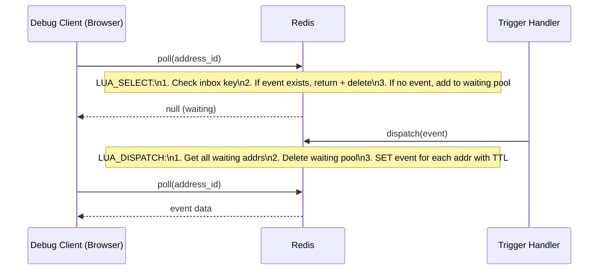

The trigger system enables event-driven workflow execution. Workflows can be
started by webhooks, schedules, or plugin-generated events, with a subscription
model for managing external event sources.

## Trigger Types



## TriggerManager

The `TriggerManager` (`api/core/trigger/trigger_manager.py`) provides a
class-method API for trigger operations:

```python
class TriggerManager:
    @classmethod
    def list_plugin_trigger_providers(cls, tenant_id: str)
        -> list[PluginTriggerProviderController]: ...

    @classmethod
    def get_trigger_provider(cls, tenant_id: str, provider_id: TriggerProviderID)
        -> PluginTriggerProviderController: ...

    @classmethod
    def invoke_trigger_event(cls, tenant_id, user_id, provider_id,
        event_name, parameters, credentials, credential_type,
        subscription, request, payload)
        -> TriggerInvokeEventResponse: ...

    @classmethod
    def subscribe_trigger(cls, tenant_id, user_id, provider_id,
        endpoint, parameters, credentials, credential_type)
        -> Subscription: ...

    @classmethod
    def unsubscribe_trigger(cls, tenant_id, user_id, provider_id,
        subscription, credentials, credential_type)
        -> UnsubscribeResult: ...

    @classmethod
    def refresh_trigger(cls, tenant_id, provider_id,
        subscription, credentials, credential_type)
        -> Subscription: ...
```

### Lazy Loading with Caching

The `get_trigger_provider()` method uses a thread-safe lazy loading pattern
with context-variable caching:

```python
@classmethod
def get_trigger_provider(cls, tenant_id, provider_id):
    # Check context cache
    plugin_trigger_providers = contexts.plugin_trigger_providers.get()
    if provider_id_str in plugin_trigger_providers:
        return plugin_trigger_providers[provider_id_str]

    # Double-checked locking
    with contexts.plugin_trigger_providers_lock.get():
        # Re-check after acquiring lock
        if provider_id_str in plugin_trigger_providers:
            return plugin_trigger_providers[provider_id_str]

        # Load from plugin daemon
        manager = PluginTriggerClient()
        provider = manager.fetch_trigger_provider(tenant_id, provider_id)
        controller = PluginTriggerProviderController(entity=provider.declaration, ...)
        plugin_trigger_providers[provider_id_str] = controller
        return controller
```

## PluginTriggerProviderController

The controller (`api/core/trigger/provider.py`) wraps trigger provider
operations:

```python
class PluginTriggerProviderController:
    def __init__(
        self,
        entity: TriggerProviderEntity,
        plugin_id: str,
        plugin_unique_identifier: str,
        provider_id: TriggerProviderID,
        tenant_id: str,
    ):

    def get_events(self) -> list[EventEntity]: ...
    def invoke_trigger_event(self, ...) -> TriggerInvokeEventResponse: ...
    def subscribe_trigger(self, ...) -> Subscription: ...
    def unsubscribe_trigger(self, ...) -> UnsubscribeResult: ...
    def refresh_trigger(self, ...) -> Subscription: ...
```

## Webhook Flow



## Schedule Flow

Scheduled triggers use Celery Beat for periodic polling:



Configuration in `api/extensions/ext_celery.py`:

```python
if dify_config.ENABLE_WORKFLOW_SCHEDULE_POLLER_TASK:
    beat_schedule["workflow_schedule_task"] = {
        "task": "schedule.workflow_schedule_task.poll_workflow_schedules",
        "schedule": timedelta(minutes=dify_config.WORKFLOW_SCHEDULE_POLLER_INTERVAL),
    }
```

## Plugin Trigger Flow

Plugin triggers allow external plugins to define custom event sources:



## Subscription Lifecycle



### Subscription Refresh

Trigger subscriptions may need periodic renewal (e.g., webhook registrations
that expire). The refresh task runs via Celery Beat:

```python
if dify_config.ENABLE_TRIGGER_PROVIDER_REFRESH_TASK:
    beat_schedule["trigger_provider_refresh"] = {
        "task": "schedule.trigger_provider_refresh_task.trigger_provider_refresh",
        "schedule": timedelta(minutes=dify_config.TRIGGER_PROVIDER_REFRESH_INTERVAL),
    }
```

## Debug Event Bus

The `TriggerDebugEventBus` (`api/core/trigger/debug/event_bus.py`) enables
real-time debugging of trigger events using Redis with Lua scripts:

```python
class TriggerDebugEventBus:
    TRIGGER_DEBUG_EVENT_TTL = 300  # 5 minutes

    # Atomic poll-or-register script
    LUA_SELECT = (
        "local v=redis.call('GET',KEYS[1]);"
        "if v then redis.call('DEL',KEYS[1]);return v end;"
        "redis.call('SADD',KEYS[2],ARGV[1]);"
        f"redis.call('EXPIRE',KEYS[2],{TRIGGER_DEBUG_EVENT_TTL});"
        "return false"
    )

    # Dispatch event to all waiting addresses
    LUA_DISPATCH = (
        "local a=redis.call('SMEMBERS',KEYS[1]);"
        "if #a==0 then return 0 end;"
        "redis.call('DEL',KEYS[1]);"
        "for i=1,#a do "
        f"redis.call('SET','trigger_debug_inbox:'..ARGV[1]..':'..a[i],ARGV[2],"
        f"'EX',{TRIGGER_DEBUG_EVENT_TTL});"
        "end;"
        "return #a"
    )
```

### Debug Event Bus Flow



### Redis Key Structure

```
trigger_debug_inbox:{tenant_id}:{address_id}     -> event JSON (TTL 300s)
trigger_debug_waiting_pool:{tenant_id}:{...}     -> SET of address_ids (TTL 300s)
```

The `{tenant_id}` hash tag ensures Redis Cluster compatibility by routing
all keys for a tenant to the same shard.

## Trigger-Related Services

| Service | File | Responsibility |
|---------|------|---------------|
| `TriggerService` | `services/trigger/trigger_service.py` | Core trigger orchestration |
| `TriggerProviderService` | `services/trigger/trigger_provider_service.py` | Provider CRUD |
| `AppTriggerService` | `services/trigger/app_trigger_service.py` | App-trigger bindings |
| `TriggerSubscriptionBuilderService` | `services/trigger/trigger_subscription_builder_service.py` | Build subscriptions |
| `TriggerSubscriptionOperatorService` | `services/trigger/trigger_subscription_operator_service.py` | Manage subscription lifecycle |
| `ChatflowTriggerService` | `services/chatflow_trigger_service.py` | Chatflow-specific triggers |
| `ChatflowTriggerSubscriptionService` | `services/trigger/chatflow_trigger_subscription_service.py` | Chatflow subscriptions |

## Cross-References

- [02-Workflow Engine](/docs/architecture/workflow-engine) -- Trigger nodes as workflow entry points
- [05-Plugin System](/docs/architecture/plugin-system) -- Plugin trigger providers
- [09-Async and Celery](/docs/architecture/async-and-celery) -- Schedule polling and trigger execution queues
