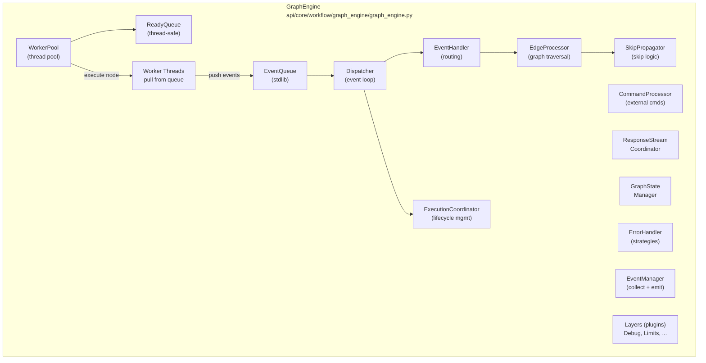
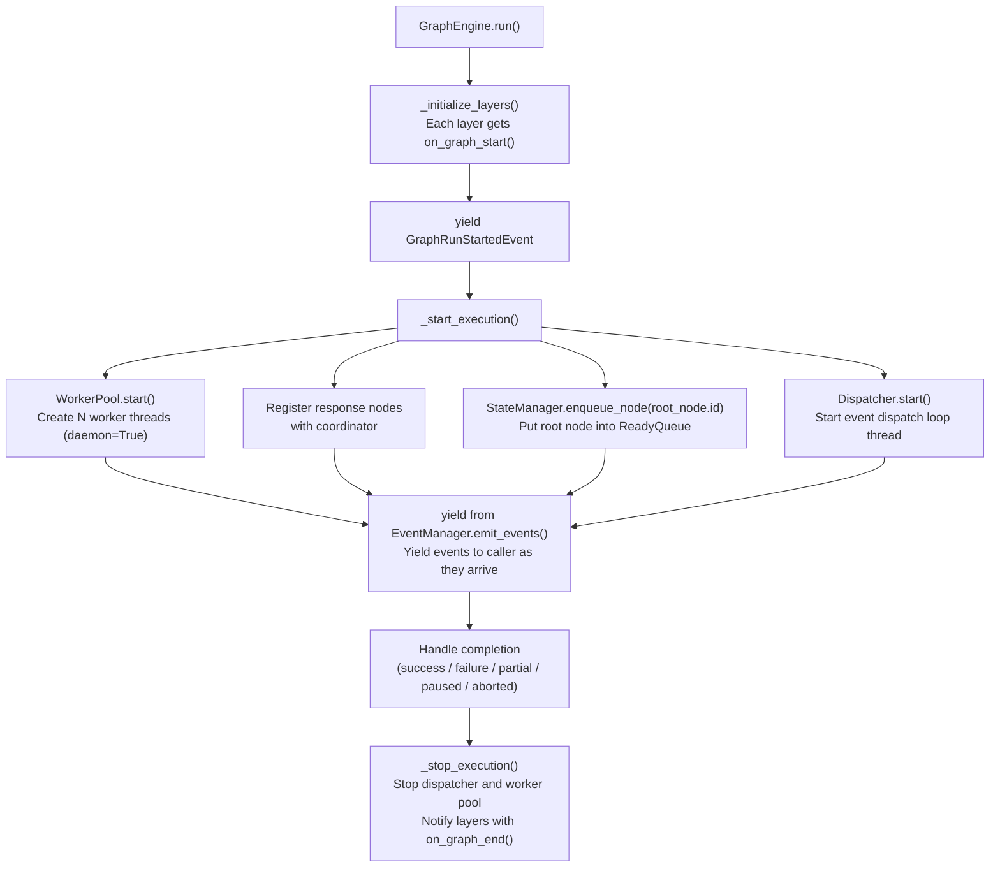
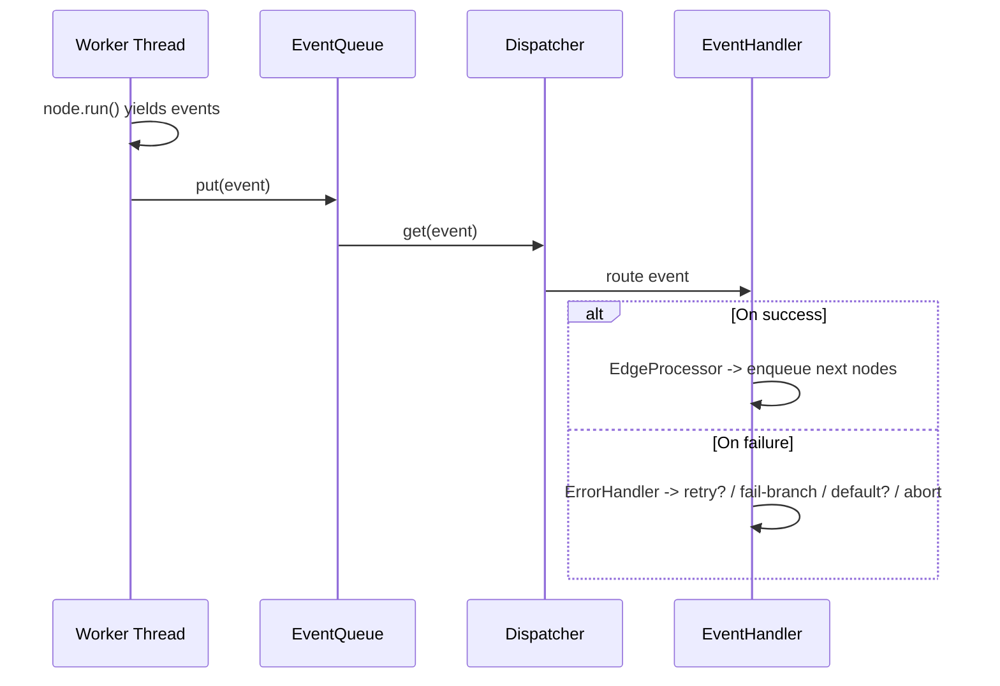
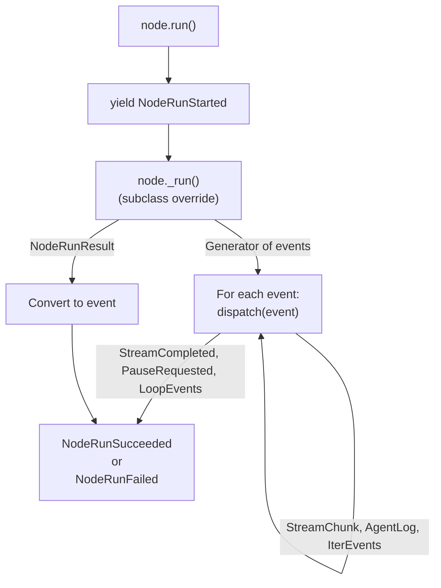
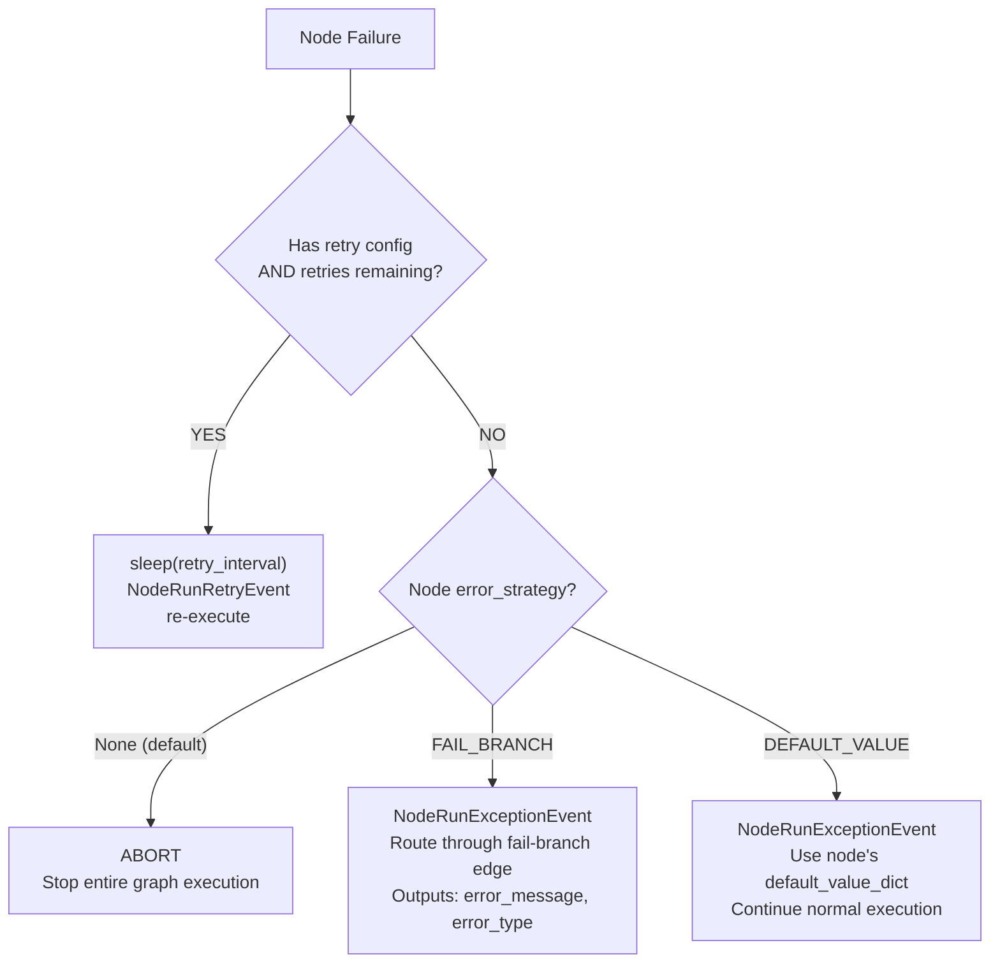
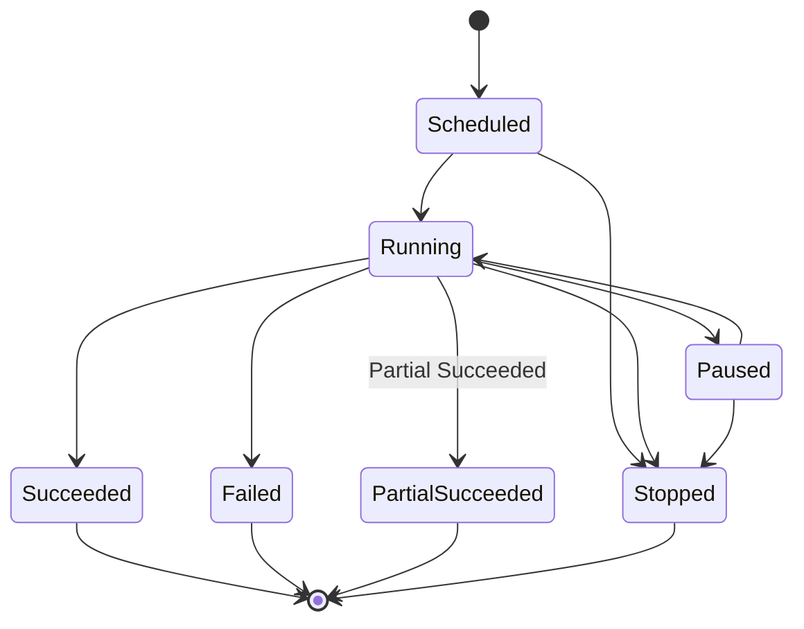
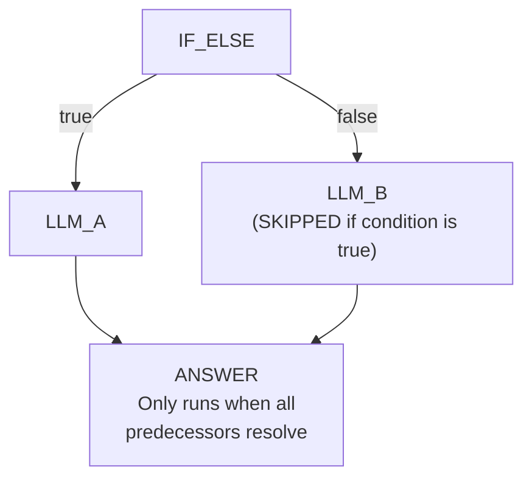

The workflow engine is the most complex subsystem in Pulse. It executes
user-defined directed acyclic graphs (DAGs) of nodes, handling parallel
execution, streaming responses, error recovery, and external control commands.

## Architecture Overview



## GraphEngine Constructor

The `GraphEngine` class (`api/core/workflow/graph_engine/graph_engine.py`) is
the central orchestrator. Its constructor wires together all subsystems:

```python
@final
class GraphEngine:
    def __init__(
        self,
        workflow_id: str,
        graph: Graph,
        graph_runtime_state: GraphRuntimeState,
        command_channel: CommandChannel,
        min_workers: int | None = None,
        max_workers: int | None = None,
        scale_up_threshold: int | None = None,
        scale_down_idle_time: float | None = None,
    ) -> None:
```

Key subsystems initialized in the constructor:

| Subsystem                 | Class                       | Responsibility                                       |
| ------------------------- | --------------------------- | ---------------------------------------------------- |
| ReadyQueue                | `InMemoryReadyQueue`        | Thread-safe queue of node IDs ready for execution    |
| EventQueue                | `queue.Queue`               | stdlib queue for events from workers to dispatcher   |
| GraphStateManager         | `GraphStateManager`         | Node state transitions and queue operations          |
| ResponseStreamCoordinator | `ResponseStreamCoordinator` | Ordered streaming from response nodes                |
| EventManager              | `EventManager`              | Event collection, layer notification, emission       |
| ErrorHandler              | `ErrorHandler`              | Error strategy selection and execution               |
| SkipPropagator            | `SkipPropagator`            | Propagate skip states through conditional branches   |
| EdgeProcessor             | `EdgeProcessor`             | Process edges, determine next nodes, handle branches |
| CommandProcessor          | `CommandProcessor`          | Handle external commands (abort, pause, update vars) |
| WorkerPool                | `WorkerPool`                | Dynamic thread pool for parallel node execution      |
| ExecutionCoordinator      | `ExecutionCoordinator`      | Overall execution lifecycle management               |
| Dispatcher                | `Dispatcher`                | Event routing and execution flow management          |
| EventHandler              | `EventHandler`              | Central registry for handling node execution events  |

## Execution Flow

### Startup Sequence



### Worker Execution Loop

Each `Worker` thread runs this loop (`api/core/workflow/graph_engine/worker.py`):

```python
@final
class Worker(threading.Thread):
    def run(self) -> None:
        while not self._stop_event.is_set():
            try:
                node_id = self._ready_queue.get(timeout=0.1)
            except queue.Empty:
                continue

            node = self._graph.nodes[node_id]
            self._execute_node(node)
            self._ready_queue.task_done()
```

Workers pull node IDs from the `ReadyQueue`, execute them via `node.run()`,
and push the resulting events into the `EventQueue` for the `Dispatcher`.

### Event Flow



## Node Type Taxonomy

All node types are defined in `api/core/workflow/enums.py`:

```python
class NodeType(StrEnum):
    START = "start"
    END = "end"
    ANSWER = "answer"
    LLM = "llm"
    KNOWLEDGE_RETRIEVAL = "knowledge-retrieval"
    KNOWLEDGE_INDEX = "knowledge-index"
    IF_ELSE = "if-else"
    CODE = "code"
    TEMPLATE_TRANSFORM = "template-transform"
    QUESTION_CLASSIFIER = "question-classifier"
    HTTP_REQUEST = "http-request"
    TOOL = "tool"
    DATASOURCE = "datasource"
    VARIABLE_AGGREGATOR = "variable-aggregator"
    LOOP = "loop"
    ITERATION = "iteration"
    PARAMETER_EXTRACTOR = "parameter-extractor"
    VARIABLE_ASSIGNER = "assigner"
    DOCUMENT_EXTRACTOR = "document-extractor"
    LIST_OPERATOR = "list-operator"
    AGENT = "agent"
    TRIGGER_WEBHOOK = "trigger-webhook"
    TRIGGER_SCHEDULE = "trigger-schedule"
    TRIGGER_PLUGIN = "trigger-plugin"
    HUMAN_INPUT = "human-input"
```

### Node Execution Types

Each node type has an `execution_type` classification
(`api/core/workflow/enums.py`):

```python
class NodeExecutionType(StrEnum):
    EXECUTABLE = "executable"   # Regular nodes (LLM, Code, HTTP, Tool, ...)
    RESPONSE   = "response"     # Stream outputs (Answer, End)
    BRANCH     = "branch"       # Choose branches (if-else, question-classifier)
    CONTAINER  = "container"    # Manage subgraphs (iteration, loop)
    ROOT       = "root"         # Execution entry points (start, triggers, datasource)
```

### Node Classification Matrix

| Execution Type | Node Types | Behavior |
| -------------- | ---------- | -------- |
| ROOT | START | Workflow entry point |
| | DATASOURCE | RAG pipeline entry |
| | TRIGGER_WEBHOOK | Webhook-triggered entry |
| | TRIGGER_SCHEDULE | Cron-triggered entry |
| | TRIGGER_PLUGIN | Plugin-triggered entry |
| EXECUTABLE | LLM | Call language model |
| | CODE | Execute Python/JS in sandbox |
| | HTTP_REQUEST | Make HTTP calls (via SSRF proxy) |
| | TOOL | Invoke plugin tools |
| | TEMPLATE_TRANSFORM | Jinja2 template rendering |
| | PARAMETER_EXTRACTOR | Extract structured data from text |
| | KNOWLEDGE_RETRIEVAL | Query vector store |
| | KNOWLEDGE_INDEX | Index documents |
| | DOCUMENT_EXTRACTOR | Parse file content |
| | LIST_OPERATOR | List manipulation |
| | VARIABLE_AGGREGATOR | Merge variables |
| | VARIABLE_ASSIGNER | Assign/update variables |
| | AGENT | Run agent strategy |
| | HUMAN_INPUT | Pause for human input |
| RESPONSE | ANSWER | Stream text to user |
| | END | Terminal node with outputs |
| BRANCH | IF_ELSE | Conditional branching |
| | QUESTION_CLASSIFIER | LLM-based routing |
| CONTAINER | ITERATION | Iterate over list items |
| | LOOP | Loop with condition |

## Node Base Class and Registry

The `Node` base class (`api/core/workflow/nodes/base/node.py`) uses
`__init_subclass__` for automatic registration:

```python
class Node(Generic[NodeDataT]):
    node_type: ClassVar[NodeType]
    execution_type: NodeExecutionType = NodeExecutionType.EXECUTABLE
    _node_data_type: ClassVar[type[BaseNodeData]] = BaseNodeData

    # Global registry populated via __init_subclass__
    _registry: ClassVar[dict[NodeType, dict[str, type[Node]]]] = {}

    def __init_subclass__(cls, **kwargs: Any) -> None:
        # 1. Extract NodeDataT from generic parameter
        # 2. Register cls in _registry[node_type][version]
        # 3. Maintain "latest" pointer for version resolution
        ...
```

When you define a new node:

```python
class CodeNode(Node[CodeNodeData]):
    node_type = NodeType.CODE

    @classmethod
    def version(cls) -> str:
        return "1"

    def _run(self) -> NodeRunResult | Generator[NodeEventBase, None, None]:
        ...
```

The registry automatically maps `NodeType.CODE -> {"1": CodeNode, "latest": CodeNode}`.

### Node Lifecycle



## VariablePool

The `VariablePool` (`api/core/workflow/runtime/variable_pool.py`) stores all
runtime variables using a selector-based addressing scheme:

```python
class VariablePool(BaseModel):
    variable_dictionary: defaultdict[str, dict[str, Variable]]
    user_inputs: Mapping[str, Any]
    system_variables: SystemVariable
    environment_variables: Sequence[Variable]
    conversation_variables: Sequence[Variable]
    rag_pipeline_variables: list[RAGPipelineVariableInput]
```

### Selector Pattern

Variables are addressed by a tuple selector: `(node_id, key1, key2, ...)`.

```
variable_pool.add(("node_abc", "result"), "hello world")
variable_pool.get(("node_abc", "result"))  # -> Variable("hello world")
```

### Variable Namespaces

| Namespace Node ID | Content |
| ----------------- | ------- |
| `"sys"` | System variables (query, files, conversation_id, user_id, ...) |
| `"env"` | Environment variables (per-workflow config) |
| `"conversation"` | Conversation variables (persist across turns) |
| `"rag_pipeline"` | RAG pipeline variables |
| `"<actual_node_id>"` | Node outputs (set after successful execution) |

### System Variables

Defined in `api/core/workflow/enums.py`:

```python
class SystemVariableKey(StrEnum):
    QUERY = "query"
    FILES = "files"
    CONVERSATION_ID = "conversation_id"
    USER_ID = "user_id"
    DIALOGUE_COUNT = "dialogue_count"
    APP_ID = "app_id"
    WORKFLOW_ID = "workflow_id"
    WORKFLOW_EXECUTION_ID = "workflow_run_id"
    TIMESTAMP = "timestamp"
    DOCUMENT_ID = "document_id"
    DATASET_ID = "dataset_id"
    DATASOURCE_TYPE = "datasource_type"
    DATASOURCE_INFO = "datasource_info"
    INVOKE_FROM = "invoke_from"
```

## Error Handling Strategies

The `ErrorHandler` (`api/core/workflow/graph_engine/error_handler.py`)
implements a cascading error strategy:



```python
class ErrorStrategy(StrEnum):
    FAIL_BRANCH = "fail-branch"
    DEFAULT_VALUE = "default-value"
```

## Execution State Machine

The `WorkflowExecutionStatus` enum defines the complete state machine:



## Layer System

Layers are middleware-like extensions that observe and interact with execution.
Base class: `api/core/workflow/graph_engine/layers/base.py`.

```python
class GraphEngineLayer(ABC):
    def initialize(self, graph_runtime_state, command_channel) -> None: ...

    @abstractmethod
    def on_graph_start(self) -> None: ...

    @abstractmethod
    def on_event(self, event: GraphEngineEvent) -> None: ...

    @abstractmethod
    def on_graph_end(self, error: Exception | None) -> None: ...

    def on_node_run_start(self, node: Node) -> None: ...
    def on_node_run_end(self, node: Node, error: Exception | None) -> None: ...
```

### Built-in Layers

| Layer                  | File                         | Purpose                             |
| ---------------------- | ---------------------------- | ----------------------------------- |
| `DebugLoggingLayer`    | `layers/debug_logging.py`    | Log all events for debugging        |
| `ExecutionLimitsLayer` | `layers/execution_limits.py` | Enforce max steps and time limits   |
| `ObservabilityLayer`   | `layers/observability.py`    | Create OpenTelemetry spans per node |

#### ExecutionLimitsLayer

```python
@final
class ExecutionLimitsLayer(GraphEngineLayer):
    def __init__(self, max_steps: int, max_time: int) -> None:
        self.max_steps = max_steps
        self.max_time = max_time
        self.step_count = 0
```

Monitors step count and elapsed time. When exceeded, sends an `AbortCommand`
through the command channel.

#### ObservabilityLayer

```python
@final
class ObservabilityLayer(GraphEngineLayer):
    def on_node_run_start(self, node: Node) -> None:
        # Create OTel span for the node
        # Set span in context so auto-instrumentation associates

    def on_node_run_end(self, node: Node, error: Exception | None) -> None:
        # Set span status, attributes, and end the span
```

## Command Channels

External control of running workflows is handled through command channels.

### Command Channel Protocol

```python
# api/core/workflow/graph_engine/protocols/command_channel.py
class CommandChannel(Protocol):
    def send(self, command: Command) -> None: ...
    def receive(self, timeout: float) -> Command | None: ...
```

### Implementations

| Channel           | File                                    | Use Case                   |
| ----------------- | --------------------------------------- | -------------------------- |
| `InMemoryChannel` | `command_channels/in_memory_channel.py` | Single-process (default)   |
| `RedisChannel`    | `command_channels/redis_channel.py`     | Cross-process (production) |

### Supported Commands

```python
# api/core/workflow/graph_engine/entities/commands.py
class AbortCommand:          # Stop workflow execution
class PauseCommand:          # Pause at current state
class UpdateVariablesCommand:  # Update variables mid-execution
```

The `CommandProcessor` routes commands to registered handlers:

```python
self._command_processor.register_handler(AbortCommand, AbortCommandHandler())
self._command_processor.register_handler(PauseCommand, PauseCommandHandler())
self._command_processor.register_handler(
    UpdateVariablesCommand,
    UpdateVariablesCommandHandler(variable_pool)
)
```

## Skip Propagation

When a branch node (IF_ELSE, QUESTION_CLASSIFIER) takes one path, the
`SkipPropagator` marks all nodes on untaken branches as `SKIPPED`.



The propagation is recursive: if a skipped node has downstream nodes that
have no other non-skipped predecessors, those are also skipped.

## Response Stream Coordination

The `ResponseStreamCoordinator`
(`api/core/workflow/graph_engine/response_coordinator/coordinator.py`) manages
ordered streaming from response nodes (ANSWER, END).

Response nodes contain template segments that reference upstream node outputs:

```
Answer node template: "The result is {{#node_abc.result#}}"
                                       ^^^^^^^^^^^^^^^^
                                       VariableSegment

Segments: [TextSegment("The result is "), VariableSegment("node_abc", "result")]
```

The coordinator buffers stream chunks and only emits them when upstream
blocking nodes have completed, ensuring correct output ordering.

## WorkflowEntry

`WorkflowEntry` (`api/core/workflow/workflow_entry.py`) is the public entry
point for running a workflow. It assembles the engine with all layers:

```python
class WorkflowEntry:
    def __init__(
        self,
        tenant_id: str,
        app_id: str,
        workflow_id: str,
        graph_config: Mapping[str, Any],
        graph: Graph,
        user_id: str,
        user_from: UserFrom,
        invoke_from: InvokeFrom,
        call_depth: int,
        variable_pool: VariablePool,
        graph_runtime_state: GraphRuntimeState,
        command_channel: CommandChannel | None = None,
    ) -> None:
```

The `call_depth` parameter prevents infinite recursion when workflows invoke
sub-workflows, enforced by `dify_config.WORKFLOW_CALL_MAX_DEPTH`.

## Draft vs Published Workflows

Pulse supports two execution modes:

- **Published**: The saved, production-ready workflow graph. Used when apps
  are invoked by end users via API or UI.
- **Draft**: The in-progress workflow being edited in the studio. Used for
  "debug run" and "preview" executions. Draft variables can differ from
  published environment variables.

Draft execution uses `DraftVariableSaverFactory` and `DraftVarLoader` to
load/save draft-specific variable state without affecting the published
workflow.

## Graph Structure

The `Graph` class (`api/core/workflow/graph/`) holds the parsed workflow
definition:

```
Graph
  |-- nodes: dict[str, Node]        # All node instances
  |-- edges: list[Edge]             # Connections between nodes
  |-- root_node: Node               # Entry point node
  |-- edge_mapping: dict[str, list[Edge]]  # node_id -> outgoing edges
  |-- reverse_edge_mapping: dict[str, list[Edge]]  # node_id -> incoming edges
```

## Cross-References

- [01-System Overview](/docs/architecture/system-overview) -- System context
- [06-Trigger System](/docs/architecture/trigger-system) -- Trigger nodes that start workflows
- [08-App Modes and Runners](/docs/architecture/app-modes-and-runners) -- How apps invoke the engine
- [09-Async and Celery](/docs/architecture/async-and-celery) -- Async workflow execution
