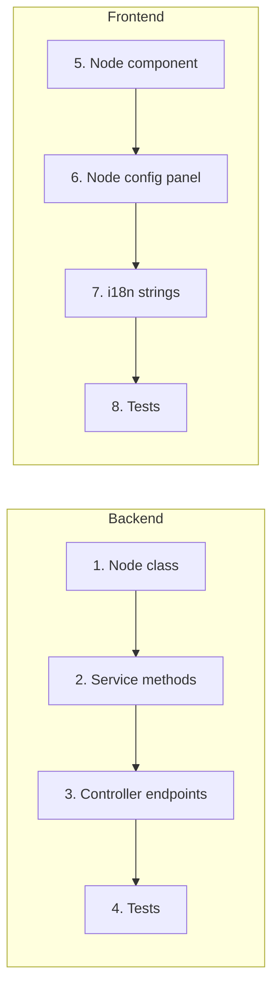

This document walks through adding a complete feature end-to-end. The example
adds a hypothetical new workflow node type called "Data Transform" that applies
a transformation function to input data.

## Overview

Adding a workflow node type touches several layers:



## Step 1: Define the Node Type Enum

Add the new node type to the workflow enums:

```python
# api/core/workflow/enums.py
class NodeType(StrEnum):
    # ... existing types ...
    DATA_TRANSFORM = "data-transform"
```

## Step 2: Create the Node Implementation

Create a new directory under `api/core/workflow/nodes/`:

```
api/core/workflow/nodes/data_transform/
    __init__.py
    node.py
    entities.py
```

### Define the Node Entity

```python
# api/core/workflow/nodes/data_transform/entities.py
from pydantic import BaseModel, ConfigDict, field_validator


class DataTransformNodeData(BaseModel):
    """Configuration for the Data Transform node."""
    transform_type: str  # "map", "filter", "reduce"
    expression: str
    input_variable: str

    model_config = ConfigDict(extra="forbid")

    @field_validator("transform_type")
    @classmethod
    def validate_transform_type(cls, value: str) -> str:
        valid_types = {"map", "filter", "reduce"}
        if value not in valid_types:
            raise ValueError(
                f"transform_type must be one of {valid_types}"
            )
        return value
```

### Implement the Node

```python
# api/core/workflow/nodes/data_transform/node.py
import logging
from collections.abc import Mapping, Sequence

from core.workflow.enums import NodeType
from core.workflow.nodes.base.node import Node
from core.workflow.nodes.data_transform.entities import (
    DataTransformNodeData,
)

logger = logging.getLogger(__name__)

LATEST_VERSION = "latest"


class DataTransformNode(Node[DataTransformNodeData]):
    """Node that transforms input data using a specified operation."""

    _node_data_cls = DataTransformNodeData
    _node_type = NodeType.DATA_TRANSFORM

    def _run(self) -> Mapping[str, object]:
        node_data = self.node_data
        input_value = self.graph_runtime_state.variable_pool.get(
            node_data.input_variable
        )

        if input_value is None:
            raise ValueError(
                f"Input variable '{node_data.input_variable}' not found"
            )

        result = self._apply_transform(
            transform_type=node_data.transform_type,
            expression=node_data.expression,
            data=input_value,
        )

        logger.info(
            "Data transform completed for node %s, type=%s",
            self.node_id,
            node_data.transform_type,
        )

        return {"result": result}

    def _apply_transform(
        self,
        transform_type: str,
        expression: str,
        data: object,
    ) -> object:
        match transform_type:
            case "map":
                return self._map_transform(expression, data)
            case "filter":
                return self._filter_transform(expression, data)
            case "reduce":
                return self._reduce_transform(expression, data)
            case _:
                raise ValueError(f"Unknown transform: {transform_type}")

    # ... implementation methods ...

    @classmethod
    def get_default_config(cls) -> dict:
        return {
            "type": NodeType.DATA_TRANSFORM,
            "data": {
                "transform_type": "map",
                "expression": "",
                "input_variable": "",
            },
        }
```

## Step 3: Register the Node

The node auto-registers via `Node.get_node_type_classes_mapping()` in
`api/core/workflow/nodes/node_mapping.py`, which scans the `nodes/` directory.
Ensure your node class is importable from its `__init__.py`:

```python
# api/core/workflow/nodes/data_transform/__init__.py
from .node import DataTransformNode

__all__ = ["DataTransformNode"]
```

## Step 4: Write Backend Tests

```python
# api/tests/unit_tests/core/workflow/nodes/test_data_transform.py
import pytest

from core.workflow.nodes.data_transform.entities import (
    DataTransformNodeData,
)


class TestDataTransformNodeData:
    def test_valid_transform_type_accepted(self):
        data = DataTransformNodeData(
            transform_type="map",
            expression="x * 2",
            input_variable="input.data",
        )
        assert data.transform_type == "map"

    def test_invalid_transform_type_rejected(self):
        with pytest.raises(ValueError, match="transform_type must be"):
            DataTransformNodeData(
                transform_type="invalid",
                expression="x * 2",
                input_variable="input.data",
            )

    def test_extra_fields_rejected(self):
        with pytest.raises(ValueError):
            DataTransformNodeData(
                transform_type="map",
                expression="x",
                input_variable="input.data",
                unexpected_field="value",
            )
```

Run the tests:

```bash
uv run --project api pytest tests/unit_tests/core/workflow/nodes/test_data_transform.py -v
```

## Step 5: Add Frontend Node Component

Create the node component in the workflow components directory:

```
web/app/components/workflow/nodes/data-transform/
    index.tsx
    config-panel.tsx
    types.ts
    index.spec.tsx
```

### Define Types

```tsx
// web/app/components/workflow/nodes/data-transform/types.ts
export type TransformType = 'map' | 'filter' | 'reduce'

export type DataTransformNodeConfig = {
  transformType: TransformType
  expression: string
  inputVariable: string
}
```

### Create the Node Component

```tsx
// web/app/components/workflow/nodes/data-transform/index.tsx
'use client'

import { type FC } from 'react'
import { useTranslation } from 'react-i18next'
import type { DataTransformNodeConfig } from './types'

type DataTransformNodeProps = {
  id: string
  data: DataTransformNodeConfig
}

const DataTransformNode: FC<DataTransformNodeProps> = ({ id, data }) => {
  const { t } = useTranslation()

  return (
    <div className="workflow-node rounded-lg border p-3">
      <div className="font-medium">
        {t('workflow.nodes.dataTransform.title')}
      </div>
      <div className="text-sm text-gray-500">
        {t(`workflow.nodes.dataTransform.types.${data.transformType}`)}
      </div>
    </div>
  )
}

export default DataTransformNode
```

## Step 6: Add i18n Strings

Add English translations:

```json
// web/i18n/en-US/workflow.json (add to existing file)
{
  "nodes": {
    "dataTransform": {
      "title": "Data Transform",
      "description": "Transform input data using map, filter, or reduce",
      "types": {
        "map": "Map",
        "filter": "Filter",
        "reduce": "Reduce"
      },
      "expression": "Expression",
      "expressionPlaceholder": "Enter transformation expression",
      "inputVariable": "Input Variable"
    }
  }
}
```

## Step 7: Write Frontend Tests

```tsx
// web/app/components/workflow/nodes/data-transform/index.spec.tsx
import { render, screen } from '@testing-library/react'
import { describe, expect, it, vi } from 'vitest'
import DataTransformNode from './index'

vi.mock('react-i18next', () => ({
  useTranslation: () => ({
    t: (key: string) => key,
  }),
}))

describe('DataTransformNode', () => {
  const defaultProps = {
    id: 'node-1',
    data: {
      transformType: 'map' as const,
      expression: 'x * 2',
      inputVariable: 'input.data',
    },
  }

  it('should render the node title', () => {
    render(<DataTransformNode {...defaultProps} />)
    expect(
      screen.getByText('workflow.nodes.dataTransform.title'),
    ).toBeInTheDocument()
  })

  it('should display the transform type', () => {
    render(<DataTransformNode {...defaultProps} />)
    expect(
      screen.getByText('workflow.nodes.dataTransform.types.map'),
    ).toBeInTheDocument()
  })
})
```

Run the tests:

```bash
cd web
pnpm test app/components/workflow/nodes/data-transform/index.spec.tsx
```

## Step 8: Database Migration (if needed)

If your feature requires schema changes:

```bash
# Create migration
uv run --project api flask db revision --autogenerate -m "add data transform node config"

# Review the generated migration in api/migrations/versions/
# Apply it
uv run --project api flask db upgrade
```

See [09 Database & Migrations](/docs/contributing/database-and-migrations) for details.

## Complete Checklist

Before submitting your PR:

- [ ] Node type enum added
- [ ] Node implementation with proper error handling
- [ ] Node entity with Pydantic validation
- [ ] Node registered (importable from __init__.py)
- [ ] Backend unit tests written and passing
- [ ] Frontend node component created
- [ ] Frontend config panel created
- [ ] i18n strings added to en-US
- [ ] Frontend tests written and passing
- [ ] All linters pass (backend and frontend)
- [ ] Type checkers pass (backend and frontend)
- [ ] Migration created and applied (if schema changed)
- [ ] PR description explains the feature and includes test plan

## Next Steps

- [Testing Guide](/docs/contributing/testing-guide) -- comprehensive testing patterns
- [Database & Migrations](/docs/contributing/database-and-migrations) -- if schema changes needed
- [Celery & Async](/docs/contributing/celery-and-async) -- if async processing needed
