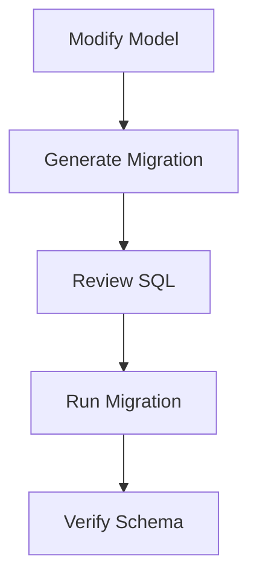

This guide covers SQLAlchemy model conventions, Alembic migrations, session
management, and query patterns used in Pulse.

## SQLAlchemy Model Conventions

### Base Classes

Pulse provides two base classes in `api/models/base.py`:

```python
# Legacy base -- used by older models
class Base(DeclarativeBase):
    metadata = metadata

# Modern base -- use this for all new models
class TypeBase(MappedAsDataclass, DeclarativeBase):
    metadata = metadata
```

**Always use `TypeBase` for new models.** It provides type-safe column
definitions via `MappedAsDataclass`.

### DefaultFieldsMixin

Most models should include the `DefaultFieldsMixin` for standard fields:

```python
from models.base import TypeBase, DefaultFieldsMixin


class MyNewModel(DefaultFieldsMixin, TypeBase):
    __tablename__ = "my_new_models"

    # DefaultFieldsMixin provides:
    #   id: str (UUIDv7, primary key)
    #   created_at: datetime
    #   updated_at: datetime

    # Add your fields
    tenant_id: Mapped[str] = mapped_column(StringUUID, nullable=False)
    name: Mapped[str] = mapped_column(db.String(255), nullable=False)
    status: Mapped[str] = mapped_column(db.String(50), default="draft")
```

### ID Generation

Pulse uses UUIDv7 for primary keys (time-sortable UUIDs):

```python
from libs.uuid_utils import uuidv7

# Generated automatically by DefaultFieldsMixin
# Or generate manually when needed:
new_id = str(uuidv7())
```

### Model Example

```python
from datetime import datetime

from sqlalchemy import DateTime, String, Text, func
from sqlalchemy.orm import Mapped, mapped_column

from models.base import DefaultFieldsMixin, TypeBase
from models.types import StringUUID


class DataTransformConfig(DefaultFieldsMixin, TypeBase):
    """Configuration for a data transform operation."""

    __tablename__ = "data_transform_configs"

    tenant_id: Mapped[str] = mapped_column(
        StringUUID,
        nullable=False,
        index=True,
    )
    workflow_id: Mapped[str] = mapped_column(
        StringUUID,
        nullable=False,
        index=True,
    )
    transform_type: Mapped[str] = mapped_column(
        String(50),
        nullable=False,
    )
    expression: Mapped[str] = mapped_column(
        Text,
        nullable=False,
        default="",
    )

    def __repr__(self) -> str:
        return (
            f"<DataTransformConfig(id={self.id}, "
            f"type={self.transform_type})>"
        )
```

## Creating Migrations



### Generate a Migration

After modifying or creating models:

```bash
uv run --project api flask db revision --autogenerate -m "add data transform configs table"
```

This creates a new migration file in `api/migrations/versions/`.

### Review the Migration

Always review the generated migration before applying it:

```python
# api/migrations/versions/abc123_add_data_transform_configs_table.py
from alembic import op
import sqlalchemy as sa
from sqlalchemy.dialects import postgresql


def upgrade():
    op.create_table(
        'data_transform_configs',
        sa.Column('id', sa.String(36), primary_key=True),
        sa.Column('tenant_id', sa.String(36), nullable=False),
        sa.Column('workflow_id', sa.String(36), nullable=False),
        sa.Column('transform_type', sa.String(50), nullable=False),
        sa.Column('expression', sa.Text(), nullable=False, default=''),
        sa.Column('created_at', sa.DateTime(), nullable=False),
        sa.Column('updated_at', sa.DateTime(), nullable=False),
    )
    op.create_index(
        'idx_data_transform_configs_tenant_id',
        'data_transform_configs',
        ['tenant_id'],
    )
    op.create_index(
        'idx_data_transform_configs_workflow_id',
        'data_transform_configs',
        ['workflow_id'],
    )


def downgrade():
    op.drop_table('data_transform_configs')
```

Check for:
- Correct column types and constraints
- Indexes on frequently queried columns (especially `tenant_id`)
- A clean `downgrade()` function
- No destructive changes in production-facing columns

### Apply the Migration

```bash
uv run --project api flask db upgrade
```

### Useful Migration Commands

```bash
# Check current migration state
uv run --project api flask db current

# See migration history
uv run --project api flask db history

# Downgrade one step
uv run --project api flask db downgrade -1

# Reset to base (development only!)
uv run --project api flask db downgrade base

# Upgrade to latest
uv run --project api flask db upgrade
```

## Session Patterns

### Context Manager Pattern (Preferred)

```python
from sqlalchemy.orm import Session
from extensions.ext_database import db

with Session(db.engine, expire_on_commit=False) as session:
    stmt = select(Workflow).where(
        Workflow.id == workflow_id,
        Workflow.tenant_id == tenant_id,
    )
    workflow = session.execute(stmt).scalar_one_or_none()
```

Key points:
- Always use `expire_on_commit=False` to prevent lazy loading issues
- The session auto-closes when the `with` block exits
- For writes, call `session.commit()` explicitly

### Write Pattern

```python
with Session(db.engine, expire_on_commit=False) as session:
    new_config = DataTransformConfig(
        tenant_id=tenant_id,
        workflow_id=workflow_id,
        transform_type="map",
        expression="x * 2",
    )
    session.add(new_config)
    session.commit()
    session.refresh(new_config)  # Get DB-generated values
```

### Bulk Operations

```python
with Session(db.engine, expire_on_commit=False) as session:
    configs = [
        DataTransformConfig(
            tenant_id=tenant_id,
            workflow_id=workflow_id,
            transform_type=t,
            expression=expr,
        )
        for t, expr in transforms
    ]
    session.add_all(configs)
    session.commit()
```

## Query Patterns

### Always Filter by tenant_id

This is the most important rule. Every query that touches tenant data
must include `tenant_id`:

```python
# GOOD
stmt = select(Workflow).where(
    Workflow.tenant_id == tenant_id,
    Workflow.status == "active",
)

# BAD -- cross-tenant data leak
stmt = select(Workflow).where(Workflow.status == "active")
```

### Select Specific Columns

For large tables, select only what you need:

```python
stmt = select(
    Workflow.id,
    Workflow.name,
    Workflow.status,
).where(
    Workflow.tenant_id == tenant_id,
)
rows = session.execute(stmt).all()
```

### Pagination

```python
stmt = (
    select(Workflow)
    .where(Workflow.tenant_id == tenant_id)
    .order_by(Workflow.created_at.desc())
    .offset(page * page_size)
    .limit(page_size)
)
```

### Locking for Updates

```python
stmt = (
    select(Workflow)
    .where(
        Workflow.id == workflow_id,
        Workflow.tenant_id == tenant_id,
    )
    .with_for_update()
)
workflow = session.execute(stmt).scalar_one_or_none()
```

### Prefer SQLAlchemy Expressions

```python
# GOOD: SQLAlchemy expression
stmt = (
    select(func.count())
    .select_from(Workflow)
    .where(Workflow.tenant_id == tenant_id)
)
count = session.execute(stmt).scalar()

# BAD: Raw SQL
result = session.execute(
    text("SELECT COUNT(*) FROM workflows WHERE tenant_id = :tid"),
    {"tid": tenant_id},
)
```

## Avoid N+1 Queries

```python
# BAD: N+1 pattern
workflows = session.execute(
    select(Workflow).where(Workflow.tenant_id == tenant_id)
).scalars().all()

for wf in workflows:
    # This triggers a new query for each workflow!
    nodes = wf.nodes

# GOOD: Eager load relationships
from sqlalchemy.orm import joinedload

stmt = (
    select(Workflow)
    .where(Workflow.tenant_id == tenant_id)
    .options(joinedload(Workflow.nodes))
)
```

## Next Steps

- [Celery & Async](/docs/contributing/celery-and-async) -- background tasks that interact with the DB
- [Backend Patterns](/docs/contributing/backend-patterns) -- broader backend conventions
- [Common Mistakes](/docs/contributing/common-mistakes) -- database-related pitfalls
