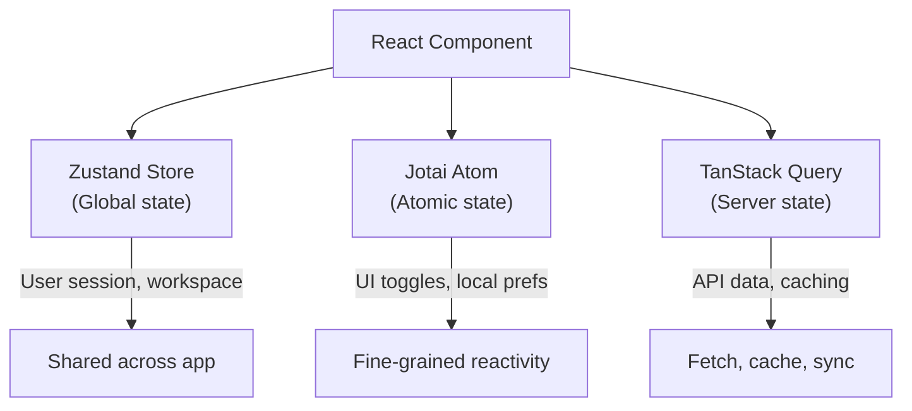

This document covers the practical patterns you need to follow when writing
frontend code for Pulse. The frontend is a Next.js 15 application with
React 19 and TypeScript 5.9.

## Next.js 15 App Router

Pulse uses the App Router (not Pages Router). Routes are defined by the
filesystem structure under `web/app/`.

### Route Groups

Route groups organize routes without affecting the URL path:

```
app/
  (commonLayout)/      # Main authenticated routes
    apps/              # /apps
    datasets/          # /datasets
    plugins/           # /plugins
  (shareLayout)/       # Public sharing routes
  (marketing)/         # Marketing pages
  layout.tsx           # Root layout (wraps everything)
```

### Page Structure

Each route directory contains:

```
apps/
  page.tsx           # Page component (server component by default)
  layout.tsx         # Optional layout wrapper
  loading.tsx        # Optional loading UI
  error.tsx          # Optional error boundary
```

### Client vs Server Components

```tsx
// Server Component (default) -- runs on the server
// Good for: data fetching, SEO, static content
export default function AppsPage() {
  return <AppsList />
}

// Client Component -- runs in the browser
// Required for: state, effects, event handlers, browser APIs
'use client'

import { useState } from 'react'

export default function AppsList() {
  const [filter, setFilter] = useState('')
  return <div>...</div>
}
```

**Rule:** Only add `'use client'` when the component needs browser-side
interactivity. Keep server components for data fetching and layout.

## React 19 Patterns

### Component Structure

```tsx
'use client'

import { type FC, useCallback, useState } from 'react'
import { useTranslation } from 'react-i18next'

type WorkflowCardProps = {
  id: string
  name: string
  description?: string
  onSelect: (id: string) => void
}

const WorkflowCard: FC<WorkflowCardProps> = ({
  id,
  name,
  description = '',
  onSelect,
}) => {
  const { t } = useTranslation()
  const [isHovered, setIsHovered] = useState(false)

  const handleClick = useCallback(() => {
    onSelect(id)
  }, [id, onSelect])

  return (
    <div
      className="rounded-lg border p-4 cursor-pointer"
      onClick={handleClick}
      onMouseEnter={() => setIsHovered(true)}
      onMouseLeave={() => setIsHovered(false)}
    >
      <h3>{name}</h3>
      {description && <p>{description}</p>}
      {isHovered && <span>{t('common.clickToOpen')}</span>}
    </div>
  )
}

export default WorkflowCard
```

**Rules:**
- Use `type` (not `interface`) for component props
- Use `FC<Props>` for component typing
- Destructure props with defaults in the parameter list
- Use `useCallback` for event handlers passed to children
- Co-locate component and its types in the same file

## State Management



Pulse uses three state management strategies for different needs:

### Zustand (Global State)

For application-wide state like user session and workspace context:

```tsx
import { create } from 'zustand'

type WorkspaceStore = {
  currentWorkspaceId: string | null
  setWorkspaceId: (id: string) => void
}

export const useWorkspaceStore = create<WorkspaceStore>((set) => ({
  currentWorkspaceId: null,
  setWorkspaceId: (id) => set({ currentWorkspaceId: id }),
}))

// Usage in component
function WorkspaceSelector() {
  const { currentWorkspaceId, setWorkspaceId } = useWorkspaceStore()
  // ...
}
```

### Jotai (Atomic State)

For fine-grained reactive state scoped to a feature:

```tsx
import { atom, useAtom } from 'jotai'

const sidebarOpenAtom = atom(true)

function Sidebar() {
  const [isOpen, setIsOpen] = useAtom(sidebarOpenAtom)
  // ...
}
```

### TanStack Query (Server State)

For data fetching, caching, and synchronization:

```tsx
import { useQuery, useMutation, useQueryClient } from '@tanstack/react-query'

function useWorkflows(tenantId: string) {
  return useQuery({
    queryKey: ['workflows', tenantId],
    queryFn: () => fetchWorkflows(tenantId),
  })
}

function useCreateWorkflow() {
  const queryClient = useQueryClient()
  return useMutation({
    mutationFn: createWorkflow,
    onSuccess: () => {
      queryClient.invalidateQueries({ queryKey: ['workflows'] })
    },
  })
}
```

## Internationalization (i18n)

All user-facing strings must use the i18n system. Never hardcode text.

### Do This

```tsx
import { useTranslation } from 'react-i18next'

function SaveButton() {
  const { t } = useTranslation()
  return <button>{t('common.save')}</button>
}
```

### Not That

```tsx
// BAD: Hardcoded string
function SaveButton() {
  return <button>Save</button>
}
```

### Adding New Strings

1. Add the English string to the appropriate file in `web/i18n/en-US/`:

```json
{
  "common": {
    "save": "Save",
    "cancel": "Cancel",
    "myNewFeature": "My New Feature"
  }
}
```

2. Reference it in your component:

```tsx
const { t } = useTranslation()
t('common.myNewFeature')
```

3. Other languages will be translated separately. Always start with `en-US`.

**Rules:**
- English (`en-US`) is the source of truth
- Never hardcode display text in components
- Use dot notation for nested keys
- Group related strings in the same file

## ORPC API Client

Pulse uses ORPC for type-safe API communication. Contracts define the
shape of requests and responses with full TypeScript types.

```tsx
// service/workflow.ts
import { client } from './client'

export async function fetchWorkflows(tenantId: string) {
  return client.workflows.list.query({ tenantId })
}

export async function createWorkflow(data: CreateWorkflowInput) {
  return client.workflows.create.mutate(data)
}
```

**Rules:**
- Define API functions in `web/service/`
- Use contracts from `web/contract/` for type safety
- Never call `fetch()` directly -- always go through the ORPC client

## TypeScript Strict Mode

The project uses strict TypeScript configuration. Follow these rules:

### Do This

```tsx
// Explicit types, no `any`
type WorkflowNode = {
  id: string
  type: NodeType
  data: Record<string, unknown>
}

function processNode(node: WorkflowNode): ProcessedNode {
  // Return type is explicit
  return { ...node, processed: true }
}
```

### Not That

```tsx
// BAD: Using `any`
function processNode(node: any): any {
  return { ...node, processed: true }
}
```

**Rules:**
- Never use `any` -- use `unknown` if the type is truly unknown
- Provide explicit return types for exported functions
- Use discriminated unions for variant types
- Import types from `web/models/` rather than defining inline

## ESLint (Antfu Config)

The project uses the Antfu ESLint configuration. Run the linter with:

```bash
pnpm lint:fix
```

This auto-fixes most formatting and style issues. The configuration is in
`web/eslint.config.mjs`.

## Component Organization

### Base Components (`web/app/components/base/`)

The ~107 base components form the design system. They include buttons, modals,
inputs, tooltips, dropdowns, and more.

**Rules:**
- Always check base components before creating a new one
- Base components must have their own tests
- Never import internal implementation details of base components

### Feature Components

Feature components are organized by domain:

```
components/
  app/                App configuration and management
  workflow/           Workflow builder and editor
  datasets/           Knowledge base management
  plugins/            Plugin marketplace and management
  rag-pipeline/       RAG pipeline builder
  header/             Navigation header
  billing/            Billing and subscription
```

### File Naming

```
ComponentName/
  index.tsx           Main component
  index.spec.tsx      Tests (same directory)
  hooks.ts            Component-specific hooks
  types.ts            Component-specific types
  utils.ts            Component-specific utilities
  context.tsx         Component-specific context
```

## General Rules

- Keep components under 400 lines; extract sub-components when larger
- Use Tailwind CSS for styling (configured in `tailwind.config.js`)
- Prefer composition over inheritance
- Use semantic HTML elements (`button`, `nav`, `main`, `section`)
- Handle loading and error states in every data-fetching component
- Test with Vitest + React Testing Library (see [07 Testing Guide](/docs/contributing/testing-guide))

## Next Steps

- [Adding a Feature](/docs/contributing/adding-a-feature) -- end-to-end walkthrough
- [Testing Guide](/docs/contributing/testing-guide) -- frontend testing patterns
- [Common Mistakes](/docs/contributing/common-mistakes) -- pitfalls to avoid
