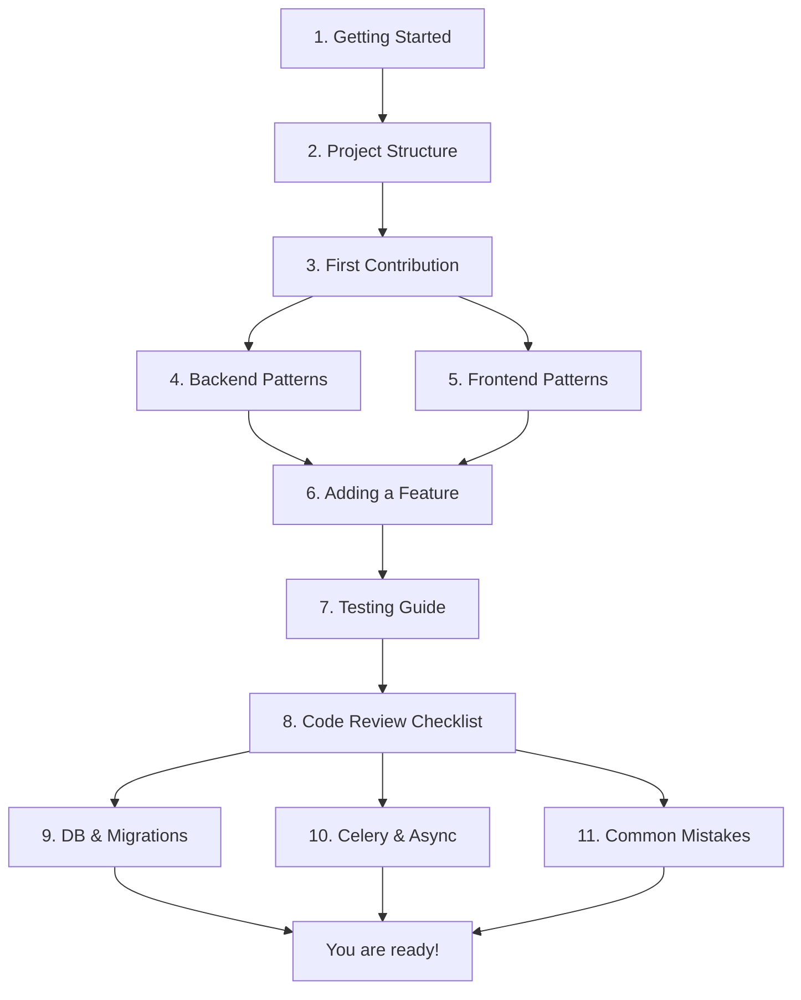

Welcome to the Pulse contributing guide. This section contains everything you
need to go from zero to productive contributor.

## Learning Path

Follow these documents in order for the fastest ramp-up. Each builds on the
previous one.



## Document Index

### Fundamentals (do these first)

| # | Document | Time | Description |
|---|----------|------|-------------|
| 01 | [Getting Started](/docs/contributing/getting-started) | 30 min | Git clone to running app |
| 02 | [Project Structure](/docs/contributing/project-structure) | 15 min | Directory map and layers |
| 03 | [First Contribution](/docs/contributing/first-contribution) | 15 min | Branch, test, and PR workflow |

### Stack-Specific Patterns (pick your stack)

| # | Document | Time | Description |
|---|----------|------|-------------|
| 04 | [Backend Patterns](/docs/contributing/backend-patterns) | 20 min | Flask, DDD layers, config, errors |
| 05 | [Frontend Patterns](/docs/contributing/frontend-patterns) | 20 min | Next.js 15, React 19, Zustand, i18n |

### Going Deeper

| # | Document | Time | Description |
|---|----------|------|-------------|
| 06 | [Adding a Feature](/docs/contributing/adding-a-feature) | 30 min | Walkthrough: new workflow node type |
| 07 | [Testing Guide](/docs/contributing/testing-guide) | 20 min | pytest, Vitest, TDD, mocking |
| 08 | [Code Review Checklist](/docs/contributing/code-review-checklist) | 10 min | What reviewers check |

### Reference Guides

| # | Document | Time | Description |
|---|----------|------|-------------|
| 09 | [Database & Migrations](/docs/contributing/database-and-migrations) | 15 min | SQLAlchemy, Alembic, sessions |
| 10 | [Celery & Async](/docs/contributing/celery-and-async) | 15 min | Tasks, queues, workers |
| 11 | [Common Mistakes](/docs/contributing/common-mistakes) | 10 min | Pitfalls and how to avoid them |

## Quick Reference

### Backend Commands

```bash
# Run API server
uv run --project api flask run --host 0.0.0.0 --port=5001 --debug

# Lint and format
uv run --project api ruff check --fix --unsafe-fixes
uv run --project api ruff format

# Type check
uv run --project api basedpyright .

# Run tests
uv run --project api pytest tests/unit_tests/

# Database migrations
uv run --project api flask db upgrade
uv run --project api flask db revision --autogenerate -m "description"
```

### Frontend Commands

```bash
cd web

# Lint and format
pnpm lint:fix

# Type check
pnpm type-check:tsgo

# Run tests
pnpm test
pnpm test:coverage
```

### Middleware

```bash
cd docker
docker compose -f docker-compose.middleware.yaml -p pulse up -d
```

## Related Resources

- [Glossary](/docs/glossary) -- Shared vocabulary
- [Documentation Home](/docs) -- Full documentation index
- `api/AGENTS.md` -- Backend agent guide and coding style
- `web/testing/testing.md` -- Frontend testing specification
- `api/commands.md` -- Flask CLI commands reference
