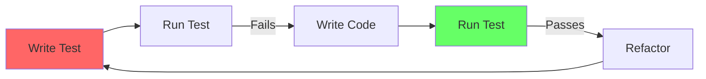

This guide covers practical testing for both the backend (pytest) and
frontend (Vitest + React Testing Library). It emphasizes TDD workflow and
concrete patterns you can copy.

## TDD Workflow

All new features and bug fixes should follow Test-Driven Development:



This workflow ensures:
- Every behavior has a test before the code exists
- You write only the code you need
- Refactoring is safe because tests catch regressions

## Backend Testing (pytest)

### Running Tests

```bash
# All unit tests
uv run --project api pytest tests/unit_tests/

# Specific file
uv run --project api pytest tests/unit_tests/core/workflow/test_engine.py

# Specific test
uv run --project api pytest tests/unit_tests/core/workflow/test_engine.py::test_execute_node -v

# With coverage
uv run --project api pytest tests/unit_tests/ --cov --cov-report=term-missing
```

Note: Integration tests (`tests/integration_tests/`) are CI-only and are
not expected to run locally.

### Test File Organization

```
tests/
  unit_tests/
    core/
      workflow/
        test_engine.py        # Tests for core/workflow/engine.py
        nodes/
          test_llm.py         # Tests for core/workflow/nodes/llm/
    services/
      test_workflow_service.py
    models/
      test_workflow.py
  integration_tests/          # CI-only
```

### Test Structure (Arrange-Act-Assert)

```python
import pytest
from unittest.mock import MagicMock, patch

from services.workflow_service import WorkflowService
from services.errors.workflow_service import WorkflowNotFoundError


class TestWorkflowService:
    def test_get_workflow_returns_workflow_for_valid_id(self):
        # Arrange
        tenant_id = "tenant-123"
        workflow_id = "wf-456"
        mock_workflow = MagicMock(id=workflow_id, tenant_id=tenant_id)

        with patch(
            "services.workflow_service.Session"
        ) as mock_session:
            mock_session.return_value.__enter__.return_value \
                .execute.return_value \
                .scalar_one_or_none.return_value = mock_workflow

            # Act
            result = WorkflowService.get_workflow(tenant_id, workflow_id)

        # Assert
        assert result.id == workflow_id
        assert result.tenant_id == tenant_id

    def test_get_workflow_raises_not_found_for_missing_id(self):
        # Arrange
        with patch(
            "services.workflow_service.Session"
        ) as mock_session:
            mock_session.return_value.__enter__.return_value \
                .execute.return_value \
                .scalar_one_or_none.return_value = None

            # Act & Assert
            with pytest.raises(WorkflowNotFoundError):
                WorkflowService.get_workflow("tenant-123", "missing-id")

    def test_get_workflow_always_filters_by_tenant_id(self):
        # Arrange
        with patch(
            "services.workflow_service.Session"
        ) as mock_session:
            session = mock_session.return_value.__enter__.return_value
            session.execute.return_value \
                .scalar_one_or_none.return_value = None

            # Act
            with pytest.raises(WorkflowNotFoundError):
                WorkflowService.get_workflow("tenant-123", "wf-456")

            # Assert -- verify tenant_id was in the query
            call_args = session.execute.call_args
            assert call_args is not None
```

### Mocking Patterns

```python
from unittest.mock import MagicMock, patch, PropertyMock

# Mock a module-level function
with patch("services.workflow_service.some_function") as mock_fn:
    mock_fn.return_value = expected_value

# Mock a class method
with patch.object(WorkflowService, "validate_quota") as mock_validate:
    mock_validate.return_value = True

# Mock dify_config
with patch("configs.dify_config") as mock_config:
    type(mock_config).DEBUG = PropertyMock(return_value=True)
    type(mock_config).MAX_WORKFLOWS = PropertyMock(return_value=100)

# Mock database session
with patch("services.workflow_service.Session") as MockSession:
    session = MockSession.return_value.__enter__.return_value
    session.execute.return_value.scalar_one_or_none.return_value = mock_obj
```

### Fixture Patterns

```python
import pytest
from models.workflow import Workflow


@pytest.fixture
def sample_workflow():
    return Workflow(
        id="wf-test-123",
        tenant_id="tenant-test",
        name="Test Workflow",
        description="A test workflow",
    )


@pytest.fixture
def mock_db_session():
    with patch("extensions.ext_database.db") as mock_db:
        yield mock_db


class TestWorkflowCreation:
    def test_creates_with_valid_data(self, sample_workflow, mock_db_session):
        # Use fixtures
        assert sample_workflow.name == "Test Workflow"
```

## Frontend Testing (Vitest)

### Running Tests

```bash
cd web

# All tests
pnpm test

# Watch mode (re-runs on file changes)
pnpm test:watch

# With coverage
pnpm test:coverage

# Specific file
pnpm test app/components/workflow/nodes/llm/index.spec.tsx
```

### Test File Organization

Test files live next to their source files:

```
app/components/workflow/
  WorkflowCard/
    index.tsx              # Component
    index.spec.tsx         # Tests
    hooks.ts               # Component hooks
```

### Test Structure

```tsx
import { fireEvent, render, screen, waitFor } from '@testing-library/react'
import { describe, expect, it, vi, beforeEach } from 'vitest'
import WorkflowCard from './index'

// Mock external dependencies only
vi.mock('@/service/api')
vi.mock('next/navigation', () => ({
  useRouter: () => ({ push: vi.fn() }),
  usePathname: () => '/test',
}))

describe('WorkflowCard', () => {
  beforeEach(() => {
    vi.clearAllMocks()  // Reset before each test, not after
  })

  // Rendering tests
  describe('Rendering', () => {
    it('should render workflow name', () => {
      // Arrange
      const props = { id: '1', name: 'My Workflow', onSelect: vi.fn() }

      // Act
      render(<WorkflowCard {...props} />)

      // Assert
      expect(screen.getByText('My Workflow')).toBeInTheDocument()
    })
  })

  // Interaction tests
  describe('User Interactions', () => {
    it('should call onSelect when clicked', () => {
      // Arrange
      const onSelect = vi.fn()
      render(
        <WorkflowCard id="1" name="Test" onSelect={onSelect} />,
      )

      // Act
      fireEvent.click(screen.getByText('Test'))

      // Assert
      expect(onSelect).toHaveBeenCalledWith('1')
    })
  })

  // Edge cases
  describe('Edge Cases', () => {
    it('should handle empty description gracefully', () => {
      render(
        <WorkflowCard id="1" name="Test" onSelect={vi.fn()} />,
      )
      // Assert no crash, component renders
      expect(screen.getByText('Test')).toBeInTheDocument()
    })
  })
})
```

### Query Priority

Use queries in this order (most to least preferred):

1. `getByRole` -- follows accessibility standards
2. `getByLabelText` -- form fields
3. `getByPlaceholderText` -- when no label exists
4. `getByText` -- non-interactive elements
5. `getByDisplayValue` -- current form values
6. `getByAltText` -- images
7. `getByTitle` -- last choice before testid
8. `getByTestId` -- absolute last resort

### Mocking Rules

- **Do** mock: API services (`@/service/*`), `next/navigation`, complex
  context providers, external libraries
- **Do not** mock: base components (`@/app/components/base/*`), sibling
  components, project utilities
- Always reset mocks in `beforeEach`, not `afterEach`
- Match actual component behavior in mocks (especially conditional rendering)

### Async Testing

```tsx
it('should show data after loading', async () => {
  // Arrange
  vi.mocked(fetchWorkflows).mockResolvedValue([
    { id: '1', name: 'Workflow 1' },
  ])

  // Act
  render(<WorkflowList />)

  // Assert
  await waitFor(() => {
    expect(screen.getByText('Workflow 1')).toBeInTheDocument()
  })
})

it('should show error on API failure', async () => {
  // Arrange
  vi.mocked(fetchWorkflows).mockRejectedValue(new Error('Network error'))

  // Act
  render(<WorkflowList />)

  // Assert
  const error = await screen.findByText(/error/i)
  expect(error).toBeInTheDocument()
})
```

## Coverage Targets

| Scope | Target |
|-------|--------|
| Overall project | 80%+ |
| Single file (when focused) | 100% function, 100% statement, 95%+ branch |
| New features | 80%+ on all new code |

## Test Data Builders

Use factory functions for test data:

```python
# Backend
def make_workflow(**overrides) -> Workflow:
    defaults = {
        "id": "wf-test-1",
        "tenant_id": "tenant-test",
        "name": "Test Workflow",
        "description": "",
    }
    return Workflow(**{**defaults, **overrides})
```

```tsx
// Frontend
function createWorkflowProps(
  overrides?: Partial<WorkflowCardProps>,
): WorkflowCardProps {
  return {
    id: 'wf-1',
    name: 'Test Workflow',
    description: '',
    onSelect: vi.fn(),
    ...overrides,
  }
}
```

## Next Steps

- [Code Review Checklist](/docs/contributing/code-review-checklist) -- what reviewers check
- [Common Mistakes](/docs/contributing/common-mistakes) -- testing pitfalls
- `web/testing/testing.md` -- full frontend testing specification
