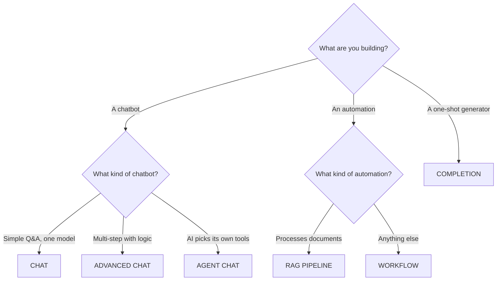

Pulse offers six different app modes. Each mode is designed for a
different type of application. This chapter helps you understand the
differences and choose the right one.

---

## Table of Contents

1. [Overview](#overview)
2. [Mode Details](#mode-details)
3. [Decision Table](#decision-table)
4. [Mode Comparison](#mode-comparison)
5. [Switching Modes](#switching-modes)

---

## Overview

Think of app modes like vehicle types. You would not use a bicycle to
haul freight, and you would not use a semi-truck for a quick trip to
the store. Each mode is optimized for a different job.

| Mode | One-Line Summary | Analogy |
|------|-----------------|---------|
| **Chat** | Simple conversational chatbot | A helpful assistant you text with |
| **Completion** | One-shot text generation | A form: input in, result out |
| **Advanced Chat** | Workflow-powered chatbot | A customer support system with departments |
| **Agent Chat** | Tool-using autonomous AI | A personal assistant who figures out the steps |
| **Workflow** | Standalone automation pipeline | A factory assembly line |
| **RAG Pipeline** | Document processing workflow | A librarian cataloging books |

---

## Mode Details

### Chat

The simplest mode. The user sends messages, the AI responds, and the
conversation continues. The AI remembers what was said earlier in the
conversation.

**How it works**: You choose a model, write a system prompt (instructions
for the AI), and optionally connect a knowledge base. That is it.

**Best for**:
- Customer support chatbots
- Q&A assistants
- General-purpose conversational AI
- Quick prototypes

**Limitations**:
- Cannot make complex decisions (no branching logic)
- Cannot call external services
- Limited to what a single AI model can do

**Example use cases**:
- "Help our employees find answers in the company handbook"
- "Create a chatbot that explains our product features"

---

### Completion

A single request-response interaction with no conversation. The user
provides input, the AI generates output, and it is done. There is no
back-and-forth.

**How it works**: You define input fields (like a form), write a prompt
that uses those inputs, and the AI generates a result.

**Best for**:
- Text summarization
- Translation
- Content generation from templates
- Data extraction
- Any task where the AI needs to transform input into output once

**Limitations**:
- No conversation memory
- No follow-up questions
- One input, one output

**Example use cases**:
- "Summarize this meeting transcript"
- "Translate this document from English to Spanish"
- "Generate a product description from these bullet points"

---

### Advanced Chat

A chatbot powered by a visual workflow. Instead of sending messages
directly to an AI model, you design a multi-step process that each
message goes through. This gives you full control over how the chatbot
handles different situations.

**How it works**: You build a workflow on a visual canvas. The Start
node receives the user's message, and subsequent nodes process it
through any combination of AI calls, knowledge base searches, branching
logic, and external service calls.

**Best for**:
- Complex chatbots that need branching logic
- Chatbots that search multiple knowledge bases
- Chatbots that call external APIs
- Any conversational app that needs more than a simple prompt

**Limitations**:
- More complex to set up than basic Chat mode
- Requires understanding the workflow builder

**Example use cases**:
- "Route support questions to different knowledge bases based on topic"
- "Build a chatbot that checks inventory before answering product
  questions"

---

### Agent Chat

A chatbot where the AI autonomously decides which tools to use and in
what order. Instead of you defining every step, the AI figures out the
best approach to answer each question.

**How it works**: You give the AI access to a set of tools (web search,
calculator, API calls, etc.) and instructions. When a user asks a
question, the AI decides which tools to use, calls them, and combines
the results into an answer.

**Best for**:
- Research tasks that require multiple information sources
- Complex problem-solving where the steps are not predictable
- Tasks that require real-time data gathering

**Limitations**:
- Less predictable than workflows (the AI decides the path)
- Can be slower (multiple tool calls)
- Higher token usage (the AI reasons about which tools to use)

**Example use cases**:
- "Research this competitor and summarize what you find"
- "Find the best flight options and compare prices"
- "Analyze this data and create a summary report"

---

### Workflow

A standalone automation pipeline with no chat interface. It runs when
triggered by a schedule, a webhook, or a manual button click, processes
data through a series of steps, and produces output.

**How it works**: You build a workflow on the visual canvas, starting
with a trigger (schedule, webhook, or manual start). Data flows through
the nodes and ends with an output.

**Best for**:
- Background automation
- Batch data processing
- Scheduled reports
- Integration between systems
- Any task that does not need a conversational interface

**Limitations**:
- No conversation -- it processes data and produces output
- Not interactive (except for Human Input nodes)

**Example use cases**:
- "Generate a weekly report every Monday morning"
- "Process incoming form submissions automatically"
- "Sync data between our CRM and our support system daily"

---

### RAG Pipeline

A specialized workflow for document processing. Designed specifically
for ingesting, chunking, embedding, and indexing documents into
knowledge bases.

**How it works**: Similar to Workflow mode, but with specialized nodes
and variables for document processing. The workflow receives documents
and processes them through extraction, transformation, and indexing
steps.

**Best for**:
- Custom document ingestion pipelines
- Specialized chunking strategies
- Multi-source data processing
- Advanced knowledge base management

**Limitations**:
- Specialized -- only for document processing use cases
- Requires understanding of knowledge base concepts

**Example use cases**:
- "Process incoming PDFs with custom chunking rules"
- "Ingest data from multiple sources with different formats"

---

## Decision Table

Use this table to quickly determine which mode to use:

| Question | Answer --> Mode |
|----------|----------------|
| Do you need a conversation interface? | No --> **Workflow** or **RAG Pipeline** |
| Is it a simple Q&A with one model? | Yes --> **Chat** |
| Does it need one input and one output (no conversation)? | Yes --> **Completion** |
| Does the chatbot need branching logic or multiple steps? | Yes --> **Advanced Chat** |
| Should the AI decide which tools to use autonomously? | Yes --> **Agent Chat** |
| Is it specifically for document processing? | Yes --> **RAG Pipeline** |
| Does it run on a schedule or via webhook? | Yes --> **Workflow** |

### Flowchart

---

## Mode Comparison

| Feature | Chat | Completion | Advanced Chat | Agent Chat | Workflow | RAG Pipeline |
|---------|------|-----------|--------------|-----------|---------|-------------|
| Conversation memory | Yes | No | Yes | Yes | No | No |
| Visual workflow builder | No | No | Yes | No | Yes | Yes |
| Branching logic | No | No | Yes | AI decides | Yes | Yes |
| External API calls | No | No | Yes | Via tools | Yes | Yes |
| Knowledge base search | Direct | No | Via node | Via tools | Via node | Via node |
| Schedule/webhook trigger | No | No | No | No | Yes | Yes |
| User interaction | Chat | Form | Chat | Chat | Form/none | Form/none |
| Complexity to set up | Low | Low | Medium | Medium | Medium | High |
| Predictability | High | High | High | Low | High | High |

---

## Switching Modes

Some modes can be converted:

| From | To | Possible? |
|------|----|-----------|
| Chat | Advanced Chat | Yes -- create a new Advanced Chat app and recreate your prompt as a workflow |
| Completion | Workflow | Yes -- create a Workflow with the same logic |
| Advanced Chat | Workflow | Partially -- the workflow graph can be similar, but triggers differ |

> **Note**: There is no automatic conversion between modes. You will
> need to recreate the app in the new mode. Keep the original app as
> reference until the new one is ready.

---

## Next Steps

- **Build a chatbot**: See [Building Your First Chatbot](/docs/user-guide/building-your-first-chatbot)
- **Build a workflow**: See [Building a Workflow](/docs/user-guide/building-a-workflow)
- **Explore recipes**: See [Recipes](/docs/user-guide/recipes)
