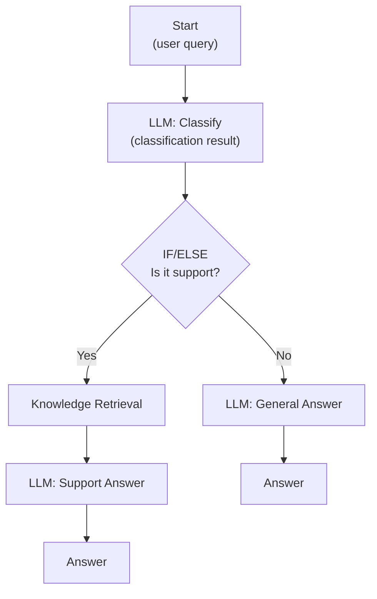
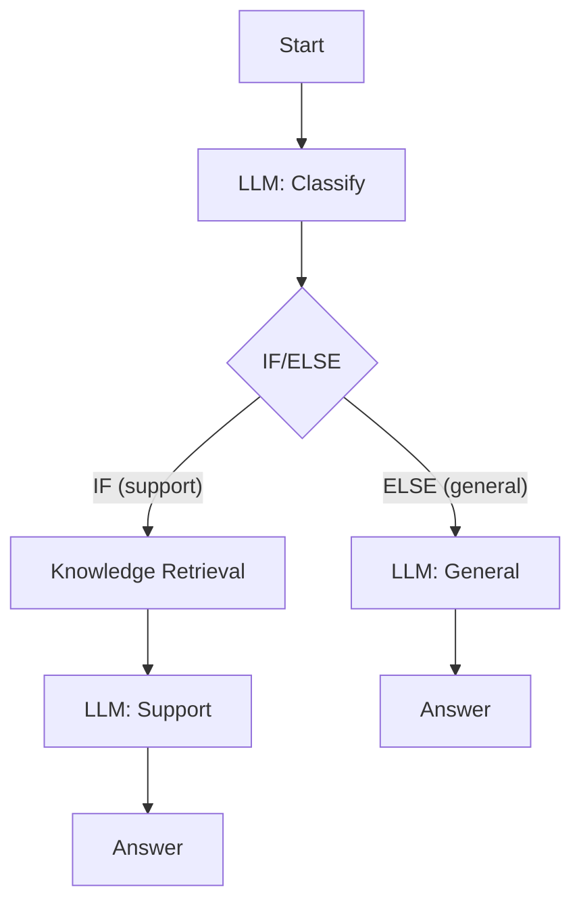

Workflows let you build AI applications that follow multi-step processes.
Instead of just sending a message to an AI model, you design a visual
diagram that defines exactly what happens at each step.

**Time needed**: About 20 minutes.

---

## Table of Contents

1. [What Is a Workflow?](#what-is-a-workflow)
2. [What We Are Building](#what-we-are-building)
3. [Step 1: Create a Workflow App](#step-1-create-a-workflow-app)
4. [Step 2: Understand the Canvas](#step-2-understand-the-canvas)
5. [Step 3: Configure the Start Node](#step-3-configure-the-start-node)
6. [Step 4: Add an LLM Node](#step-4-add-an-llm-node)
7. [Step 5: Add Branching with IF/ELSE](#step-5-add-branching-with-ifelse)
8. [Step 6: Add More Nodes to Each Branch](#step-6-add-more-nodes-to-each-branch)
9. [Step 7: Connect to Output Nodes](#step-7-connect-to-output-nodes)
10. [Step 8: Understanding Variables](#step-8-understanding-variables)
11. [Step 9: Test Your Workflow](#step-9-test-your-workflow)
12. [Step 10: Publish](#step-10-publish)
13. [What You Learned](#what-you-learned)

---

## What Is a Workflow?

A workflow is like a flowchart that Pulse follows when processing a
request. Each box in the flowchart does something specific -- ask the AI
a question, search a knowledge base, make a decision, call an external
service -- and arrows between the boxes define the order.

Workflows are more powerful than simple chatbots because they can:

- Make decisions based on the content of a message
- Search through your documents before responding
- Call external services (like sending an email or querying a database)
- Process information in multiple steps
- Run steps in parallel for faster results

---

## What We Are Building

We are going to build a smart routing workflow that:

1. Receives a user question
2. Uses AI to classify it as "support" or "general"
3. If it is a support question, searches a knowledge base and generates
   a detailed answer
4. If it is a general question, generates a friendly general response

Here is what the finished workflow looks like:



Do not worry if this looks complex -- we will build it one step at a
time.

---

## Step 1: Create a Workflow App

1. From the dashboard, click **"Create App."**
2. Choose the app type based on what you want:
   - **"Chatbot" > "Workflow-based"** -- if you want a conversational
     app powered by a workflow (Advanced Chat mode)
   - **"Workflow"** -- if you want a standalone automation (no chat
     interface)
3. For this tutorial, choose **"Chatbot" > "Workflow-based."**
4. Name it "Smart Router Bot."
5. Click **"Create."**

You will be taken to the **workflow editor** -- a visual canvas where
you build your workflow.

---

## Step 2: Understand the Canvas

The workflow editor has several areas:

### The Canvas (Center)

This is the large area where you build your workflow. You will see:

- A **Start** node already placed (every workflow begins with one).
- A grid background that you can zoom and pan.

**Navigation tips**:
- **Scroll** to zoom in/out
- **Click and drag** on empty space to pan
- **Click a node** to select and configure it
- **Drag from a node's output dot** to create a connection

### The Node Panel (Left or Top)

A panel or toolbar where you can find all available node types. You can
drag nodes from here onto the canvas or use a right-click menu.

### The Configuration Panel (Right)

When you click a node, its settings appear in a panel on the right.
This is where you configure what the node does.

### The Debug Panel (Right or Bottom)

A test panel where you can run your workflow and see the results step
by step.

---

## Step 3: Configure the Start Node

The **Start node** is where every workflow begins. It defines what
inputs your workflow accepts.

1. Click the **Start** node on the canvas.
2. In the configuration panel, you will see options to add input fields.
3. For our chatbot, the Start node automatically receives the user's
   message as a variable called "query." You do not need to change
   anything for now.

The Start node's output (the user's message) will be available to all
downstream nodes.

---

## Step 4: Add an LLM Node

Now we will add an AI step that classifies the user's question.

1. **Add a node**: Click the **"+"** button on the Start node's output
   arrow, or drag an "LLM" node from the node panel onto the canvas.
2. **Connect it**: If you used the "+" button, it is already connected.
   If you dragged it, draw a line from the Start node's output dot to
   the LLM node's input dot.
3. **Configure the LLM node**:
   a. Click the LLM node to open its settings.
   b. **Name it**: Change the name to "Classify Question."
   c. **Choose a model**: Select a model from the dropdown (GPT-4o
      works well for classification).
   d. **Write the prompt**: This is the instruction for the AI. Enter
      something like:

```
Classify the following user message into one of two categories:
- "support" if the user is asking for help with a product issue,
  billing, or technical problem
- "general" if the user is asking a general question, making
  conversation, or anything else

User message: {{#start.query#}}

Respond with ONLY the word "support" or "general". Nothing else.
```

4. Notice the `{{#start.query#}}` part -- this is a **variable
   reference**. It pulls in the user's message from the Start node.
   You can insert variables by clicking the variable insertion button
   in the prompt editor.

---

## Step 5: Add Branching with IF/ELSE

Now we need to route the conversation based on the classification.

1. Add an **IF/ELSE** node after the Classify Question node.
2. Connect the Classify Question node's output to the IF/ELSE node.
3. Configure the IF/ELSE conditions:
   a. Click the IF/ELSE node.
   b. Set the condition:
      - **Variable**: Select the output of the Classify Question node
        (the text it generated)
      - **Operator**: "Contains"
      - **Value**: "support"
   c. This means: "If the classification contains the word 'support',
      go down the IF path. Otherwise, go down the ELSE path."

The IF/ELSE node will now have two output paths: one labeled "IF" (for
support questions) and one labeled "ELSE" (for general questions).

---

## Step 6: Add More Nodes to Each Branch

### The Support Branch (IF path)

For support questions, we want to search a knowledge base first:

1. Add a **Knowledge Retrieval** node to the IF path.
   - Connect the IF output of the IF/ELSE node to this new node.
   - Configure it to search your knowledge base (if you have one set
     up -- see [Chapter 06](/docs/user-guide/knowledge-bases) for how to create
     one). For now, you can skip this step and come back later.

2. Add an **LLM** node after the Knowledge Retrieval node.
   - Name it "Generate Support Answer."
   - Write a prompt like:

```
You are a helpful support agent. Answer the user's question using the
context provided.

User question: {{#start.query#}}

Relevant information:
{{#knowledge_retrieval.result#}}

If the provided information does not contain the answer, say so honestly.
```

### The General Branch (ELSE path)

For general questions, we just need a friendly response:

1. Add an **LLM** node to the ELSE path.
   - Name it "Generate General Answer."
   - Write a prompt like:

```
You are a friendly assistant. Respond to the user's message in a
helpful and conversational way.

User message: {{#start.query#}}
```

---

## Step 7: Connect to Output Nodes

Every workflow needs to end with an output. In a chatbot workflow, the
output node is the **Answer** node.

1. Add an **Answer** node after the "Generate Support Answer" node.
   - Configure it to output the text from the support LLM node.

2. Add another **Answer** node after the "Generate General Answer" node.
   - Configure it to output the text from the general LLM node.

Both branches now end with an Answer node that sends the response back
to the user.

Your completed workflow should look like this:



---

## Step 8: Understanding Variables

Variables are how nodes pass data to each other. Think of them as labeled
containers that hold information.

### How Variables Work

- Each node produces **outputs** (results of its work).
- Other nodes can reference those outputs as **inputs** using the
  `{{#node_name.output_name#}}` syntax.
- When the workflow runs, Pulse replaces each variable reference with
  the actual value.

### Types of Variables

| Type | Where It Comes From | Example |
|------|---------------------|---------|
| **User input** | The Start node | The user's message |
| **Node output** | Any completed node | The AI's generated text |
| **System variables** | Automatically set by Pulse | User ID, timestamp |
| **Environment variables** | Set at the workflow level | API keys, configuration |
| **Conversation variables** | Persist across chat turns | User's name from a previous message |

### Inserting Variables

When writing a prompt or configuring a node:

1. Look for a **"/"** or **variable insertion** button in the text
   editor.
2. Click it to see a list of available variables.
3. Select the one you want. It will be inserted as `{{#node.variable#}}`.

> **Tip**: You can only reference variables from nodes that come BEFORE
> the current node in the workflow. A node cannot read the output of a
> node that has not run yet.

---

## Step 9: Test Your Workflow

Before publishing, test your workflow thoroughly.

1. Click the **"Debug"** or **"Run"** button.
2. Enter a test message, for example: "My widget is broken, how do I
   get a replacement?"
3. Click **"Run."**
4. Watch the workflow execute step by step:
   - The Start node receives your message.
   - The Classify node determines it is a "support" question.
   - The IF/ELSE node routes to the support branch.
   - The Knowledge Retrieval node searches for relevant information.
   - The Support LLM generates a detailed answer.
   - The Answer node displays the result.

5. Check the output at each step by clicking on individual nodes. This
   helps you understand what happened and diagnose any issues.

### Test Both Branches

| Test Message | Expected Branch | What to Check |
|-------------|-----------------|---------------|
| "My order is late" | Support | Routes correctly, gives helpful answer |
| "What is the weather?" | General | Routes correctly, gives friendly response |
| "Help me reset my password" | Support | Classification is correct |
| "Tell me a joke" | General | Does not treat as support |

### Common Issues

- **Wrong branch**: The classification prompt may need to be more
  specific. Add examples of each category to help the AI classify
  correctly.
- **Empty response**: Check that your variable references are correct.
  A typo in `{{#node_name.output#}}` will result in an empty value.
- **Error on a node**: Click the node to see the error message. Common
  causes: missing model configuration, invalid variable reference.

---

## Step 10: Publish

Once everything works:

1. Click **"Publish"** in the top-right corner.
2. Your workflow-powered chatbot is now live.
3. Share it using the same methods described in
   [Chapter 03](/docs/user-guide/building-your-first-chatbot#step-6-publish-your-chatbot).

---

## What You Learned

In this chapter, you:

- Created a workflow-based chatbot app
- Added and connected nodes on the visual canvas
- Configured an LLM node with a classification prompt
- Added branching logic with IF/ELSE
- Connected a knowledge retrieval step
- Used variable references to pass data between nodes
- Tested both branches of your workflow
- Published the finished app

---

## Next Steps

- **Learn about all node types**: See the [Node Reference](/docs/user-guide/node-reference)
  for details on all 29 node types.
- **Build from templates**: Check out [Recipes](/docs/user-guide/recipes) for
  step-by-step guides to common use cases.
- **Add a knowledge base**: See [Knowledge Bases](/docs/user-guide/knowledge-bases)
  to upload your documents.
