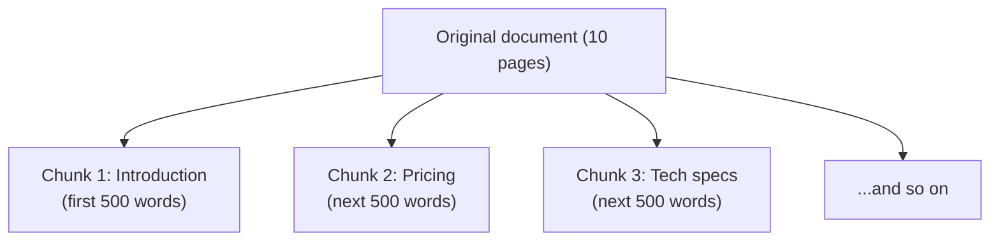

A knowledge base lets you give your AI access to your own documents. When
a user asks a question, Pulse searches through your documents, finds the
most relevant information, and uses it to generate a better answer.

Without a knowledge base, the AI can only use its general training data.
With a knowledge base, it can answer questions specific to your company,
products, or domain.

---

## Table of Contents

1. [What Is a Knowledge Base?](#what-is-a-knowledge-base)
2. [How It Works (Simply)](#how-it-works-simply)
3. [Creating a Knowledge Base](#creating-a-knowledge-base)
4. [Uploading Documents](#uploading-documents)
5. [Supported File Formats](#supported-file-formats)
6. [Understanding Chunking](#understanding-chunking)
7. [Retrieval Settings](#retrieval-settings)
8. [Connecting to a Chatbot](#connecting-to-a-chatbot)
9. [Connecting to a Workflow](#connecting-to-a-workflow)
10. [Hit Testing](#hit-testing)
11. [Maintaining Your Knowledge Base](#maintaining-your-knowledge-base)

---

## What Is a Knowledge Base?

Think of a knowledge base like a private library for your AI. You upload
your documents -- manuals, FAQs, policies, product descriptions, help
articles -- and Pulse organizes them so the AI can quickly find relevant
information when someone asks a question.

**Without a knowledge base**:
- User asks: "What is your return policy?"
- AI responds: "I don't have information about your specific return
  policy." (It only knows general information from its training.)

**With a knowledge base** (containing your return policy document):
- User asks: "What is your return policy?"
- AI responds: "Our return policy allows returns within 30 days of
  purchase. Items must be in original packaging..." (It found and used
  your actual policy.)

---

## How It Works (Simply)

Here is what happens behind the scenes when you use a knowledge base:


You do not need to understand the technical details. Just know that
uploading documents makes the AI smarter about your specific content.

---

## Creating a Knowledge Base

1. Go to **"Knowledge"** in the sidebar.
2. Click **"Create Knowledge Base."**
3. Give it a name (e.g., "Product Documentation" or "Company FAQ").
4. Optionally add a description to help team members understand what
   it contains.
5. Click **"Create."**

You now have an empty knowledge base. The next step is adding documents.

---

## Uploading Documents

### From Files

1. Open your knowledge base.
2. Click **"Add Files"** or **"Upload."**
3. Select one or more files from your computer.
4. Pulse will process each file:
   - Read the content
   - Break it into searchable pieces
   - Make it ready for searching
5. Wait for processing to complete (this can take a few seconds to
   several minutes depending on document size).

### From Text

1. In your knowledge base, look for a **"Create from Text"** option.
2. Paste or type the content directly.
3. Give it a title.
4. Click **"Save."**

### From a Website

1. Look for an **"Import from URL"** option.
2. Enter the web page URL.
3. Pulse will fetch the page content and add it to your knowledge base.

> **Tip**: You can upload multiple documents at once. Pulse will process
> them all in the background.

---

## Supported File Formats

Pulse can read many common file types:

| Format | Extensions | Notes |
|--------|-----------|-------|
| PDF | .pdf | Includes text from scanned PDFs if they have OCR |
| Word | .docx, .doc | Microsoft Word documents |
| Text | .txt | Plain text files |
| Markdown | .md | Formatted text files |
| HTML | .html, .htm | Web page files |
| CSV | .csv | Spreadsheet data |
| Excel | .xlsx, .xls | Microsoft Excel spreadsheets |
| PowerPoint | .pptx | Presentation slides |
| EPUB | .epub | E-book format |

> **Note**: Pulse reads the text content of files, not images embedded
> within them. If important information is in images (like diagrams or
> charts), the AI will not be able to access it.

---

## Understanding Chunking

When you upload a document, Pulse breaks it into smaller pieces called
"chunks." This is necessary because AI models can only process a limited
amount of text at once, and searching through smaller pieces produces
more precise results.

### How Chunking Works

Think of it like cutting up a newspaper article:



### Chunking Settings

When uploading documents, you may see options to control chunking:

- **Chunk size** -- how large each piece should be (measured in
  characters or tokens). Larger chunks provide more context but may
  include irrelevant information. Smaller chunks are more precise but
  may miss context.
  - **Recommended**: 500-1000 characters for most use cases
  - **Larger** (1000-2000): For technical documents where context is
    important
  - **Smaller** (200-500): For FAQs or bullet-pointed content

- **Chunk overlap** -- how much neighboring chunks share. Overlap
  prevents information from being split across chunks and lost.
  - **Recommended**: 50-100 characters

> **If you are unsure**, use the default settings. They work well for
> most documents.

---

## Retrieval Settings

When searching your knowledge base, you can configure how Pulse finds
relevant information.

### Retrieval Methods

| Method | How It Works | Best For |
|--------|-------------|----------|
| **Semantic search** | Finds content that means the same thing, even if different words are used | Natural language questions |
| **Keyword search** | Finds content that contains the exact words | Technical terms, product names |
| **Hybrid** | Combines both methods | Best of both worlds (recommended) |

### Key Settings

- **Top K** -- how many chunks to return (3-5 is usually good). More
  results give the AI more information but may dilute the most relevant
  answer.
- **Score threshold** -- minimum relevance score. Lower values include
  more results; higher values are more selective.
- **Reranking** -- an optional second AI model that re-orders search
  results for better relevance. Improves quality but adds a small
  amount of processing time.

---

## Connecting to a Chatbot

The simplest way to use a knowledge base is to connect it directly to
a chatbot.

### Basic Chat App

1. Open your Chat app in the editor.
2. Look for a **"Knowledge"** or **"Context"** section.
3. Click **"Add Knowledge Base."**
4. Select the knowledge base you want to connect.
5. Publish the app.

Now when users ask questions, the chatbot will automatically search
your knowledge base and use the results in its answers.

### Workflow-Based Chat App

1. In your workflow, add a **Knowledge Retrieval** node.
2. Configure it to search your knowledge base using the user's question.
3. Connect the Knowledge Retrieval node's output to an LLM node.
4. In the LLM node's prompt, include the retrieved information:

```
Answer the user's question using the provided context.

Context: {{#knowledge_retrieval.result#}}

Question: {{#start.query#}}
```

This gives you more control over how the knowledge base is used.

---

## Connecting to a Workflow

In a standalone workflow (not a chatbot), you can use the Knowledge
Retrieval node the same way:

1. Add a **Knowledge Retrieval** node after your Start or Trigger node.
2. Configure which knowledge base to search.
3. Set the query (what to search for).
4. Use the results in downstream nodes.

---

## Hit Testing

**Hit testing** lets you check what your knowledge base returns for a
given question without running a full workflow. It is a debugging tool
to make sure your documents are being found correctly.

### How to Hit Test

1. Open your knowledge base.
2. Look for a **"Hit Testing"** or **"Search Test"** option.
3. Type a question or search term.
4. Click **"Test."**
5. You will see the chunks that would be returned, along with their
   relevance scores.

### What to Check

| What You See | What It Means | What to Do |
|-------------|---------------|------------|
| Relevant chunks with high scores | Working correctly | Nothing -- you are good |
| Relevant chunks with low scores | Information is there but hard to find | Adjust chunk size or add more descriptive content |
| Irrelevant chunks | Wrong information is being matched | Improve document quality, add keywords |
| No results | Information is missing | Upload relevant documents |

### When to Hit Test

- After uploading new documents
- When your chatbot gives wrong answers
- When you change retrieval settings
- Before publishing a new app

---

## Maintaining Your Knowledge Base

### Adding New Documents

Add documents whenever you have new information. The knowledge base
updates automatically -- new documents become searchable immediately
after processing.

### Updating Existing Documents

If a document has changed (e.g., updated return policy):

1. Delete the old version from the knowledge base.
2. Upload the new version.

Pulse will re-process the document and update the searchable chunks.

### Removing Documents

1. In your knowledge base, find the document you want to remove.
2. Click the delete or remove option.
3. Confirm the deletion.

The document's chunks will be removed from search results immediately.

### Monitoring Quality

Periodically review your knowledge base:

- Are users asking questions that are not being answered? You may need
  to add more documents.
- Are answers referencing outdated information? Update the relevant
  documents.
- Is the knowledge base very large? Consider splitting it into
  topic-specific knowledge bases for better search precision.

---

## Next Steps

- **Configure AI models**: See [Model Configuration](/docs/user-guide/model-configuration)
- **Build a RAG chatbot**: See the [RAG Chatbot Recipe](/docs/user-guide/recipes/rag-chatbot)
- **Understand app types**: See [App Modes](/docs/user-guide/app-modes)
