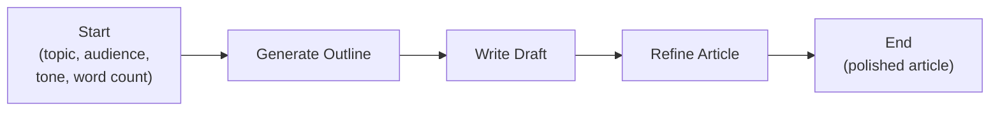
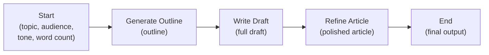

Build a workflow that generates blog posts and marketing content in
multiple steps: research, outline, write, and refine.

---

## Goal

By the end of this recipe, you will have a workflow that:

- Takes a topic and target audience as input
- Generates a structured outline
- Writes a full draft based on the outline
- Refines the draft for tone, clarity, and engagement
- Produces a polished final article

---

## Prerequisites

1. A Pulse account with Editor or higher permissions
2. A model provider configured with a capable text generation model
   (GPT-4o, Claude Sonnet, or similar)

---

## Overview



## Steps

### Step 1: Create the Workflow App

1. Click **"Create App"** from the dashboard.
2. Choose **"Workflow"** (standalone, not chatbot).
3. Name it "Content Generator."
4. Click **"Create."**

### Step 2: Configure the Start Node

1. Click the **Start** node.
2. Add input fields:
   - **topic** (text): "What should the article be about?"
   - **audience** (text): "Who is the target audience?"
   - **tone** (dropdown): Options: "Professional", "Casual",
     "Educational", "Persuasive"
   - **word_count** (number): "Approximate word count" (default: 800)

These fields will appear as a form when someone runs the workflow.

### Step 3: Add the Research and Outline Node

1. Add an **LLM** node after the Start node.
2. Name it "Generate Outline."
3. Choose a strong model (GPT-4o or Claude Sonnet).
4. Write this prompt:

```
Create a detailed outline for a {{#start.tone#}} article about:
"{{#start.topic#}}"

Target audience: {{#start.audience#}}
Target length: approximately {{#start.word_count#}} words

The outline should include:
1. A compelling title
2. An introduction hook
3. 3-5 main sections with bullet points for key ideas
4. A conclusion section
5. A call to action

Format the outline with clear headings and sub-points.
```

### Step 4: Add the Writing Node

1. Add another **LLM** node.
2. Name it "Write Draft."
3. Use the same model.
4. Write this prompt:

```
Write a complete {{#start.tone#}} article following this outline:

{{#generate_outline.text#}}

Target audience: {{#start.audience#}}
Target length: approximately {{#start.word_count#}} words

Guidelines:
- Write in a {{#start.tone#}} tone throughout
- Use short paragraphs (2-3 sentences each)
- Include relevant examples and specifics
- Make the introduction engaging to hook the reader
- End with a clear call to action
- Use subheadings to break up the content
```

### Step 5: Add the Refinement Node

1. Add another **LLM** node.
2. Name it "Refine Article."
3. Write this prompt:

```
Review and improve this article draft:

{{#write_draft.text#}}

Target audience: {{#start.audience#}}
Desired tone: {{#start.tone#}}

Improve the article by:
1. Fixing any grammar or clarity issues
2. Making the introduction more engaging
3. Ensuring transitions between sections flow smoothly
4. Strengthening the conclusion and call to action
5. Verifying the tone is consistently {{#start.tone#}}
6. Removing any filler or repetitive content

Return the complete, polished article.
```

### Step 6: Add the End Node

1. Add an **End** node after the Refine Article node.
2. Configure the output to include:
   - The final article text from the Refine Article node
   - The outline from the Generate Outline node (useful reference)

### Step 7: Review the Complete Workflow

Your workflow should look like:



---

## Testing

### Run a Test

1. Click **"Run"** or **"Debug."**
2. Fill in the form:
   - Topic: "The Benefits of Remote Work"
   - Audience: "HR managers at mid-size companies"
   - Tone: "Professional"
   - Word count: 800
3. Click **"Run."**
4. Watch each step execute:
   - Outline appears first
   - Draft is written based on the outline
   - Final article is refined and polished

### What to Check

| Checkpoint | What to Look For |
|-----------|------------------|
| Outline | Clear structure, relevant sections, compelling title |
| Draft | Follows the outline, correct tone, appropriate length |
| Final article | Polished, no grammar issues, good flow, strong conclusion |

### Try Different Inputs

| Test | Topic | Audience | Tone |
|------|-------|----------|------|
| Business content | "AI in Supply Chain" | "Logistics executives" | Professional |
| Marketing copy | "Summer Sale Launch" | "Young professionals" | Casual |
| Educational | "Introduction to Investing" | "College students" | Educational |

---

## Variations

### Add a Title Generator

Insert an LLM node before the outline that generates 5 title options,
then use the best one in the outline step.

### Add SEO Keywords

Add a text input field for SEO keywords. Include them in the writing
prompt:

```
Naturally incorporate these keywords: {{#start.keywords#}}
```

### Add a Parallel Social Media Branch

After the article is refined, add a branch that generates:

- A LinkedIn post summarizing the article
- Three tweet-length highlights
- A one-paragraph email newsletter blurb

Use an **Iteration** node to generate all three in parallel.

### Connect to a CMS

Add an **HTTP Request** node at the end that publishes the article
directly to your content management system (WordPress, Ghost,
Contentful, etc.) via their API.

### Add Human Review

Insert a **Human Input** node between the draft and refinement steps.
This lets a human editor review the draft and provide feedback before
the AI refines it.

---

## Next Steps

- **Trigger from external events**: See [Webhook-Triggered Automation](/docs/user-guide/recipes/webhook-triggered-automation)
- **Run on a schedule**: See [Scheduled Workflow](/docs/user-guide/recipes/scheduled-workflow)
