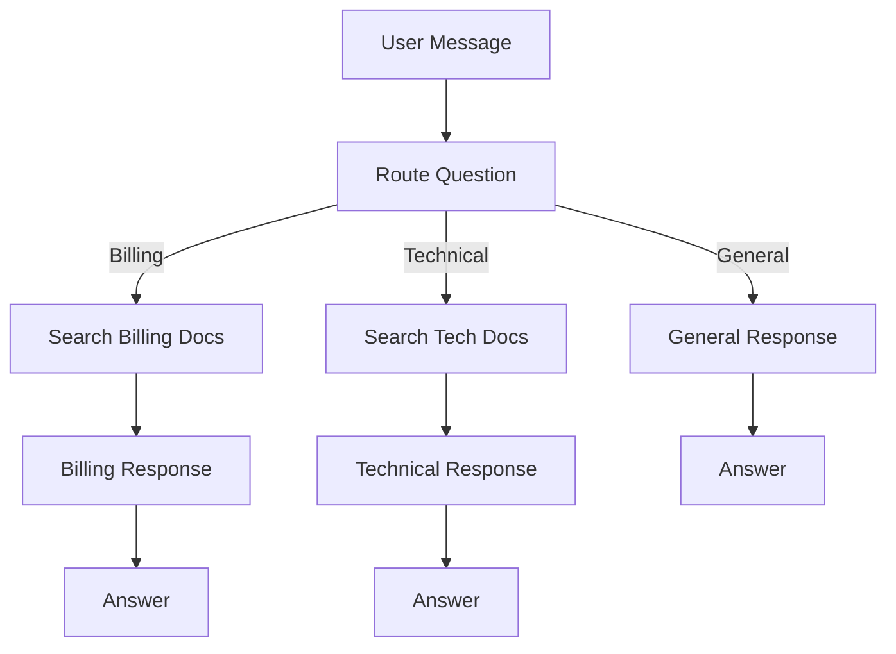

Build a multi-turn customer support chatbot that classifies questions,
routes them to the right handling path, searches your help documentation,
and escalates to a human when needed.

---

## Goal

By the end of this recipe, you will have a support chatbot that:

- Classifies incoming questions (billing, technical, general)
- Searches your help documentation for relevant answers
- Remembers context across the conversation
- Escalates to a human agent when it cannot help
- Collects customer information when needed

---

## Prerequisites

1. A Pulse account with Editor or higher permissions
2. A model provider configured
3. A knowledge base with your support documentation (see
   [RAG Chatbot recipe](/docs/user-guide/recipes/rag-chatbot) for how to create one)

---

## Overview



## Steps

### Step 1: Create the App

1. Click **"Create App"** from the dashboard.
2. Choose **"Chatbot" > "Workflow-based."**
3. Name it "Customer Support Bot."
4. Click **"Create."**

You will be taken to the workflow editor with a Start node already in
place.

### Step 2: Add the Question Classifier

1. Add a **Question Classifier** node after the Start node.
2. Name it "Route Question."
3. Choose a fast model (GPT-4o-mini or Claude Haiku -- classification
   does not need the most powerful model).
4. Define three categories:
   - **Billing**: "Questions about invoices, payments, subscriptions,
     pricing, refunds, charges, upgrades, and account billing."
   - **Technical**: "Questions about product features, bugs, errors,
     setup, configuration, integrations, and how things work."
   - **General**: "Greetings, general inquiries, feedback, and anything
     that does not fit billing or technical."
5. Each category becomes a separate output path from this node.

### Step 3: Build the Billing Branch

1. From the "Billing" output of the classifier, add a **Knowledge
   Retrieval** node.
   - Name it "Search Billing Docs."
   - Connect it to your billing/pricing knowledge base.
   - Set Top K to 3.
   - Use the user's query as the search input.

2. Add an **LLM** node after the Knowledge Retrieval.
   - Name it "Billing Response."
   - Choose a mid-tier model (GPT-4o or Claude Sonnet).
   - Write this prompt:

```
You are a billing support specialist. Answer the customer's billing
question using the provided documentation.

Customer question: {{#start.query#}}

Relevant documentation:
{{#search_billing_docs.result#}}

Guidelines:
- Be specific about prices, policies, and procedures
- If the answer requires accessing the customer's account, say:
  "I would need to look up your account for that. Let me connect
  you with our billing team."
- If unsure, offer to escalate rather than guessing
```

3. Add an **Answer** node after the LLM to display the response.

### Step 4: Build the Technical Branch

1. From the "Technical" output, add a **Knowledge Retrieval** node.
   - Name it "Search Tech Docs."
   - Connect it to your technical documentation knowledge base.

2. Add an **LLM** node.
   - Name it "Technical Response."
   - Write a prompt similar to the billing one, but focused on
     technical troubleshooting:

```
You are a technical support specialist. Help the customer with their
technical issue using the provided documentation.

Customer question: {{#start.query#}}

Relevant documentation:
{{#search_tech_docs.result#}}

Guidelines:
- Provide step-by-step instructions when possible
- If the issue seems complex, suggest these steps:
  1. Try the solution from documentation
  2. If that does not work, collect error details
  3. Offer to escalate to the engineering team
- Include relevant links or references from the documentation
```

3. Add an **Answer** node.

### Step 5: Build the General Branch

1. From the "General" output, add an **LLM** node.
   - Name it "General Response."
   - Write a friendly general-purpose prompt:

```
You are a friendly customer support agent. Respond helpfully to
the customer's message.

Customer message: {{#start.query#}}

Guidelines:
- Be warm and conversational
- If they are asking about something specific, let them know which
  category might help (billing or technical)
- For feedback, thank them sincerely
- For greetings, introduce yourself and offer to help
```

2. Add an **Answer** node.

### Step 6: Add Conversation Memory

To make the bot remember previous messages in the conversation:

1. Click on each LLM node.
2. Find the **"Memory"** or **"Conversation History"** setting.
3. Enable it and set the window size to 10 (remembers the last 10
   messages).

This means if a customer says "My payment failed" and then follows up
with "What should I do?", the bot remembers the context of the payment
failure.

### Step 7: Add an Escalation Path

For cases where the bot cannot help:

1. Add a **Variable Assigner** node somewhere accessible in your
   workflow.
2. Create a conversation variable called "needs_escalation."
3. In your LLM prompts, add an instruction:

```
If you cannot answer the question from the documentation, end your
response with "[ESCALATE]" on the last line.
```

4. After each LLM response, add an **IF/ELSE** node.
   - Condition: LLM output contains "[ESCALATE]"
   - IF true: Route to a special Answer node that says:
     "I am going to connect you with a human agent who can help with
     this. Please hold while I transfer you."
   - ELSE: Route to the normal Answer node.

### Step 8: Add a Welcome Message

1. In the app settings (outside the workflow), find **"Features."**
2. Enable **"Conversation Opener."**
3. Write a welcome message:

```
Hi! I am the Acme Support Bot. I can help with:

- Billing questions (invoices, payments, subscriptions)
- Technical issues (setup, features, troubleshooting)
- General inquiries

What can I help you with today?
```

4. Add suggested starter questions like:
   - "How do I update my payment method?"
   - "My widget is not connecting"
   - "What are your pricing plans?"

---

## Testing

### Test Each Branch

| Test Message | Expected Branch | Expected Behavior |
|-------------|-----------------|-------------------|
| "How much does the pro plan cost?" | Billing | Answers with pricing details |
| "I got error code 404" | Technical | Provides troubleshooting steps |
| "Hi there!" | General | Friendly greeting, offers help |
| "Cancel my subscription" | Billing | Provides cancellation info or escalates |
| "Nothing is working and I have tried everything" | Technical | Escalates to human agent |

### Test Conversation Flow

1. Start with "My payment failed."
2. Follow up with "I used my Visa card."
3. Then ask "What should I do?"
4. Verify the bot maintains context throughout.

---

## Variations

### Add Sentiment Detection

Before the classifier, add an LLM node that detects customer sentiment.
If the customer is frustrated, prioritize empathy in the response.

### Multi-Language Support

Add language detection and respond in the customer's language. Use
knowledge bases with translated content.

### Ticket Creation

Add an HTTP Request node to create a support ticket in your ticketing
system when escalation happens.

### Feedback Collection

At the end of the conversation, add a Human Input node that asks
"Was this helpful?" to collect satisfaction feedback.

---

## Next Steps

- **Automate content creation**: See [Content Generation Pipeline](/docs/user-guide/recipes/content-generation-pipeline)
- **Add external triggers**: See [Webhook-Triggered Automation](/docs/user-guide/recipes/webhook-triggered-automation)
