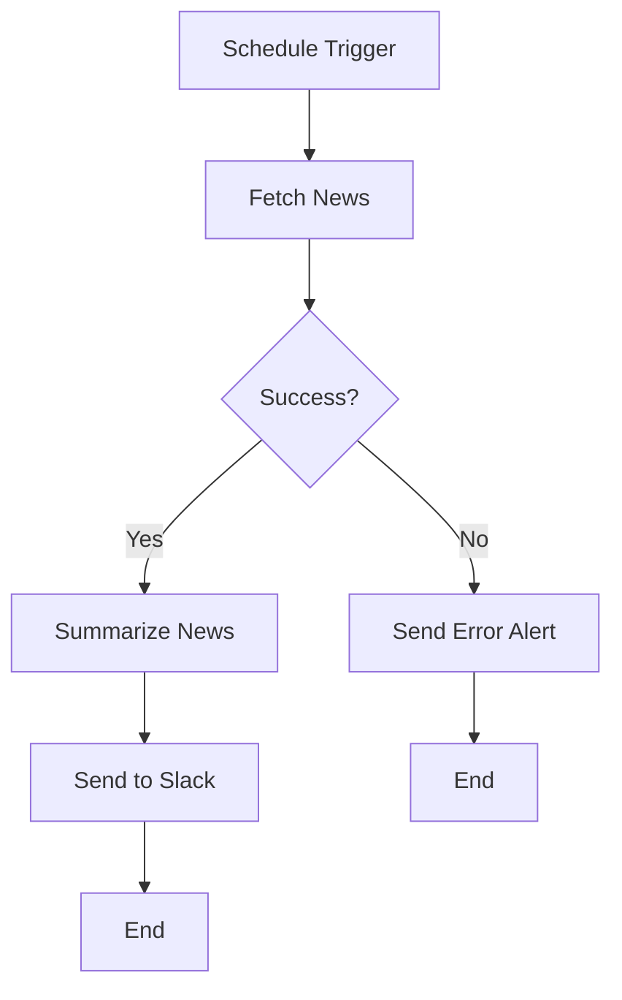

Build a workflow that runs automatically on a recurring schedule --
like a cron job, but without any coding. Perfect for daily reports,
weekly summaries, periodic data processing, or monitoring tasks.

---

## Goal

By the end of this recipe, you will have a workflow that:

- Runs automatically on a schedule you define (daily, weekly, etc.)
- Fetches data from an external source
- Processes the data with AI
- Delivers results (via email, Slack, or stored output)

The example we will build: a weekly industry news digest that fetches
recent articles, summarizes them with AI, and sends a formatted digest.

---

## Prerequisites

1. A Pulse account with Editor or higher permissions
2. A model provider configured
3. A way to deliver the output (Slack webhook URL, email API key, or
   simply checking the workflow run history in Pulse)

---

## Steps

### Step 1: Create the Workflow App

1. Click **"Create App"** from the dashboard.
2. Choose **"Workflow."**
3. Name it "Weekly News Digest."
4. Click **"Create."**

### Step 2: Add the Schedule Trigger

1. Remove the default Start node (or change the trigger type).
2. Add a **Trigger: Schedule** node.
3. Configure the schedule:
   - **Frequency**: Weekly
   - **Day**: Monday
   - **Time**: 8:00 AM
   - **Timezone**: Select your timezone
4. This means the workflow will run automatically every Monday at 8 AM.

> **Tip**: For testing, you can temporarily set the schedule to run
> every hour. Switch to weekly after you confirm everything works.

### Step 3: Add a Data Fetching Node

1. Add an **HTTP Request** node after the schedule trigger.
2. Name it "Fetch News."
3. Configure it to call a news API or RSS feed:
   - **URL**: The API endpoint (e.g., a news API, RSS-to-JSON service,
     or your company's internal data endpoint)
   - **Method**: GET
   - **Headers**: Include any required API keys

> **Alternative**: If you do not have a news API, you can use a
> Knowledge Base instead. Upload articles periodically, and use a
> Knowledge Retrieval node to fetch the latest content.

### Step 4: Add a Content Processing Node

1. Add an **LLM** node after the HTTP Request.
2. Name it "Summarize News."
3. Choose a capable model (GPT-4o or Claude Sonnet).
4. Write this prompt:

```
You are a professional news curator. Create a weekly digest from the
following news data:

{{#fetch_news.body#}}

Format the digest as follows:

WEEKLY INDUSTRY DIGEST
Week of [current date]

TOP STORIES:

1. [Title]
   Summary: [2-3 sentence summary]
   Why it matters: [1 sentence on significance]

2. [Title]
   Summary: [2-3 sentence summary]
   Why it matters: [1 sentence on significance]

[Continue for up to 5 stories]

KEY TAKEAWAYS:
- [Bullet point summarizing the week's themes]
- [Another key takeaway]
- [Another key takeaway]

Keep the total digest under 500 words. Focus on the most impactful
stories.
```

### Step 5: Add a Delivery Node

Choose how to deliver the digest:

#### Option A: Slack Notification

1. Add an **HTTP Request** node.
2. Name it "Send to Slack."
3. Configure:
   - **URL**: Your Slack webhook URL
   - **Method**: POST
   - **Body**:
     ```
     {"text": "{{#summarize_news.text#}}"}
     ```

#### Option B: Email Delivery

1. Add an **HTTP Request** node.
2. Name it "Send Email."
3. Configure it to call your email API (SendGrid, Mailgun, etc.) with
   the digest content as the email body.

#### Option C: Just Store It

1. Add an **End** node with the digest text as output.
2. Team members can check the workflow run history to read the latest
   digest.

### Step 6: Add Error Handling

Scheduled workflows run unattended, so error handling is important:

1. After the HTTP Request node (Fetch News), add an **IF/ELSE** node.
2. Check if the request was successful:
   - **IF** the status code is 200 (success): Continue to summarization
   - **ELSE**: Send an error notification

3. On the error path, add an **HTTP Request** or **End** node that
   logs the error or sends an alert:



### Step 7: Review and Publish

1. Review all nodes and connections.
2. Click **"Publish."**
3. The workflow is now active and will run on the schedule you defined.

---

## Testing

### Manual Test Run

1. In the workflow editor, click **"Debug"** or **"Run."**
2. The schedule trigger will have a **"Run Now"** or **"Test"** button.
3. Click it to execute the workflow immediately.
4. Check each step's output.

### Verify the Schedule

1. After publishing, check the workflow's run history.
2. Wait for the first scheduled run (or set a short interval for
   testing).
3. Confirm the workflow ran at the expected time.
4. Check the output quality.

### Test Scenarios

| Scenario | What to Check |
|----------|---------------|
| Normal run | Data fetched, summary generated, notification sent |
| API unavailable | Error handling path activates, alert sent |
| Empty data | AI handles gracefully, does not produce empty digest |
| Long data response | AI summarizes within limits, no truncation issues |

---

## Variations

### Daily Stand-Up Summary

Change the schedule to daily. Fetch data from your project management
tool (Jira, Linear, Asana) and generate a stand-up summary of
yesterday's progress.

### Weekly Report Generator

Fetch data from multiple sources (sales CRM, support tickets, website
analytics) using multiple HTTP Request nodes in parallel. Combine the
data and generate a comprehensive weekly report.

### Periodic Data Cleanup

Run a weekly workflow that:
1. Queries your database for stale records
2. Uses AI to classify which records need attention
3. Generates a cleanup report
4. Sends it to the data team

### Monitoring and Alerting

Run an hourly workflow that:
1. Checks the status of critical services (via HTTP Request)
2. If any service is down, generates an incident report
3. Sends an alert to your on-call channel

### Competitive Analysis

Run a weekly workflow that:
1. Fetches news about competitors
2. Summarizes key developments
3. Identifies potential impacts on your business
4. Delivers a competitive intelligence briefing

---

## Tips for Scheduled Workflows

- **Start with a longer interval** (weekly) and shorten it once you
  confirm everything works. Running a broken workflow every minute
  wastes model API credits.

- **Always add error handling**. Unlike chatbots where a user can retry,
  scheduled workflows run unattended. If they fail silently, nobody
  knows.

- **Monitor run history**. Check your workflow's history page regularly
  to catch any failures.

- **Be mindful of costs**. A workflow that runs every hour and calls a
  powerful model can accumulate significant API costs. Use the cheapest
  model that produces acceptable results.

- **Set appropriate timeouts** on HTTP Request nodes. External APIs may
  be slow or unresponsive.

---

## Next Steps

- **Learn about other triggers**: See [Webhook-Triggered Automation](/docs/user-guide/recipes/webhook-triggered-automation)
- **Build a chatbot**: See [Customer Support Bot](/docs/user-guide/recipes/customer-support-bot)
- **Explore all node types**: See [Node Reference](/docs/user-guide/node-reference)
