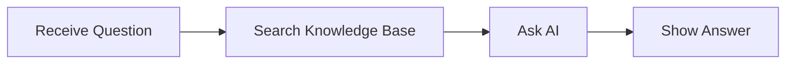
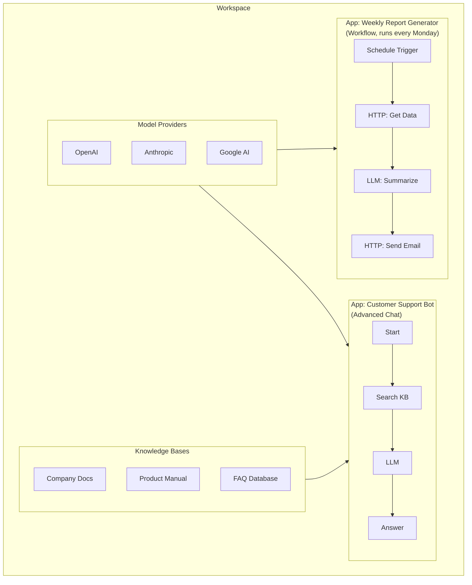

Pulse is a platform for building AI-powered applications without writing
code. Think of it as a visual workshop where you design how AI should
behave, connect it to your data, and publish it for others to use.

---

## Table of Contents

1. [What Can Pulse Do?](#what-can-pulse-do)
2. [Core Concepts](#core-concepts)
3. [The Six App Modes](#the-six-app-modes)
4. [How the Pieces Fit Together](#how-the-pieces-fit-together)

---

## What Can Pulse Do?

Here are some real examples of what people build with Pulse:

- **Customer support chatbot** that answers questions using your company's
  documentation
- **Content generation pipeline** that drafts blog posts, social media
  updates, or marketing copy
- **Document analyzer** that reads uploaded files and extracts key
  information
- **Internal assistant** that helps employees find answers in company
  knowledge bases
- **Automated workflow** that processes data on a schedule or when
  triggered by an external event
- **Multi-step agent** that can search the web, query databases, and
  take actions on your behalf

---

## Core Concepts

### Apps

An **app** is a complete AI application that you build in Pulse. It has a
name, a description, and a set of instructions that define how it behaves.

Think of an app like a recipe: it tells the AI what ingredients to use
(which model, which data sources) and what steps to follow (the workflow).

Once built, you can share your app with others by giving them a link or
embedding it in a website.

### Workflows

A **workflow** is a visual diagram that defines the steps your app follows.
Each step is represented by a box (called a node), and arrows connect the
boxes to show the order of operations.

Think of a workflow like a flowchart: "First, receive the user's question.
Then, search the knowledge base. Then, send the question and search results
to the AI. Finally, show the answer."

Workflows can branch (like an "if this, then that" rule), loop, and run
steps in parallel.

### Nodes

A **node** is a single step in a workflow. Pulse offers 29 different types
of nodes, grouped by what they do:

- **Entry point nodes** -- where the workflow starts (user message,
  webhook, schedule)
- **AI nodes** -- send prompts to an AI model and get responses
- **Data nodes** -- search knowledge bases, extract text from documents
- **Logic nodes** -- make decisions, transform data, call external APIs
- **Flow control nodes** -- loop over lists, wait for human input,
  collect results
- **Output nodes** -- send the final response back to the user

You do not need to memorize all 29 types. The [Node Reference](/docs/user-guide/node-reference)
chapter covers each one in detail.

### Models

A **model** is the AI "brain" that powers your app. Different models have
different strengths:

- **Text generation models** (like GPT-4, Claude, Llama) -- write text,
  answer questions, have conversations
- **Embedding models** -- convert text into numerical representations for
  searching (you will not interact with these directly, but they power
  knowledge base search)
- **Reranking models** -- improve search result quality by re-ordering
  results
- **Speech models** -- convert speech to text or text to speech
- **Image models** -- generate or analyze images

Pulse supports dozens of model providers (OpenAI, Anthropic, Google,
Mistral, and many more). You bring your own API keys and Pulse handles
the rest.

### Knowledge Bases

A **knowledge base** is a collection of your documents that the AI can
search through. When a user asks a question, Pulse can look through your
documents to find relevant information and use it to generate a better
answer.

This is sometimes called RAG (Retrieval-Augmented Generation), but you
do not need to know that term. Just think of it as "teaching the AI your
company's information."

You can upload PDFs, Word documents, text files, web pages, and more.
Pulse breaks them into smaller pieces, understands their meaning, and
makes them searchable.

### Plugins

A **plugin** is an add-on that gives Pulse extra abilities. Plugins can:

- Add new AI model providers
- Add new tools that workflows can use (like sending emails, querying
  databases, or calling external APIs)
- Add new types of workflow nodes

Plugins are installed by workspace administrators and become available
to everyone in the workspace.

### Workspaces

A **workspace** is your team's shared area in Pulse. Everything you build
(apps, knowledge bases, model configurations) lives inside a workspace.

Team members can have different roles:

| Role                 | What They Can Do                              |
| -------------------- | --------------------------------------------- |
| **Owner**            | Everything, including deleting the workspace  |
| **Admin**            | Manage settings, members, and model providers |
| **Editor**           | Create and edit apps and workflows            |
| **Normal**           | View and run apps                             |
| **Dataset Operator** | Manage knowledge bases only                   |

---

## The Six App Modes

Pulse offers six different types of apps, each designed for a different
use case. Think of them as templates that determine how your app behaves.

### 1. Chat

A conversational chatbot. The user types messages, and the AI responds.
The AI remembers previous messages in the conversation.

**Best for**: Customer support, Q&A assistants, general-purpose chatbots.

**Analogy**: Like texting with a helpful assistant who remembers what you
have already discussed.

### 2. Completion

A single-shot text generator. The user provides input, the AI generates
output, and the conversation is done. There is no back-and-forth.

**Best for**: Text summarization, translation, content generation from
a template.

**Analogy**: Like filling out a form and getting a result -- one input,
one output.

### 3. Advanced Chat

A chatbot powered by a visual workflow. Instead of just sending the
user's message to an AI model, you design a multi-step process that the
message goes through.

**Best for**: Complex chatbots that need to search knowledge bases, call
external APIs, or follow branching logic.

**Analogy**: Like a customer support system with different departments --
the message gets routed to the right specialist based on its content.

### 4. Agent Chat

A chatbot with the ability to use tools autonomously. The AI decides
which tools to use, calls them on its own, and combines the results.

**Best for**: Research assistants, data analysts, complex problem-solving
where the AI needs to take multiple actions.

**Analogy**: Like asking a personal assistant to "find the cheapest
flight and book it" -- they figure out the steps themselves.

### 5. Workflow

A standalone automation pipeline that runs without a chat interface.
Triggered by a schedule, a webhook, or a manual button click.

**Best for**: Data processing, report generation, batch operations,
integrations between systems.

**Analogy**: Like a factory assembly line -- raw materials go in one end,
a finished product comes out the other.

### 6. RAG Pipeline

A document processing workflow designed specifically for ingesting and
preparing documents for knowledge base search.

**Best for**: Custom document processing, specialized chunking strategies,
multi-source data ingestion.

**Analogy**: Like a librarian who reads new books, catalogs them, and
files them so they can be found later.

---

## How the Pieces Fit Together

Here is how all the concepts connect:

### Summary

1. You create a **workspace** for your team.
2. You add **model providers** (connect your AI API keys).
3. You upload documents to create **knowledge bases**.
4. You build **apps** using the visual **workflow** builder.
5. Each workflow is made of **nodes** that define the steps.
6. You publish your app and share it with users.

---

## Next Steps

Ready to get started? Continue to [Getting Started](/docs/user-guide/getting-started)
to set up your account and explore the Pulse dashboard.
